# Banjo

Banjo is a physics engine, and a 3D world built on it, in which every object is
made of a real material. It is developed in the open and meant to become an
open-source project.

Each object is a block of small cubes of material, called cells, held together
by bonds. The bonds stretch, bend and break according to the material's
stiffness and strength, so what happens in a collision is calculated rather
than scripted. Drop an iron ball and a glass ball onto the same floor from the
same height and they behave differently, because their materials are
different. When something breaks, its pieces are whatever stays connected
after the bonds fail. Nothing is cut in advance and nothing is animated.

The same world has heat and fire, flowing water, ground that can be dug, and
machines made of real hinges, ropes, motors and batteries. The goal is a large,
persistent world in which all of this physics works together: a place to walk
around, pick things up, build, dig, dam a river, light a fire, run a machine or
break something, with an AI assistant that builds what you ask for using the
same tools a programmer would.

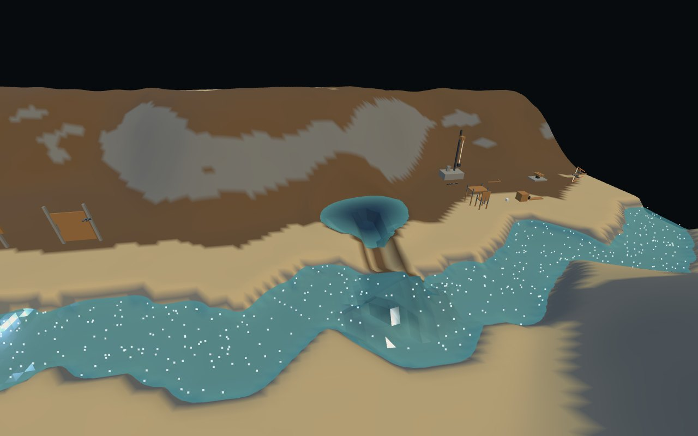

*The main world at `/world`. Every picture in this README is a screenshot of
the running world, taken on 21 September 2026. What happens in them is
simulated, not animated.*

> **Status (21 September 2026).** Banjo is early and experimental. A lot of
> physics has been built and merged, but not all of it has reached the world
> you can walk around in. [The physics](#the-physics) shows where each part
> stands, and the [to-do list](#to-do) collects everything that remains.
> Banjo is developed on Windows and tested on Linux. It does not have a licence
> yet.

## Contents

1. [The physics](#the-physics): how it works, what you can try, and what is not in the world yet
2. [Try it](#try-it): build, run, the rooms and the controls
3. [How the system fits together](#how-the-system-fits-together)
4. [Design rules](#design-rules)
5. [To-do](#to-do)
6. [Documentation](#documentation), [repository layout](#repository-layout) and [contributing](#contributing)

---

## The physics

### How matter works

A scene is a list of objects. Each has a shape, a size, a position and one of
eight materials, and the whole scene has one **cell size**: the edge length of
the cubes its matter is cut into. Neighbouring cells, up to two cells apart,
are joined by bonds whose stiffness and strength come from the material
catalogue ([`src/material/MaterialCatalog.cpp`](src/material/MaterialCatalog.cpp)).
An object's mass, centre of mass and inertia are summed from its cells, never
taken from a render mesh or a collision shape.

Most of the time the bonds do nothing. An object that is not being hit hard
moves as one rigid body in [Jolt Physics](https://github.com/jrouwe/JoltPhysics)
(v5.6.0, double precision), which costs microseconds per step. Only when a blow
could break or dent something does the engine run the struck object's cells and
bonds, for a few milliseconds of simulated time. Bonds strained past their
strength fail, and whatever is still connected afterwards becomes the new
objects, each with the mass, spin and speed of its own cells. They are rigid
bodies again and can break again later.

This is Banjo's main performance idea. Moving intact matter is almost free and
barely grows with size: 0.059 ms per 1/240 s step for 492 cells, 0.067 ms for
16,680. A break costs about 309 ms of lattice time (5,275 substeps of 1.36 µs).
So the engine pays for material detail only where a break is possible.

| Before | After |
|---|---|
| 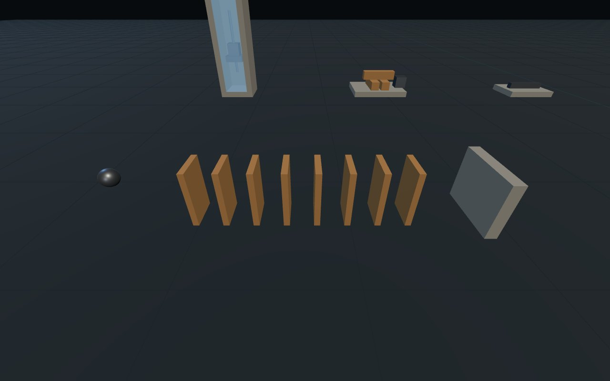 | 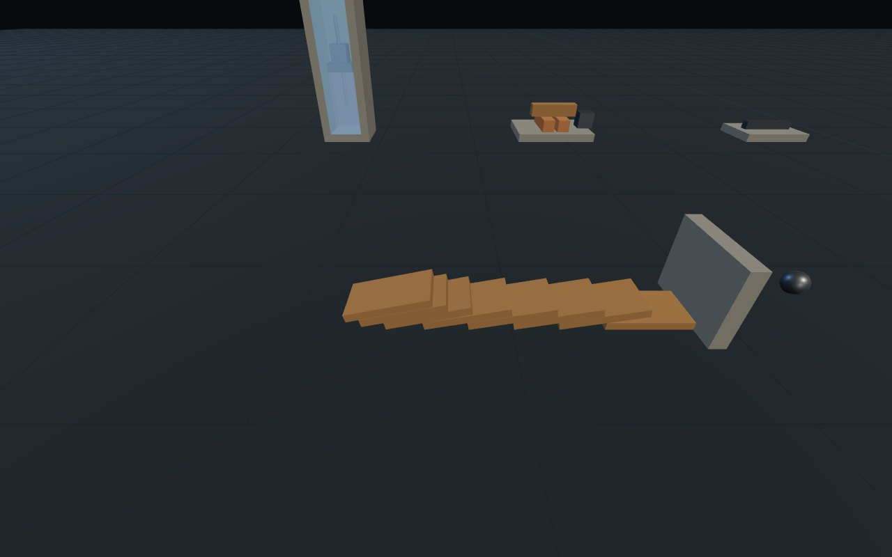 |

*In `/world?scene=tests-motion`, an iron ball rolls into eight oak dominoes at
4 m/s. Nothing is hit hard enough to break, so every domino falls as one
rigid body.*

**Why a step that would break something is taken back.** Jolt resolves a
collision inside its step, so by the time a collision is reported its energy
has already gone into bouncing the objects apart, and running the cells from
that state breaks nothing, however hard the hit (measured: 171 ms of lattice
that produced one piece). So every step is a **reversible trial**. The engine
saves Jolt's state, takes the step and checks every contact. If a contact could
break something, the step is undone: the world stays one step before the
impact, with the objects still closing, and the clock waits until the caller
decides. In the C API, `banjo_step` returns `BANJO_BREAK_PENDING` and the
caller runs the break (`banjo_fracture`) or declines it (`banjo_decline_break`);
`banjo_advance` decides for you. A program that ignores the question leaves the
world frozen at that moment.

The check, `admitRefracture`
([`src/fastlattice/Refracture.cpp`](src/fastlattice/Refracture.cpp)), is a few
multiplications on the closing speed, the two materials' acoustic impedances,
the wave speed and the weakest bond. It is deliberately generous: passing it
means a break is possible, not certain.

| 100 mm iron ball onto a 300 × 40 × 300 mm glass pane | threshold | result |
|---|---|---|
| dropped 0.06 m (0.9 m/s at impact) | 4.5 m/s | below the threshold; holds |
| dropped 1.5 m (5.4 m/s) | 4.5 m/s | above the threshold, but still holds |
| dropped 10 m (13.9 m/s) | 4.5 m/s | breaks into 78 pieces |

Two things make breaks feel immediate. **Foresight** looks along the path of
anything moving fast, predicts the speed it will arrive at, and starts the
lattice run before the impact; that cut the delay between a glass pane's impact
and its pieces from 856 ms to 127 ms. It also guesses where a held object would
land if dropped, and starts that run while the object is still in the hand,
which brings the delay to about 50 ms from any height. And the break is worked
out on a separate thread (`banjo_begin_fracture` / `banjo_finish_fracture`), so
the world keeps running while it does.

### What you can try today

Everything below is merged into `main` unless it is marked **Branch**. Merged is
not the same as reachable in the world, and the difference is most of the
[to-do list](#to-do). The status labels mean:

- **World**: you can try it in the main world at `/world`.
- **Test room**: in the live world, but in a room you reach only by typing its
  address, `/world?scene=<name>`.
- **Chat**: in the live world, but only if you ask the room's chat to build it.
- **Page**: on a separate page (the Workshop, `/fabrication`, `/qa`,
  `/mechanics-qa`, `/tool-qa`, or the older lab at `/`), not in the world.
- **Code only**: built and tested, but no page reaches it. You can run it from
  the C API, the MCP servers, a command-line tool or the tests.
- **Branch**: built on a branch that is not merged yet.
- **Not built**: designed, measured or planned only.

At a glance ("in the live world" includes the test rooms and what the chat can
build; the tables further down say which):

| System | In the live world | Built, but not in the world | Not built yet |
|---|---|---|---|
| Breaking | impact fracture of all eight materials, pieces breaking again, denting, breaking under a steady load, foresight, cutting | other fracture solvers and failure laws; joints weaker than their material (switched off) | calibration against real materials; converged piece counts |
| Cell sizes | one size per room: 10, 20, 40 or 50 mm; exact bodies with no cells | Workshop designs at 5-200 mm; per-object resolution in an older solver | different cell sizes in one world |
| Materials | eight materials: brittle or dentable, friction, bounce, rolling resistance | internal damping, strength variation, wood grain, full plasticity | grain in the world, rate effects |
| Heat and fire | heating, conduction, radiation, burning wood, heat weakening and charring, burning away, gas pistons, ice melting into the room's water | freezing, which lives only in a separate thermal simulation | freezing in the world, fires going out, thermal expansion, smoke |
| Water | river and pond, floating, drag, dams, rivers beyond the valley | | waves, sediment, rain, wet ground, water putting out fire |
| Ground | digging, heaping, slumping, a pick in soil, carrying what you dig | storing dug material (manufacturing page) | breaking rock, wet soil, tool wear |
| Machines | hinges, slides, ropes, pulleys, latches, springs, drums, motors, batteries, brakes and their control panel; a cart on wheels; a cart that drives itself until its water sensor stops it at a lake's edge | electrical and thermal circuits | gears, charging batteries, joints that fail by bending, a machine that roams and docks |
| Hands and tools | pick up, carry, place, bag, throw, bow, sword, pick; things of several parts taken up whole | | two hands, grip points |

The main world is the room at `/world` ("The world"). It stands on a generated
valley with a river and a pond, and holds a latched gate, a portcullis on a
winch, a self-closing door, a bell on a rope, a crate, a ceramic pot, a plank, a
rubber ball, a bow, an iron sword, a pick, a hearth with an iron pot and two
burning logs, a table and chair, and a battery hoist. Fifteen more rooms exist
but the room menu shows only "The world" and "Expedition"; the rest open by
address ([the rooms](#the-rooms)). `/explore`, the newest interface, can pick
things up, carry, place and bag them and use them for what they are for (push
the cart, swing the mace), and what breaks there breaks; it cannot throw, heat,
dig or chat yet.

| The west terrace | The east terrace |
|---|---|
| 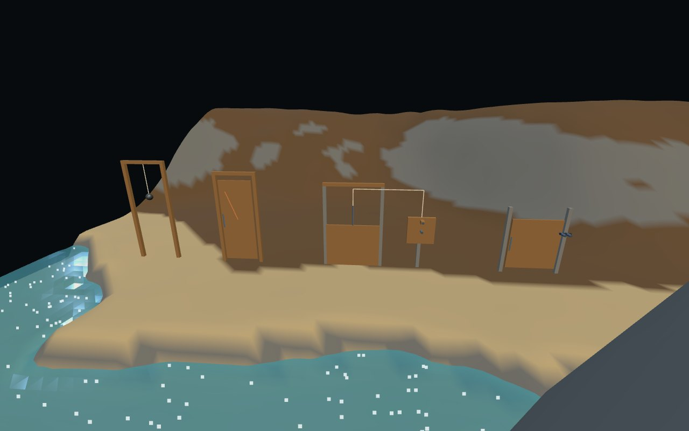 | 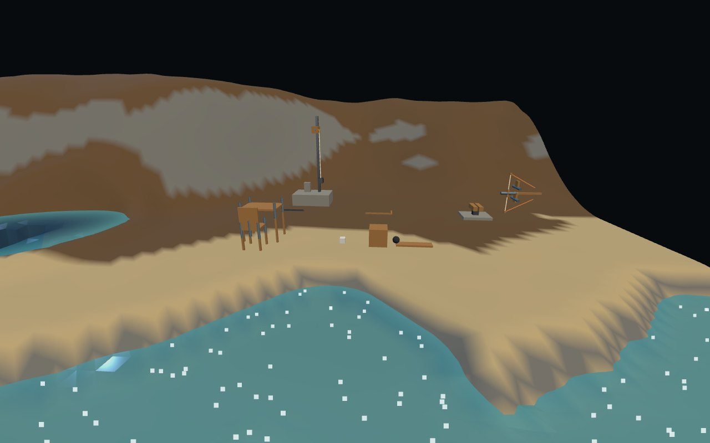 |

*The main world's two terraces. West: the bell on its rope, the self-closing
door, the portcullis and its winch, and the latched gate. East: the table and
chair, the battery hoist, the crate, the hearth and the bow.*

### Breaking, denting and cutting

| Before | After |
|---|---|
| 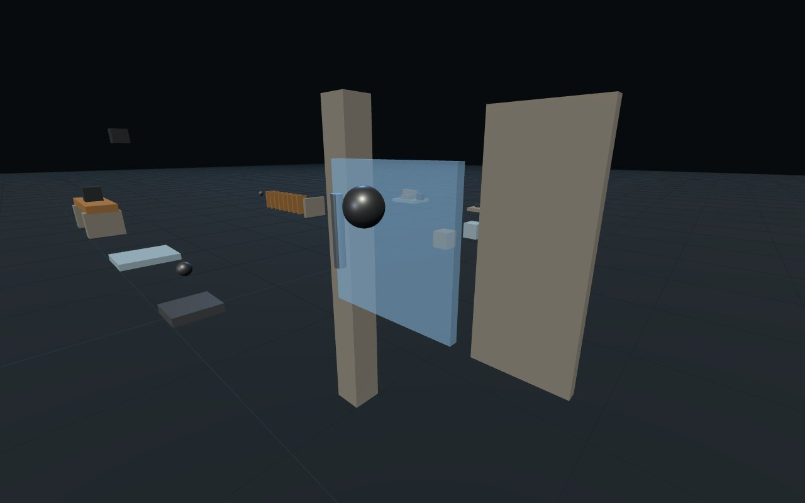 | 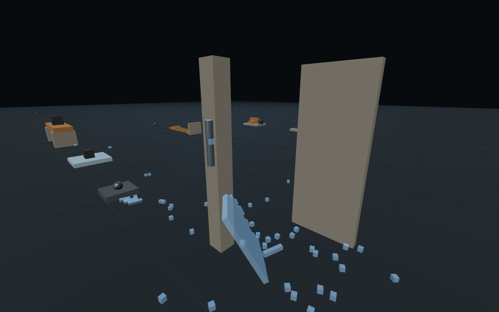 |

*In `/world?scene=tests-motion` (40 mm cells), a 120 mm iron ball hits a
640 × 640 × 40 mm glass pane hanging on a pin, at 16 m/s. The room reported
that the pane broke into 18 pieces, and that one of those was struck again and
broke into 52. The pieces were not cut in advance: each is a group of cells
that stayed connected.*

| Capability | Status | How to try it |
|---|---|---|
| Objects break when hit hard enough; all eight materials | World | throw or drop things. The bench room, `/world?scene=bench` (20 mm cells), has plates of every material on piers |
| Pieces break again when they land hard | World | break something, then drop its pieces |
| Denting: iron, aluminium, oak and rubber take a permanent set | World, Test room | on in every room; in `/world?scene=tests-motion` an iron ball hits an aluminium plate at 30 m/s as the room opens |
| Breaking under a steady load (statics) | Test room | `/world?scene=courtyard`: load the thin concrete shelf. `/world?scene=armoury`: notch the loaded batten |
| Foresight and background fracture | World | automatic |
| Cells colliding with each other while something breaks | World | automatic |
| Heat weakening what breaks | World | heat a plank or beam, then load or hit it |
| Cutting with a blade | World, Test room | the sword in the world; `/world?scene=armoury` (10 mm cells) has a rope, a panel and a batten to cut |
| Joints weaker than the material they join | Code only | built and tested, but every joint is held at full strength until the owner sets numbers |
| The energy-scaled failure law | Page | the fracture lab at `/` only; the world always uses the strain-threshold law |
| "Algorithm 3" (precomputed propagators) | Page | a lane in the fracture lab at `/` |
| Implicit Newton, modal-basis, quasi-static and GPU (CUDA) fracture solvers | Code only | command-line tools; the GPU backend needs `-DBANJO_BUILD_CUDA=ON` |
| The older "network" solver, cohesive interfaces, tetrahedral contact, continuum and J2 plasticity references | Code only | tests and probes; the lab panels that ran some of them no longer have a way in |

**Limits:** nothing is calibrated against laboratory data, and piece counts do
not converge as the cell size or timestep shrinks. One break is worked out at a
time (up to 16 wait in a queue). Past about 2,000 bodies the world stops being
able to break anything, silently. A plate one cell thick has almost no bending
stiffness, so at 40 mm cells a pane needs to be at least 80 mm thick to bend
properly (the pane above is one cell thick).

### Cell sizes

Every world has exactly one cell size. The rooms use different ones:

| Cell size | Rooms |
|---|---|
| 10 mm | armoury |
| 20 mm | bench |
| 40 mm | world, expedition, explore, valley, watershed, clearing, yard, courtyard, fabrication, tests-gates, tests-ropes, tests-motion, tests-carry |
| 50 mm | tests-machines |

The cell size shows in the pieces: the pane above broke into 40 mm cubes, and
the bench plates under [Materials](#materials) into 20 mm ones.

Cost grows with the fourth power of detail: halving the cell size gives eight
times the cells, and the internal timestep halves too, because it is bounded
by the speed of sound in the material (glass needs 0.55 µs). So a room holds at
most 16,000 cells, and nothing can be thinner than one cell; at 20 mm, window
glass (4-6 mm) is out of reach.

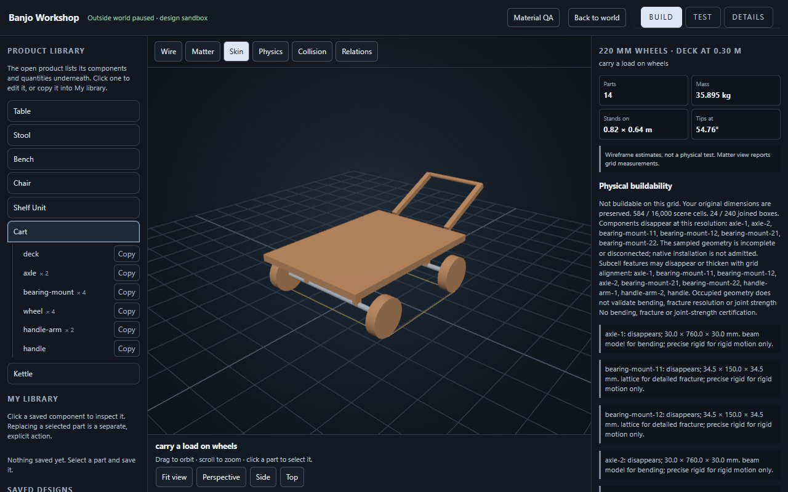

*The cart in the Workshop (`/world?workshop=1`). Its report lists what the
rooms' 40 mm cells cannot hold: both 30 mm axles and all four bearing mounts
disappear. So in the world the cart is not made of cells but of exact bodies
on pins (see [Joints, machines and energy](#joints-machines-and-energy)).*

- **Different cell sizes in one world: not built.** The scene format, the
  engine's scene builder and the renderer all assume one size. This is what the
  Workshop's finer designs need: at 40 mm the cart's axles vanish, at 20 mm it
  resolves in 6,440 cells, and at 10 mm it needs 50,408, three times what a
  room may hold.
- **Workshop designs** can use 5-200 mm cells, but a design put into a room is
  rebuilt at the room's cell size.
- **Exact bodies** ("precise rigid") are compounds of boxes and cylinders with
  no cells, each part of its own material, and they can be joined by real pins.
  They cost nothing in the cell budget and share rooms with ground, water and
  bodies made of cells. But they cannot break, dent or heat, water does not
  hold them up yet, and a break that would need one inside the lattice run is
  declined.
- **Not built:** a cell size per object, refining an object's cells when it is
  about to break, dormant regions that wake when touched, scenery that costs no
  cells, and sparse storage for large worlds.

### Materials

The eight materials are glass, ceramic, ice and concrete, which are brittle
(whole, then broken), and iron, aluminium, oak and rubber, which have a yield
point (200, 276, 45 and 6 MPa) and can dent before they break. A bond's
stiffness comes from the material's Young's modulus, the strain at which it
fails from the material's strength in tension, compression and shear, and the
strain at which it yields from the yield strength.

What that produces, for a 100 mm ball of each dropped onto a concrete floor
([docs/api/materials.md](docs/api/materials.md)):

| Material | dents above | breaks above | bounces back |
|---|---|---|---|
| iron | 14.2 m/s | 35.6 m/s | 14.5% of the drop |
| aluminium | 26.4 m/s | 47.8 m/s | 15.9% |
| oak | 10.4 m/s | 13.7 m/s | 16.0% |
| rubber | 29.0 m/s | 100.7 m/s (never broke in the tests) | 32.6% |
| glass | brittle | 8.7 m/s | 17.5% |
| concrete | brittle | 0.7 m/s | |
| ice | brittle | 2.3 m/s | 22.3% |
| ceramic | brittle | 264.8 m/s | 14.9% |

Ceramic's figure is probably too high: ceramic and ice still carry strain
multipliers (5-12 times) of the kind that were removed from glass as wrong.

| Before | After |
|---|---|
|  | 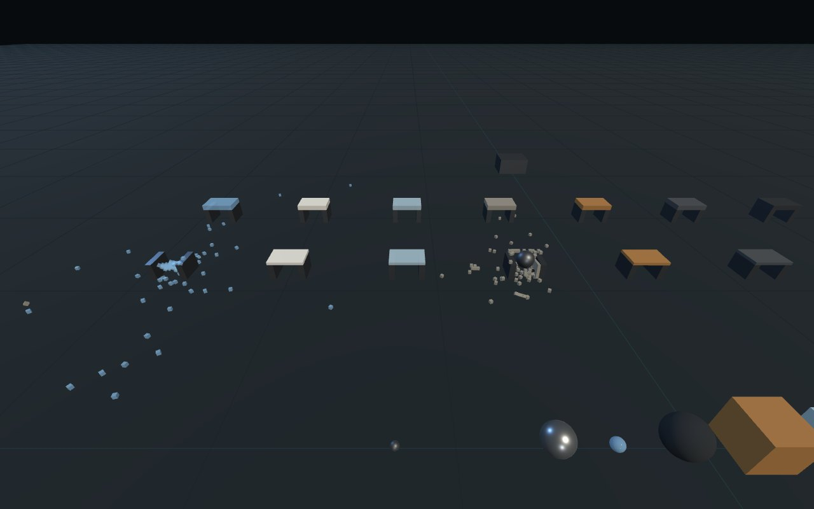 |

*In `/world?scene=bench` (20 mm cells), the same 120 mm iron ball was let go
1.5 m above three 20 mm plates in turn: glass (front row, left), concrete and
oak (front row, fourth and fifth). The glass and the concrete break; the oak
holds.*

| Behaviour | Status |
|---|---|
| Bond failure by strain; yielding and denting | World |
| Friction, bounce (restitution) and rolling resistance | World; rolling resistance also depends on the ground (rock 0.001, soil 0.06, sand 0.30) |
| Strength lost to heat (oak, iron, concrete) | World |
| Internal damping and random strength variation | Code only: in the catalogue but switched off in the world |
| Wood grain (oak's anisotropy) | Not built in the world: declared in the catalogue and never read. Directional laws exist only in the older solver and the continuum reference |
| Full (J2) plasticity with hardening | Code only: a reference solver; the world's plasticity is along each bond only, with no hardening |
| Material QA: 96 impacts across all eight materials | Page (`/qa`) |

Numbers come from the catalogue and are not calibrated; several are labelled
demonstration values in the source.

### Heat, fire and thermodynamics

Every body carries a thermal lump: a surface layer over a core. Heaters,
conduction between touching bodies, radiation (to each other and to the sky)
and convection to the air move heat between lumps, and one ledger accounts for
every joule. A body's contents are an inventory, not a flag: oak is 0.88 dry
wood, 0.10 moisture and 0.02 ash, and declared reactions turn what is there into
something else. Wood dries, then burns at the rate oxygen reaches it, so how
long a log burns follows from its fuel and its surroundings.

Heat also changes the mechanics. Each material with a heat law (oak, iron and
concrete, using the Eurocode fire-design curves) loses strength and stiffness
as it warms, oak chars from 300 °C, and the bonds of a heated body are weakened
by the same factors, so a hot beam breaks at a lower load. Burning removes
matter: oak recedes about 0.4 mm a minute from every face, and a body that
burns through leaves the world as ash. A gas sealed in a cylinder pushes on its
piston with pressure times area, and is charged exactly the work that push
does.

| Start | 100 s later | The Room tab's Heat panel |
|---|---|---|
| 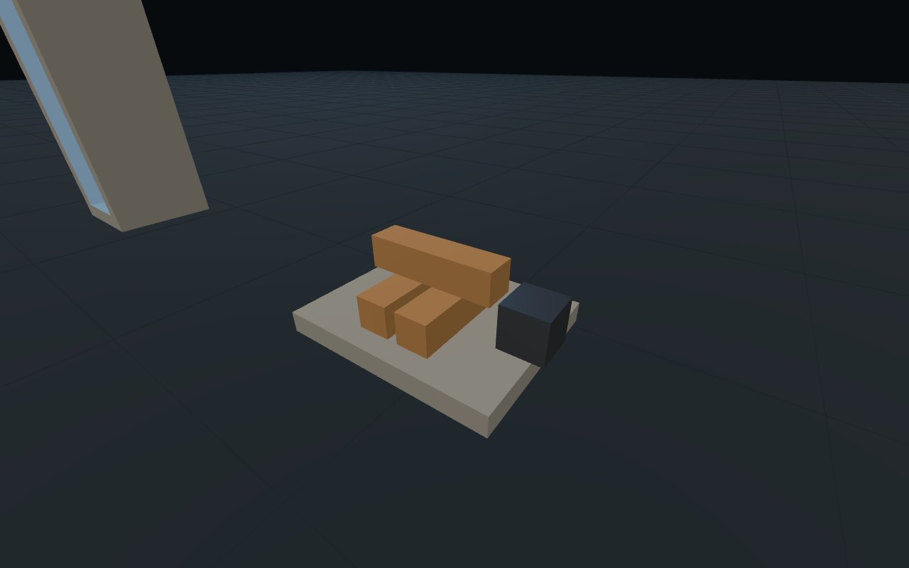 | 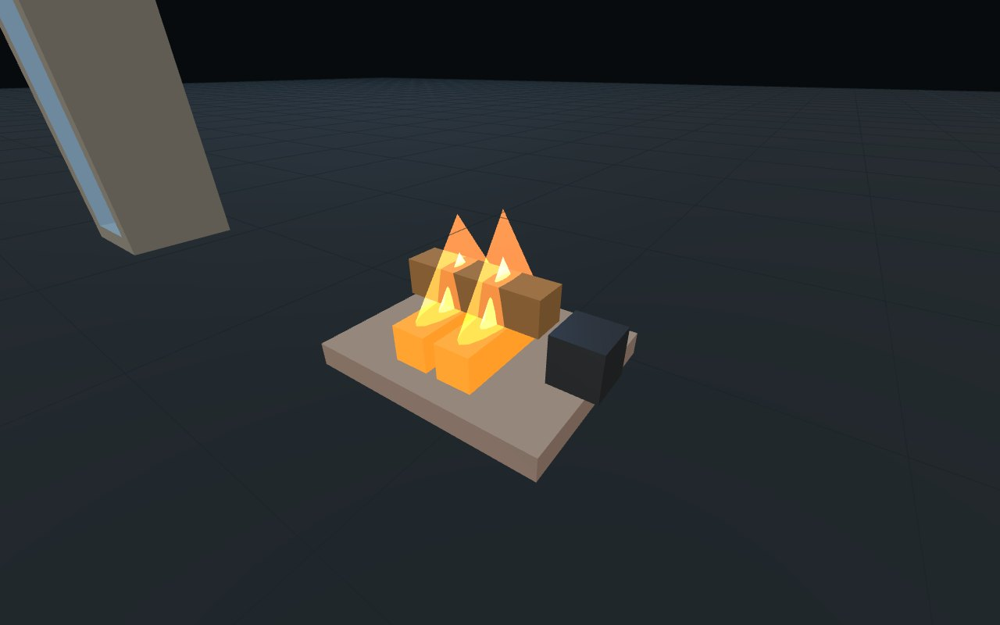 | 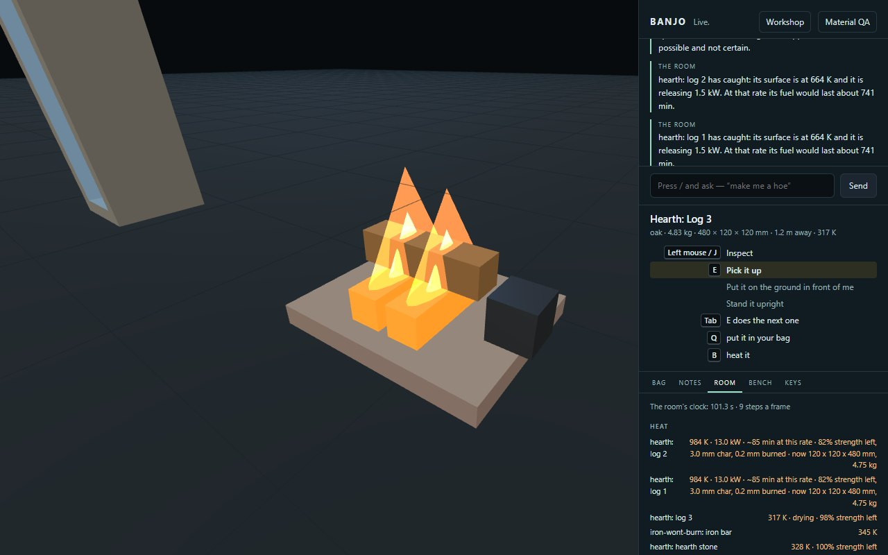 |

*The hearth in `/world?scene=tests-motion`. After 100 s the two lower logs have
caught: each is at 984 K and releasing 13 kW, with 3 mm of char and 82% of its
strength left. The log across them is still drying at 317 K. The glow and the
flames are only pictures of the engine's numbers: the glow follows a log's
temperature and the flame's height its power, and a drawn flame warms
nothing.*

Ice melts. While a body has ice in it, it is never warmer than 273.15 K: the
heat that would take it higher melts exactly as much ice as that heat can, at
333.55 kJ a kilogram, with nothing added and nothing lost. The block shrinks
from every face by what melted, weighs what is left, and its meltwater runs
into the room's water under it, or off across the floor where there is none.
Ice cannot be at a warm room's temperature, so it is followed from the moment
it is in the world, at its melting point, and the room's own air and floor melt
it slowly (a 200 mm cube loses about a quarter of a gram a second).

| Start | After 60 s of heating | The Room tab's Heat panel |
|---|---|---|
| 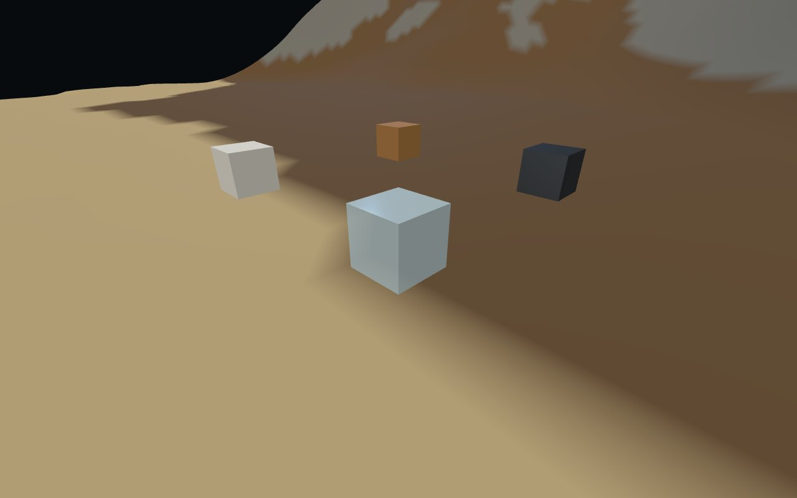 | 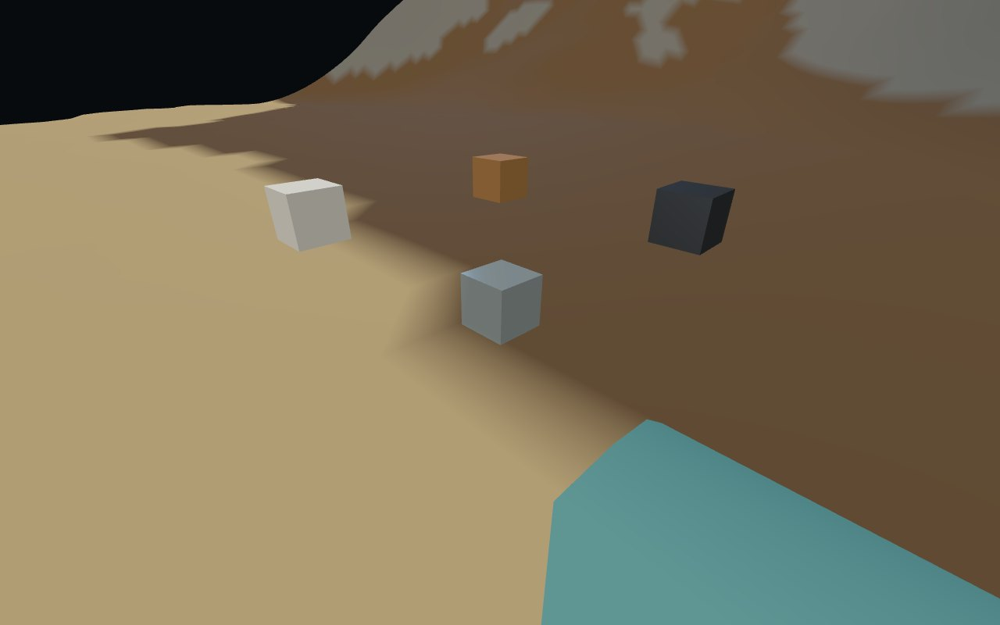 | 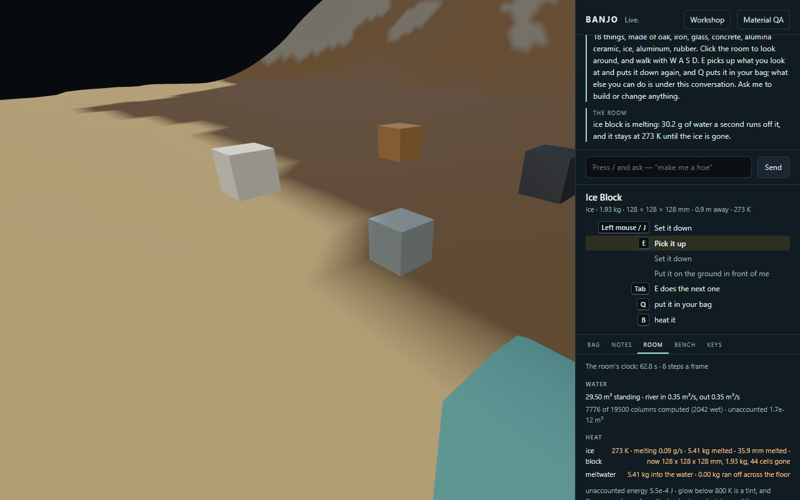 |

*The ice block in the Explorer's valley, opened on the room page
(`/world?scene=explore`) and heated with **B** three times: 30 kW for 60 s. It
stayed at 273 K throughout, 5.41 kg of its 7.34 kg melted -- 1.8 MJ over
333.55 kJ/kg -- and it is now 128 mm across. Its meltwater ran downhill and
pooled below it (lower right): 5.41 kg into the valley's water, whose ledger
still closes.*

| Capability | Status | How to try it |
|---|---|---|
| Heating, conduction, radiation, energy ledger | World | aim at something and press **Heat it** (B), 10 kW for 60 s; the Room tab's Heat panel shows temperatures, power and the ledger |
| Burning wood | World | the hearth's logs burn from the start; heat any oak |
| Strength lost to heat; oak chars at 300 °C | World | heat a plank; the panel shows the strength left and the char depth |
| Burning away: objects shrink as they burn | World | keep heating a log |
| A heated peg or pin giving way | Chat | ask for a fixing made of a named member, then heat it (about 50 s under 2 kW) |
| Gas in a cylinder pushing a piston | Test room, Chat | `/world?scene=tests-motion`: heat the piston |
| Heat kept by things in the bag | World | a thing in the bag is kept exactly as it was put away: its surface and core do not even out, and nothing reacts in it |
| Ice melting: it stays at 273 K while it melts, shrinks from every face, and its meltwater runs into the room's water | World | heat an ice block (B): 10 kW melts 30 g a second. The Explorer's valley has one: `/world?scene=explore` |
| Freezing | Code only | only in a separate voxel thermal simulation (`SparseThermalWorld`, `EnthalpyLaw`) with no link to the world's heat, whose lab panel is hidden; nothing in the world is colder than ice yet |
| Small thermal experiments | Code only | `banjo_thermal_experiment_cli` |
| Circuit heat, manufacturing heat | Code only, Page | machine circuits; the manufacturing page's station heat |

**Not built:** freezing or boiling in the world; fires that go out; thermal
expansion; smoke, flame gas and airflow; heat into water or into the ground (a
burning log in the river keeps burning, and ice floating in it melts only from
the air); friction, impact, cutting or motor work turning into heat; gas
pressure on a container's walls.

### Water

The valley's ground is generated once by drainage and erosion, then kept.
Water is a depth-averaged shallow-water solver that computes only wet tiles and
a ring around them: a lake at rest stays exactly at rest, wet and dry edges move,
and mass is conserved to rounding. Bodies float, drift and dam the flow through
their displaced volume and drag, and the drag pushes back on the water: oak
floats 70% under, and a dam block carries the pressure difference across it to
the newton. When the chat dammed the river with nine concrete blocks, the water
behind it rose from 29.5 m³ to 36.2 m³ in 69 s while the outflow fell from 0.35
to about 0.22-0.25 m³/s. Beyond the valley's edges, rivers continue as a coarse
network of reaches, junctions and lakes, so damming the valley fills a
reservoir upstream.

| Carried to the river | 8 s after letting go |
|---|---|
| 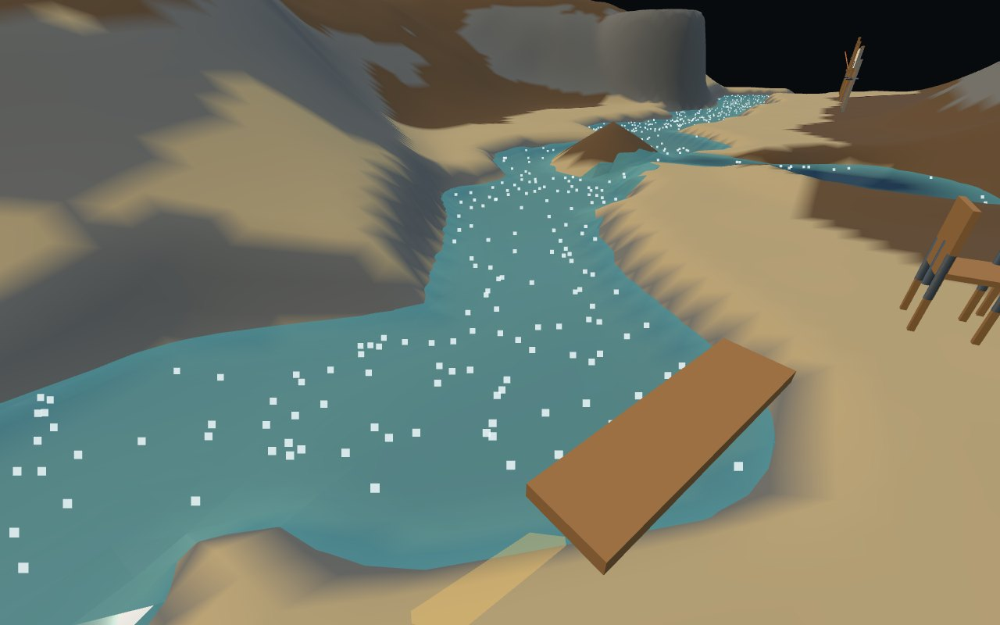 | 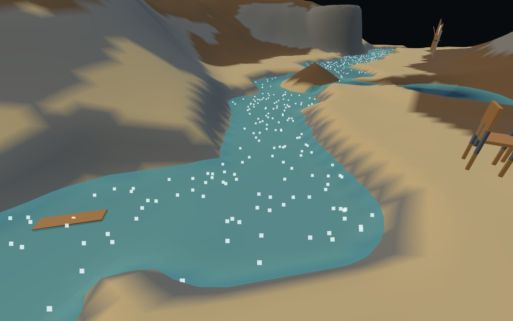 |

*An oak plank in the main world, carried to the river and let go over the
water. It floats, and the current carries it downstream.*

| Capability | Status | How to try it |
|---|---|---|
| River and pond | World | the valley under `/world` (also `/explore`, where the water is drawn but not updated) |
| Floating, drag and dams | World, Chat | drop things in the river; ask the chat to "dam the river with stone blocks" |
| Rivers beyond the valley: reservoir, reaches, a confluence and a lake | Test room | `/world?scene=watershed`; dam the river and watch the reservoir fill |
| Changing the river's flow | Chat | the chat's `set_river` |

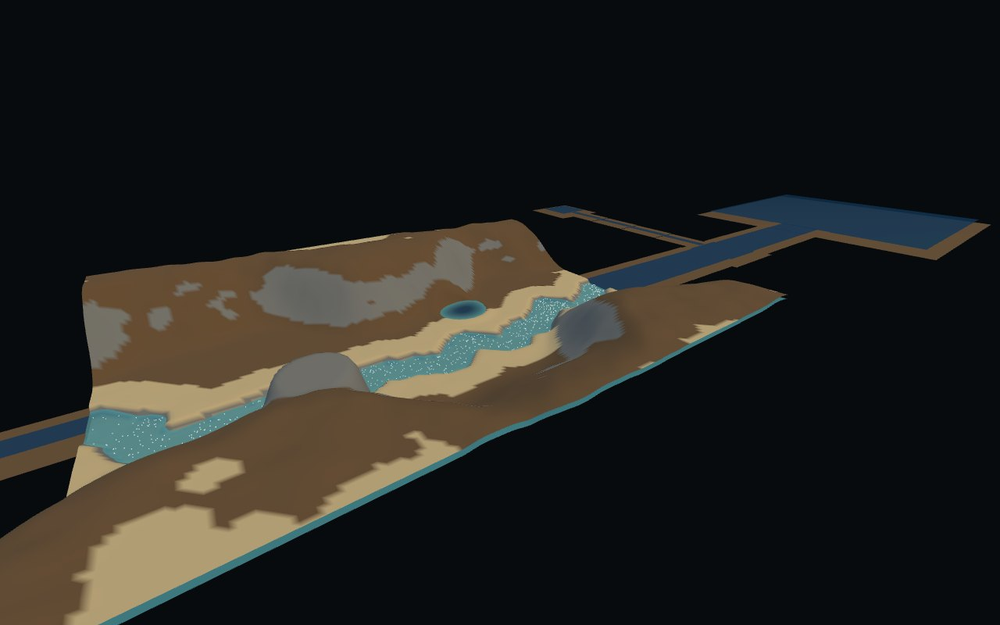

*`/world?scene=watershed`. The valley's river is simulated in detail; the flat
blue strips beyond its ends are the coarse network, running upstream to a
reservoir (left, out of the picture) and downstream to a lake (top right).*

**Not built:** waves and wakes; sediment moving while you play; rain,
infiltration and evaporation; wet soil; water and heat affecting each other;
switching regions between coarse and detailed simulation as you walk.

### Ground

The ground is columns of rock, soil and sand. After an edit, only the columns it
disturbed are checked for stability (Mohr-Coulomb friction, and Terzaghi's
critical height for cohesive soil): a sand pit settles to its angle of repose,
a 0.5 m soil trench stands and a 1.6 m one caves in, and what stood on the
ground falls in. Digging one pit rechecked 65 columns, rebuilt 1 of 20 ground
colliders in 0.05 ms and woke nothing else, so the cost follows what changes,
not the size of the world. What you dig is carried, and heaping it puts back
exactly what came out.

| Before | After one dig | The side panel |
|---|---|---|
| 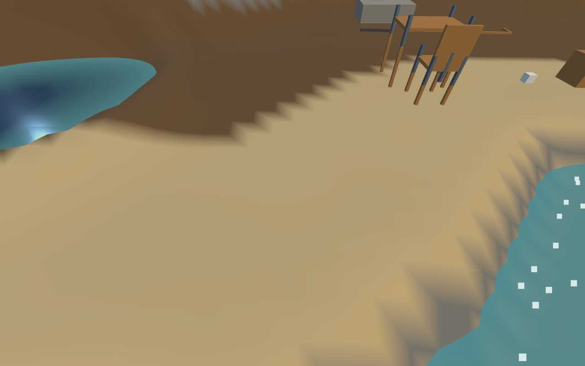 | 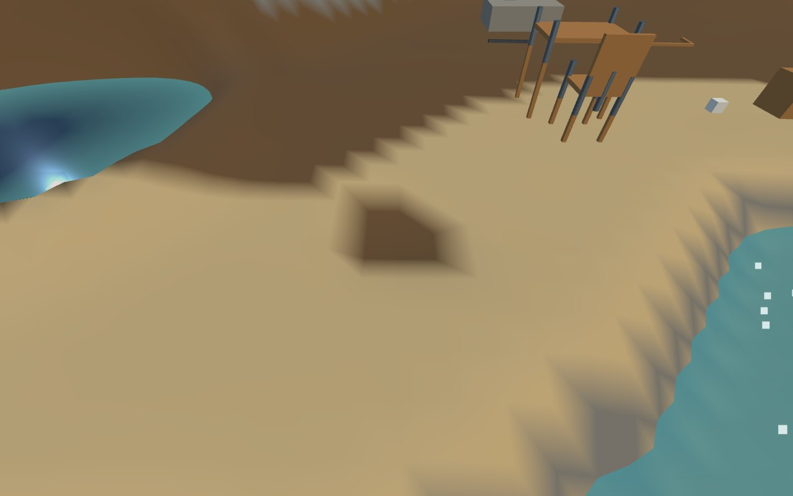 | 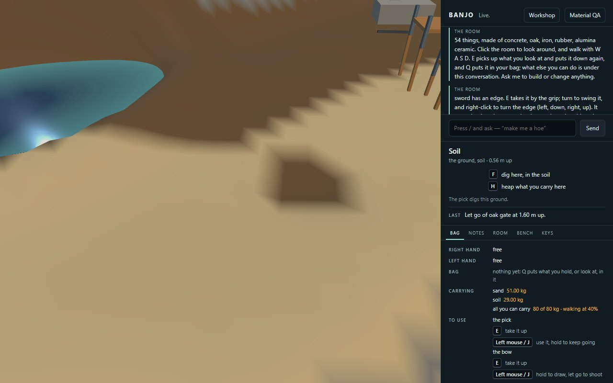 |

*One **Dig here** (F) on the main world's river bank. The panel then reads
51 kg of sand and 29 kg of soil carried: 80 of the 80 kg a person can carry,
so walking slows to 40%, and a second dig is refused.*

| Capability | Status | How to try it |
|---|---|---|
| Digging and heaping, with slumping | World | **Dig here** (F) and **Heap here** (H) |
| Digging with a pick: swing and pry | World | take up the pick with E, swing with the left mouse |
| Carrying what you dig (80 kg budget shared with what you hold) | World | dig, then look at the bag |
| Filling and cutting out blocks | Chat | the chat's `fill` and `cut_block` |
| Storing dug sand and soil | Page | `/fabrication` |
| The ground kept across reloads and restarts | World | automatic |

**Not built:** breaking rock (a pick stops on rock, or says the case is not
supported), wet soil, tool wear, and landslides that rotate rather than slump.

### Joints, machines and energy

Mechanisms are joints, not animations. A door opens because you push it off its
pin's line; a bow shoots because its limbs store energy, with no bow code
anywhere. Joints are held by name, so a pin whose post is smashed follows the
piece it ends up in.

| Before | After |
|---|---|
|  | 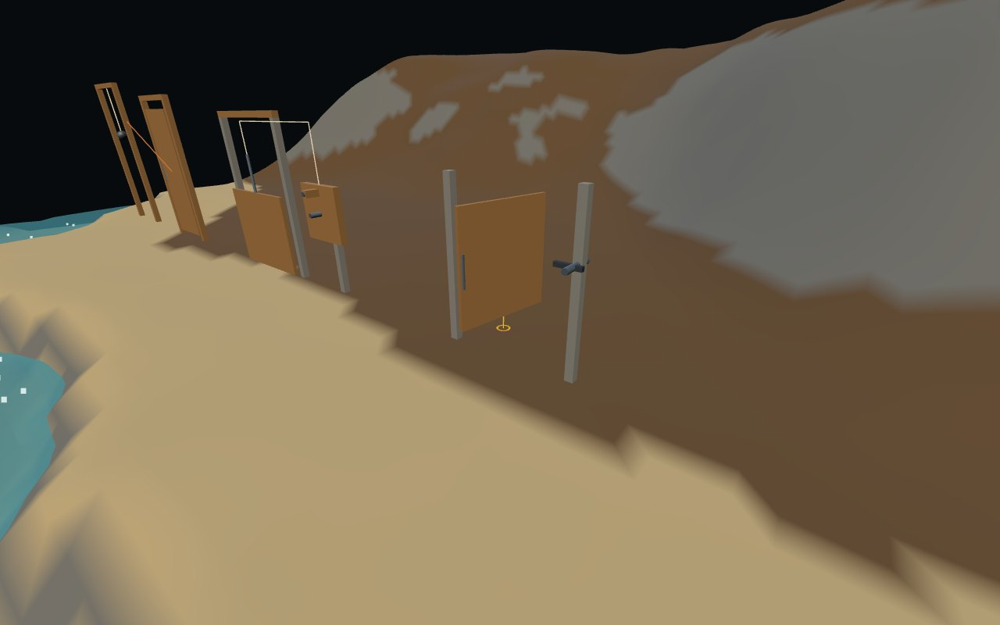 |
| 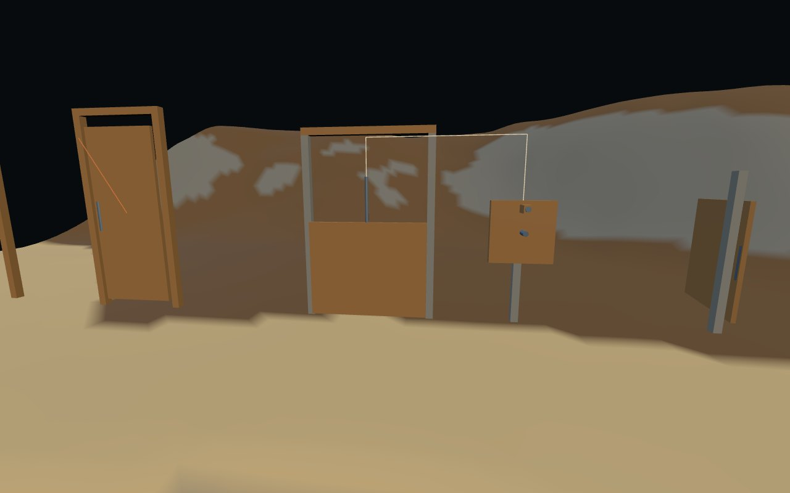 | 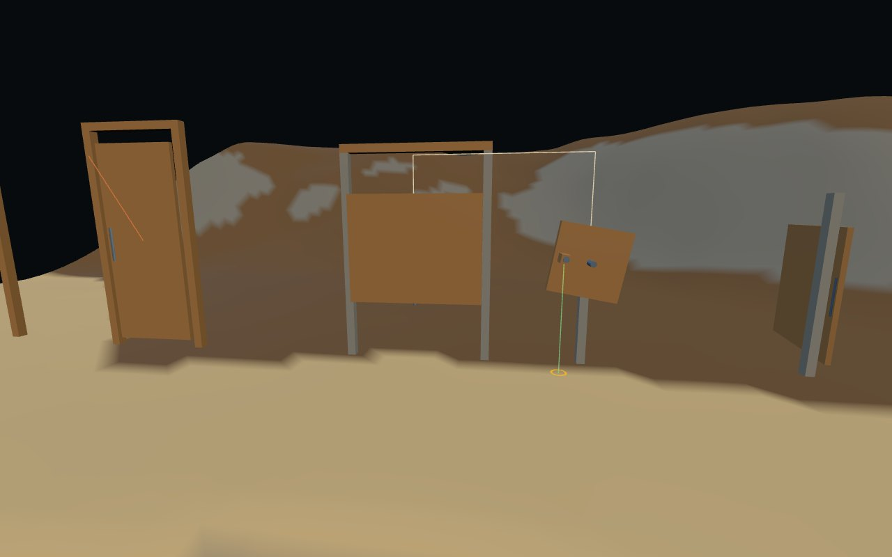 |

*Top: the latched gate in the main world, before and after releasing its latch
and choosing **Open the gate**; the hand pushes the leaf round its hinge pins.
Bottom: **Raise the portcullis**; the hand turns the winch, the rope winds on,
and the portcullis rises in its frame.*

| Before | After | The Room tab's Machines panel |
|---|---|---|
| 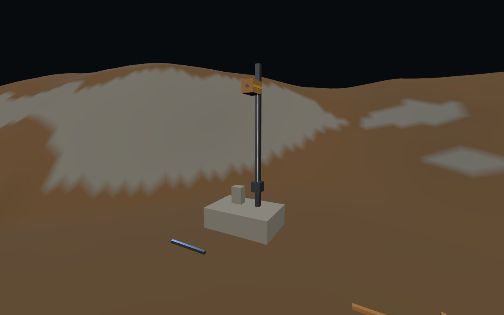 | 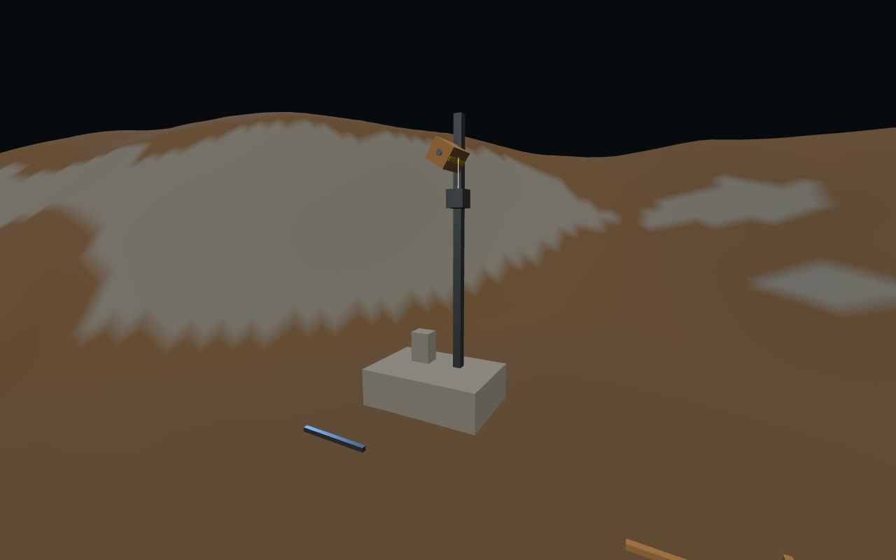 | 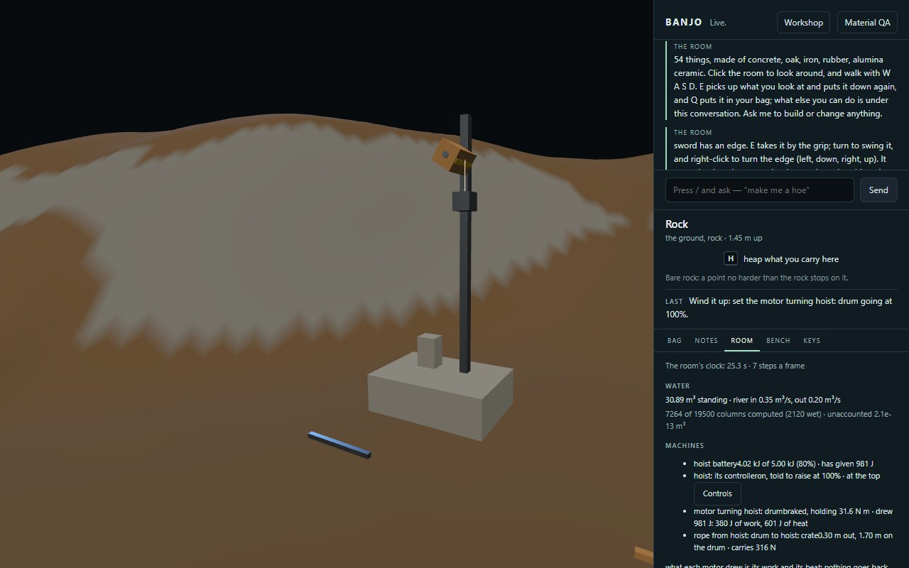 |

*The battery hoist: **Wind it up** (E on the drum) lifts the crate up the mast.
The panel accounts for every joule: the motor drew 981 J from the battery, of
which 380 J became work and 601 J heat, and the rope now carries 316 N.*

| Before | After |
|---|---|
| 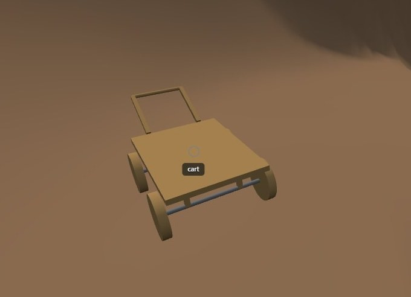 | 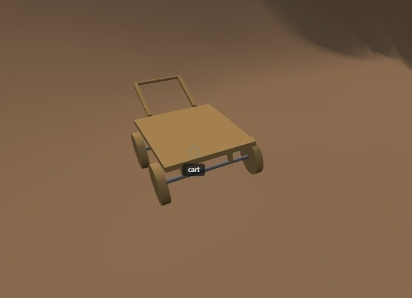 |

*The cart in the Explorer is three exact bodies, a chassis and two wheelsets
(an iron axle through oak wheels), on two free pins. **J** pushes it and it
rolls: when the cart was added, a push moved it 0.404 m while its wheels turned
145 degrees, which is 0.405 m of rim, so it rolls rather than slides.*

| Before | After |
|---|---|
| 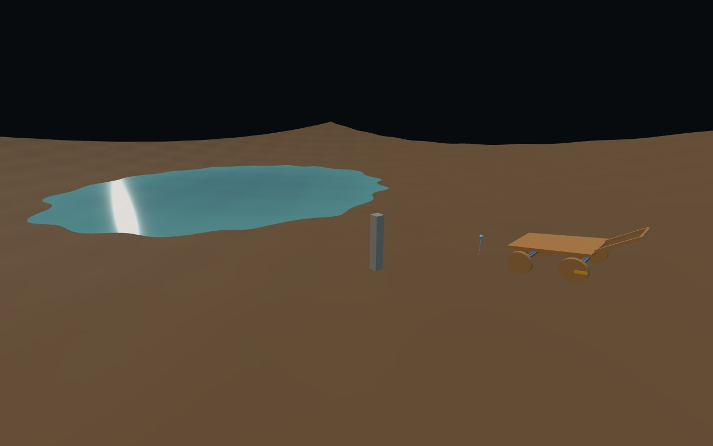 | 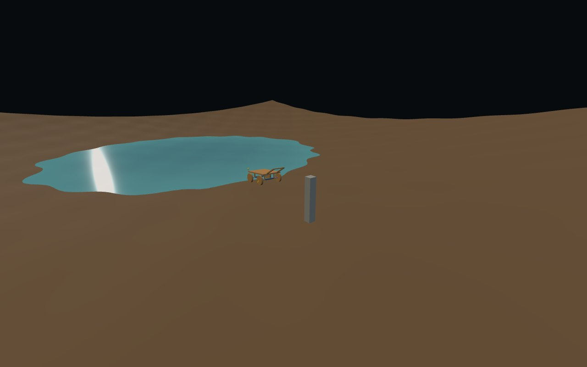 |

*A cart that drives itself (`/world?scene=tests-cart`): the same cart, with a
24 V battery in its chassis, a motor with a brake on its back wheels, and a
controller whose water sensor looks at the ground 0.6 m in front of the deck.
E on the cart opens its panel, and **On** then **Forward** send it down the
shore. The sensor is the bead on a thread; it turns amber when the water under
it is more than 10 mm deep, and the controller brakes. In the engine it went
6.0 m in 5.2 s and stopped with its front wheels 0.13 m short of the water.
Going downhill the motor mostly held it back: the battery gave 26 J, the
motor's work was -83 J, and 110 J became heat.*

| Capability | Status | How to try it |
|---|---|---|
| Hinges, slides, rope links, pulleys, latches (fixings), springs | World | the gate, door, bell, portcullis and winch; the bow's limbs |
| Fixings that fail in tension or shear | World | the arrow's nock; stacked or heated loads |
| Drum, DC motor, battery and brake | World | the hoist: E on the drum, or its Operate panel |
| Every joule of a machine accounted for | World | the Room tab's Machines panel |
| Wheels on pins: a product made of exact bodies | World (`/explore`) | the cart: J pushes it, Q puts all of it in the bag and it comes back whole |
| A machine that stops itself by what a sensor reads | Test room (`/world?scene=tests-cart`) | E on the cart, **On**, **Forward**: its water sensor stops it at the lake's edge |
| Electrical and thermal circuits | Code only | the MCP's standalone world, the C API, `examples/authoring/circuit_drive.py`; the room refuses them |

**Not built:** gears; charging batteries; motor heat that warms anything;
hinges with a strength; joints that fail by bending or prying; a bearing's
strength along its axis; the rest of the self-driving cart, which is a bump
sensor, roaming, and finding a charging post and docking at it
([machine-world.md](docs/machine-world.md)).

### Hands, tools and handling

Every control is a bounded hand, never a velocity: 800 N of pull, 60 N m of
wrist, and a 2 kg moving mass of its own, so it can lift at most 73 kg. A throw
is the hand's force over the hand's stroke, so a light ball leaves faster than
a heavy one.

| Looking at it | Holding it |
|---|---|
| 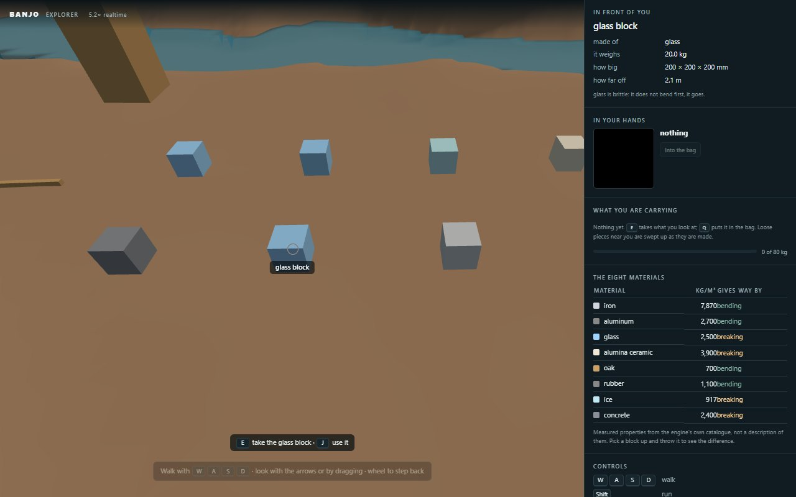 | 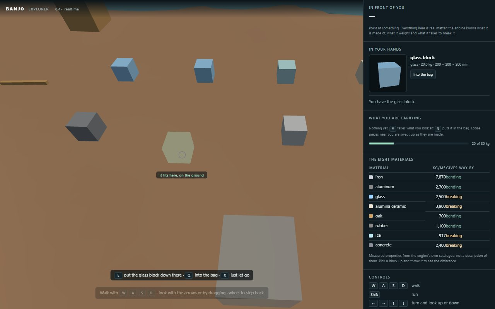 |

*The Explorer (`/explore`). Looking at a block, the panel shows what the engine
knows about it: glass, 20.0 kg, 200 × 200 × 200 mm, 2.1 m away. After **E**
it is in your hands, a see-through copy shows where **E** will put it down
(the engine has checked that it fits), and the carrying bar counts its 20 kg
against the 80 kg limit.*

| Capability | Status |
|---|---|
| Pick up, carry, put down with a checked preview, the bag | World (and `/explore`) |
| Throwing, the bow, swinging a sword, a pick | World |
| One saved "Use" per product (left mouse or J) | World (and `/explore`) |
| A thing of several parts taken up whole, its moving parts still moving | World: the mace and the cart in `/explore`, and `/explore?scene=tests-carry` |
| Two hands | Not built; the second hand is planned as a powered gripper |
| Declared grip and use points | Not built: they are stored but never read; the hand holds wherever you point |

### Other solvers and experiments in the repository

A lot of the physics code is research that did not become the world's path:

- **The older "network" solver** (`src/platform/NetworkWorld`): deformable cell
  networks with per-object resolution and directional (grain) materials. Its
  fracture does not converge.
- **Fracture solvers tried for speed**: implicit Newton/GMRES, a modal basis, a
  quasi-static solve (its static solver is reused for breaking under load), a
  GPU (CUDA) lattice, and three algorithms, of which 1 and 2 were not adopted
  and are not on `main`.
- **Reference solvers**: cohesive interfaces, tetrahedral contact, a coupled
  sphere-and-mesh contact reference, continuum pressure with J2 plasticity, and
  orthotropic elasticity.
- **The separate voxel thermal world** with melting and freezing (melting,
  since 22 September, is in the world itself).
- **Desktop applications**: the original ball lab (`banjo_lab`), the bowl lab,
  the creator workshop and the starter game (raylib).

Each needs a decision: bring it into the world, keep it as a reference test, or
archive it. They are listed on the [to-do list](#1-get-what-is-built-into-the-world).

---

## Try it

### What you need

- **CMake 3.25 or newer and a C++23 compiler**: Visual Studio 2022 on Windows,
  where Banjo is developed, or GCC 12+ / Clang 16+ on Linux, where CI builds
  it. macOS is not built or tested. Before CMake 3.27, the first build stops
  once and asks you to configure again.
- **Python 3**, with nothing to install. CMake uses it to check the build's
  floating-point settings, and the server, the MCP servers and the Python
  binding use only its standard library.
- **Git and network access for the first configure.** CMake downloads Jolt
  Physics v5.6.0 and nlohmann/json (and raylib 6.0 for the desktop lab).
- **An OpenAI API key, only for the chats** (the room's, the lab's and the
  Workshop assistant) and the model-graded QA. Put `OPENAI_API_KEY=...` in a
  `.env` file at the repository root; `OPENAI_MODEL` changes the model from
  the default `gpt-5-mini`. Everything else runs without a key.
- **Chrome**, only for the browser tests.

### Build

The world needs four programs: `banjo_c` (the shared library, `banjo.dll` or
`libbanjo.so`), `banjo_live_world_run` (the world's engine),
`banjo_platform_cli` and `banjo_network_lab` (the desktop studio). The older
lab and QA pages need more of them; build without `--target` to get
everything.

Windows:

```powershell
cmake -S . -B build/integration -G "Visual Studio 17 2022" -A x64 -DBANJO_BUILD_LAB=ON
cmake --build build/integration --config Release --parallel 8 --target banjo_c banjo_live_world_run banjo_platform_cli banjo_network_lab
```

Linux, the way the container builds it:

```bash
cmake -S . -B build/linux -G Ninja -DCMAKE_BUILD_TYPE=Release -DBANJO_BUILD_LAB=OFF -DBANJO_BUILD_HEADLESS=ON -DBANJO_BUILD_PRECOMPUTE=OFF -DBANJO_BUILD_TESTS=OFF
cmake --build build/linux --parallel 2 --target banjo_c banjo_live_world_run banjo_platform_cli
```

(Two compile jobs on purpose: one per core ran an 8 GB build machine out of
memory.)

### Run

The server looks for the engine in `build/win-joint-double/Release` unless you
tell it otherwise, so point it at your build:

```powershell
python playground/server.py --port 8765 --engine build/integration/Release/banjo_platform_cli.exe --studio build/integration/Release/banjo_network_lab.exe
```

```bash
BANJO_LIBRARY=$PWD/build/linux/libbanjo.so python3 playground/server.py --port 8765 --engine build/linux/banjo_platform_cli
```

It listens on `127.0.0.1` only and keeps its rooms in
`build/playground-rooms/<port>`. Open `http://127.0.0.1:8765/world`.

| Address | What it is |
|---|---|
| `/world` | the main world, with the chat and the side panel |
| `/explore` | the newest interface: the valley with a block of each material, five pieces of furniture, a mace and a cart. It rebuilds the valley on every load. `/explore?scene=tests-carry` opens the carrying test room in it |
| `/world?workshop=1` | the Workshop: design one product at a time and test it on a bench |
| `/world?scene=<room>` | any of the rooms below |
| `/fabrication` | manufacturing from finite stock |
| `/qa`, `/mechanics-qa`, `/tool-qa` | material, mechanism and tool test suites with 3D replays |
| `/` | the older lab: the fracture lab and its live stage |

### The rooms

| Room | Cell | Reached by | What to try |
|---|---|---|---|
| `world` | 40 mm | menu | nearly everything: breaking, burning, water, digging, joints, the hoist, the bow, the sword, the pick |
| `expedition` | 40 mm | menu | gather stone and wood, build a dryer, dry timber (a bookkeeping model, not native physics) |
| `explore` | 40 mm | `/explore` | a block of every material, furniture, a mace on its chain and a cart on pins; picking up, placing, using |
| `bench` | 20 mm | address | plates of all eight materials, 20 and 40 mm thick, on piers: break them |
| `armoury` | 10 mm | address | cutting a rope, a panel and a loaded batten with a sword |
| `courtyard` | 40 mm | address | gate, portcullis with counterweight, chain, a shelf that breaks under load |
| `tests-gates` | 40 mm | address | hinges, a castle gate on a winch, a capstan |
| `tests-ropes` | 40 mm | address | ropes, pulleys, a pendulum, springs, the bow, cutting |
| `tests-motion` | 40 mm | address | breaking, denting, bouncing, sliding, burning, a gas piston |
| `tests-machines` | 50 mm | address | a motor, drum, battery and brake |
| `tests-carry` | 40 mm | `/explore?scene=tests-carry` | a mace, a table and a chair, each taken up whole |
| `tests-cart` | 50 mm | address | a cart with a battery and a motor that drives down a shore until its water sensor stops it |
| `watershed` | 40 mm | address | rivers beyond the valley; dam one and watch the reservoir fill |
| `valley` | 40 mm | address | the valley and its river, empty: dig, dam, float things |
| `clearing` | 40 mm | address | dry soil and bare rock, for digging and for tools |
| `yard` | 40 mm | address | a flat, empty yard for the chat to build in |
| `fabrication` | 40 mm | `/fabrication` | where manufactured parts are placed |

### Controls on `/world`

| Key | Does |
|---|---|
| W A S D, mouse | walk and look |
| E | pick up what you look at, or do what the side panel marks with E; with something held, put it down where the see-through copy shows |
| Tab | move E to the next action |
| Q, 1-9 | put it in the bag; take a bag slot into the hand |
| Left mouse (hold, release) | wind up and throw; draw and loose the bow; swing a sword or a pick |
| J | use the thing you hold or look at for what it is for |
| Right mouse | lower, let down, pry with the pick, or turn a sword's edge |
| R | release a latch |
| F, H, B | dig here, heap here, heat it |
| Space, Shift+Space | up and down |
| / | talk to the room's chat |

On `/explore`: W A S D walk, drag or the arrow keys look, E takes or puts down,
J uses a thing, Q bags it, G sweeps up loose pieces, X lets go, and the mouse
wheel pulls the camera back.

### Use the engine from a program

```c
#include "banjo/banjo.h"
#include <stdio.h>

int main(void) {
    banjo_world *w = banjo_open(
        "{\"bodies\":["
        " {\"name\":\"pane\",\"shape\":\"box\",\"material\":\"glass\","
        "  \"dimensions_m\":[0.3,0.02,0.3],\"center_m\":[0,0.01,0]},"
        " {\"name\":\"ball\",\"shape\":\"sphere\",\"material\":\"iron\","
        "  \"dimensions_m\":[0.1,0.1,0.1],\"center_m\":[0,10.0,0]}]}",
        0.02);                                    /* 20 mm cells */
    if (!w) { fprintf(stderr, "%s\n", banjo_last_error()); return 1; }
    for (int i = 0; i < 600; ++i) banjo_advance(w, 1.0 / 120.0, 0.003);
    printf("%d bodies now\n", banjo_body_count(w));  /* more than two if it broke */
    banjo_close(w);
    return 0;
}
```

The floor is at y = 0, so the pane lies on it and the ball falls about 10 m,
arriving at 14 m/s. The pane breaks, and on Windows this prints `15 bodies
now`. Dropped from 3 m instead, the pane holds and it prints 2.

Build against an installed library (`cmake --install build/linux --prefix
/somewhere`, then `cc drop.c -I/somewhere/include -L/somewhere/lib -lbanjo`), or
use `find_package(Banjo)` and link `Banjo::banjo_c`. From Python, with the same
scene as a dictionary:

```python
import sys; sys.path.insert(0, "bindings/python")
from banjo import World

with World(scene, cell_size_m=0.02) as world:
    for _ in range(600):
        world.advance(1 / 120)
    for body in world.bodies():
        print(body.name, body.material, body.position_m)
```

The binding finds the library through `BANJO_LIBRARY`, or in
`build/integration/Release`, `build/Release`, `build` or `bin`. The full
reference is [docs/api/](docs/api/README.md).

### Give an AI model the tools

```bash
claude mcp add banjo -- python /path/to/banjo/mcp/banjo_mcp.py
```

`mcp/banjo_mcp.py` has 89 tools for building and running worlds;
`mcp/banjo_platform_mcp.py` adds the Workshop, material QA and physics trials,
for 115. Both speak MCP over stdio, need the built library, and call no model
themselves. See [docs/api/mcp.md](docs/api/mcp.md).

### Host it

The [Dockerfile](Dockerfile) builds the engine for Linux and runs the same
server on every network interface, which it refuses to do without
`BANJO_PASSWORD`. Set `BANJO_PUBLIC_HOST` to the one hostname it should answer
to, give it `OPENAI_API_KEY` as a secret, and mount a volume at `/data`.
[docs/deploy.md](docs/deploy.md) covers Fly.io and Render. The container builds
only the three programs the world needs, so the lab and QA pages do not work
there.

---

## How the system fits together

```text
 a person in a browser                            an AI model or agent
 /world  /explore  Workshop  lab and QA pages     (MCP over stdio)
          |  HTTP + JSON                                  |
          v                                               v
 playground/server.py  --- the room's chat --->  mcp/banjo_mcp.py        world tools
 one live world per server, rooms saved           mcp/banjo_platform_mcp.py  + Workshop
 to disk, the 1.1x realtime rule                          |
          |  JSON lines over stdin/stdout                 |  ctypes
          v                                               v
 banjo_live_world_run  ---------------------->  the engine (C++23), also built as
 (the world's engine process)                    libbanjo with a C API, ABI 25
```

- **The engine** is C++23. `LiveWorld`
  ([`src/fastlattice/LiveWorld.cpp`](src/fastlattice/LiveWorld.cpp)) runs the
  world: Jolt for rigid motion and joints, the cell lattice for breaking and
  denting, and the heat, water, ground and machine systems.
- **The C library** (`libbanjo`, [`include/banjo/banjo.h`](include/banjo/banjo.h))
  exposes the engine to any language that can call C. The Python binding
  ([`bindings/python/banjo.py`](bindings/python/banjo.py)) is plain ctypes.
- **The server** ([`playground/server.py`](playground/server.py)) holds one
  live world at a time. The world runs in its own process and is driven over
  JSON lines, so a crash in the world does not take the server down. Rooms are
  saved as they change and come back after a reload or a restart: moved,
  broken, dented and cut things, joint angles, the ground, heat, and what you
  carry. A saved world that cannot be restored whole is set aside, never
  deleted.
- **The pages** draw only what the engine reports; an object with cells is
  drawn as its cells, so a broken thing looks broken. The page steps the world
  against the real clock, about thirty times a second. With no page open, the
  world waits.
- **The chat and the MCP servers share one set of tools.** The room's chat
  (OpenAI's `gpt-5-mini` by default) builds in its own copy of the room using
  the MCP's functions, and the room is then reopened with everything the change
  did not touch kept as it was. A declared structure, such as a staircase or a
  ski jump, is measured before the chat may call it finished.
- **The Workshop** designs one product at a time, part by part with declared
  joints, and tests it on a bench of its own. A finished design can be placed
  in a room as one single-material solid, as single-material parts on ideal
  bearings, or as one exact body. The Explorer's cart was compiled from its
  design into exact bodies on real pins
  ([`playground/rigid_assembly.py`](playground/rigid_assembly.py)).

---

## Design rules

1. **Physics decides; names never do.** No pre-cut pieces, no shatter
   animations, no explosion impulses, and no rules like "iron + glass =
   shatter". Material, shape, state and a declared law decide what happens. A
   property the engine does not model is reported or refused, not faked.
2. **Real time, or refused.** Nothing may take more than 1.1 times the
   simulated time of the whole interaction, including settling. The server
   refuses such a job before it starts.
3. **Done means you can watch it in 3D.** A measurement or a passing test is
   not finished work until it can be seen in the world.
4. **Nothing resets.** A reload, a restart or a chat edit keeps everything that
   was not changed.
5. **One world, built by asking.** The world's contents are built through the
   chat and the same tools any program can use, not placed by hand. (The
   Explorer's valley is the exception so far: a script lays it out.)
6. **Simple controls, real physics.** A control is a bounded hand, never a set
   velocity.
7. **Knowledge unlocks plans; physics decides results.** Progress teaches a
   player what they can make. It never makes the same object stronger.
8. **Say what was measured.** Designed, implemented, experimental and
   validated are kept apart, with numbers and their conditions. A green build
   is not a validated material.

---

## To-do

Grouped by what it takes, roughly in priority order within each group. The
project's own checklist of 30 player capabilities
([progression/physics-capabilities.json](progression/physics-capabilities.json))
stands at 1 complete, 26 partial and 3 planned.

### 1. Get what is built into the world

- [ ] **Make `/explore` a full interface, or merge it into `/world`.** It
  cannot throw, heat, dig, chat, use a bow, blade or pick, or work a gate or a
  machine, and it does not animate the water. It rebuilds its valley on every
  load, so nothing done there is kept.
- [ ] **Put the test rooms' physics in the main world, or on the menu.** The
  menu shows 2 of 17 rooms. Breaking under load, the gas piston, fine cells for
  cutting, the plates of every material and the watershed can only be reached
  by typing an address.
- [ ] **Freezing in the world.** Ice melts in the world now; water does not
  freeze, and the water in rivers and pools has no temperature of its own. The
  separate voxel thermal simulation still has its own melting and freezing:
  bring its freezing across, or retire it, so there is one thermal model.
- [ ] **Circuits in the world.** They run in the engine and the standalone MCP
  world, but the room refuses them until room edits can keep their state.
- [ ] **Different cell sizes in one world.** The scene format, scene builder and
  renderer all assume one size. Needed for Workshop detail, thin parts and
  imported models.
- [ ] **Choose the fracture solver and failure law**, then integrate or archive
  the rest: the energy-scaled law, algorithm 3, the implicit, modal,
  quasi-static and GPU solvers, the network solver, the cohesive, tetrahedral
  and continuum references. Bring the GPU backend to the world if it is kept.
- [ ] **Turn on the material properties that are switched off:** internal
  damping and strength variation. Give oak its grain in the world's lattice.
- [ ] **Joint strengths.** The mechanism for a joint weaker than its material is
  built; the numbers are the owner's call.
- [ ] **Exact bodies that break, heat and float.** They share rooms with
  ground, water, joints and bodies of cells now, but they cannot break, dent or
  heat, water does not hold them up, and a break that would need one inside the
  lattice run is declined. A fixed group inside a product is one rigid
  compound, so its joints cannot give way.
- [ ] **Page controls for what only the chat or the protocol can do:** gas
  vents, filling and cutting ground, the river's flow, heat-weakened fixings,
  the rolling and material reports.
- [ ] **Manufacturing and storage in the world page** rather than on
  `/fabrication` alone.
- [ ] **Show the lab's hidden experiments or remove them.** The server still
  runs thermal, dynamic-material, continuum, material-state, thermal-frontier
  and network experiments, but the lab page has no way to reach them.

### 2. Physics still to build

- [ ] **Heat:** freezing and boiling in the world, fires that go out, thermal
  expansion, smoke and airflow, heat into water and ground, mechanical work
  (friction, impact, cutting, motors) turning into heat, gas pressure on
  container walls.
- [ ] **Water:** waves and wakes, sediment, rain and infiltration, wet soil,
  water putting out fire, containers and pouring, coarse-to-fine regions as you
  walk (watershed stages W4 onward).
- [ ] **Ground:** breaking rock (mining), tool wear, rotational landslides.
- [ ] **Machines:** gears, charging batteries, motor heat, hinges with a
  strength, joints that fail by bending or prying, bearings rated along their
  axis; the rest of the self-driving cart (a bump sensor, roaming, finding a
  charging post and docking), and bringing it into the main world.
- [ ] **Breaking:** calibration against laboratory data, converged piece
  counts, a failure path for thin parts, keeping a crack in a body that stays
  whole.
- [ ] **Scale:** a cell size per object, refining on demand, dormant regions,
  scenery without cells, sparse storage; beyond 16,000 cells a room and 2,000
  bodies.
- [ ] **Handling:** two hands, grip and use points.

### 3. Known defects

- [ ] **Using "Manufacture parts" locks the main world.** Once starting stock is
  set up for the world on `/fabrication?scene=world`, the server treats the
  world as a funded room and refuses the chat, heating, grabbing, throwing,
  sweeping and latch release. Because breaks cannot be answered there either, a
  hard hit would stop the world's clock, and "Start the room again" no longer
  resets it.
- [ ] Bonds reach across a one-cell gap (`buildBonds`, `src/matter/Lattice.cpp`),
  so two sides of a slot are joined through it.
- [ ] A crack inside a body that stays whole heals on its next run. A fix is
  uncommitted on `agent/shard-rest`, waiting for the owner.
- [ ] The inventory's record of the hand can disagree with the engine after a
  put-down (`/explore` believes the engine and says so).
- [ ] A thing of several parts set down on a slope goes down as one upright
  shape. Where its feet span more than the engine's 6 cm look-down it is
  refused ("nothing under it to rest on"), and at that edge the preview
  flickers between fits and does not fit.
- [ ] Holding the cart counts only its 21 kg chassis against the 80 kg carrying
  limit; the bag counts all 43 kg.
- [ ] Open issues [#17 to #21](https://github.com/lrspeiser/banjo/issues): a
  curved skin sinks a part into the floor; a glass table skids and never
  breaks; the stool, chair and shelf cannot be simulated at 40 mm; declared
  joint weakening has no numbers; a loaded oak table chars through and never
  gives.
- [ ] Inertia is computed two ways that were never compared. A chat-built hoist
  once stopped itself, and the chat once buried a ball in the ground; neither
  was diagnosed.
- [ ] `playground/rooms/world.json` was made by a script that is not in the
  repository, so the main world cannot be rebuilt from source.

### 4. Before others use the code

- [ ] **A licence**, with a `NOTICE` for Jolt Physics (MIT), nlohmann/json
  (MIT), raylib (zlib) and three.js (MIT), plus `CONTRIBUTING.md` and
  `SECURITY.md`. The repository is public, and without a licence nobody may
  legally use it.
- [ ] **A green nightly run.** CI on `main` passed again on 21 September
  (cee3b8d), after failing or being cancelled on every run since 19 September.
  The nightly long-physics job has failed every night since 14 September.
- [ ] **A first build that works.** Make every script default to one build
  folder per platform (fifteen files point at `build/win-joint-double`), and
  make the desktop lab optional so a headless Linux configure works.
- [ ] **Docs that are current.** `docs/` has 201 files; 123 are dated
  checkpoint notes and 139 were last changed between 4 and 8 September. Several
  contradict the code (for example, `docs/building-on-banjo.md` says there are
  no joints and no saving). Move the history out of the way, keep a few current
  guides, document `/explore`, and remove the owner's local paths from
  `docs/evidence`.
- [ ] **Releases.** No tags or packages exist; the shared library is versioned
  4.0.0 while its ABI is 25; the Python binding and MCP servers are not
  installable; no minimum Python version is stated.
- [ ] **More platforms.** CI runs Ubuntu with GCC only. Add Windows, and macOS
  or say it is unsupported, and a test that builds a program against the
  installed library.

### 5. Before hosting it for other people

- [ ] **Accounts** instead of one shared password, with sessions that expire,
  rate limits and an audit log.
- [ ] **A world per person or group.** One server runs one world for everyone;
  a second tab takes it over, and opening `/explore` replaces it.
- [ ] **Chat cost controls.** Measured turns use 62,000 to 2.76 million input
  tokens, with no per-person budget, and the model is fixed to OpenAI.
- [ ] **Robustness.** A world process that stops answering blocks the server;
  unexpected errors close the connection without a reply; a chat turn holds the
  world for up to 420 s; logs and run folders are never cleaned up.
- [ ] **A real host.** The hosted copy on Render is on the free plan (0.1 CPU,
  512 MB, no disk): each deploy or idle spin-down deletes the rooms, and it runs
  a build from 18 September. [docs/deploy.md](docs/deploy.md) sizes a real host
  at 8 cores, 16 GB and a 10 GB volume.

### Decisions for the owner

The licence; the hosting plan; whether `/explore` replaces `/world`; which
fracture solvers to keep; joint-strength numbers; whether charred wood keeps a
little strength; and the uncommitted fixes on `agent/shard-rest` and
`agent/foresight-partner`.

### In progress on branches

- **`agent/journey-auto-placing`**: a stricter version of the browser
  journeys' put-down, which requires the see-through copy to appear by itself.

---

## Documentation

Most of `docs/` is a development log: a checkpoint note records one piece of
work as it stood that day. Where a note disagrees with the code, the code is
right. Start with these:

| Topic | Read |
|---|---|
| The C API and materials | [docs/api/README.md](docs/api/README.md), [c-api.md](docs/api/c-api.md), [materials.md](docs/api/materials.md) |
| The MCP tools | [docs/api/mcp.md](docs/api/mcp.md), [machine-networks.md](docs/api/machine-networks.md), [workshop.md](docs/api/workshop.md) |
| The live world and why it works as it does | [a-world-that-keeps-running.md](docs/a-world-that-keeps-running.md) |
| Heat, fire and strength | [thermal-mechanics.md](docs/thermal-mechanics.md), [thermochemistry.md](docs/thermochemistry.md) |
| Water and ground | [terrain-and-water.md](docs/terrain-and-water.md), [watershed.md](docs/watershed.md), [ground-work.md](docs/ground-work.md) |
| Machines | [machine-world.md](docs/machine-world.md), [machine-circuits.md](docs/machine-circuits.md) |
| Cutting and handling | [cutting-model.md](docs/cutting-model.md), [interaction-profiles.md](docs/interaction-profiles.md), [placement-and-interaction-points.md](docs/placement-and-interaction-points.md) |
| The Workshop and products | [workshop-mode.md](docs/workshop-mode.md), [product-framework.md](docs/product-framework.md) |
| Building from language | [building-from-language.md](docs/building-from-language.md) |
| Every mechanic and its evidence | [mechanics-scorecard.md](docs/mechanics-scorecard.md) |
| The pages and HTTP routes | [playground/README.md](playground/README.md) |
| Hosting | [deploy.md](docs/deploy.md) |
| The long-term plan | [project-master-plan.md](docs/project-master-plan.md), [roadmap.md](docs/roadmap.md) |
| What is not done | [what-is-not-done.md](docs/what-is-not-done.md) |

## Repository layout

```text
include/banjo/banjo.h      the C API (ABI 25)
src/
  fastlattice/             LiveWorld (the running world), the cell lattice, fracture
                           admission, exact bodies
  rigid/                   Jolt: rigid bodies, contacts, joints, the rope drum
  matter/  material/       cells cut from shapes; the material catalogue
  fracture/                bond failure, pieces, fragment geometry, statics
  thermo/                  heat, burning and strength loss in the world
  terrain/  water/         ground columns and digging; shallow water, rivers
  machines/                circuits
  capi/                    the C API
  numeric/                 the floating-point profile
  physics/ modal/ thermal/ world/ platform/ precompute/ prediction/
                           other solvers, references and older lanes
  sim/ viewer/ app/ creator/ core/ persistence/
                           desktop apps, command-line tools, shared helpers
bindings/python/           the Python binding
mcp/                       the MCP servers, and the Workshop and product model
playground/                the server, the pages and the rooms
tools/                     the world's engine process, builders, probes
scripts/                   build guards, QA runners, benchmarks
tests/                     C++ and Python tests, browser tests
progression/               the 30-item capability checklist
docs/                      design notes, API reference, checkpoint log, evidence
examples/                  a C example, the authoring client, physics trials
```

## Contributing

Read [AGENTS.md](AGENTS.md) first. In short:

- Check `git worktree list` and the open branches before starting; several
  people and agents work on the repository at once.
- Compare any material claim across at least glass, oak and iron under the same
  conditions, and never loosen a tolerance to make a test pass.
- Every source file must be built by a CMake target;
  `python scripts/check-source-registration.py` checks this, and CI runs it.
- Something is finished when it can be watched working in the world, in 3D, at
  real time.
