# Banjo

**A 3D world where nothing is animated.** Every object is made of a real
material, cut into small cubes held together by bonds. When something is hit,
the engine works out what the bonds do — and whatever stays connected
afterwards is what you are left with. No pre-cut shards, no shatter animation,
no rule that says "glass + hammer = pieces".

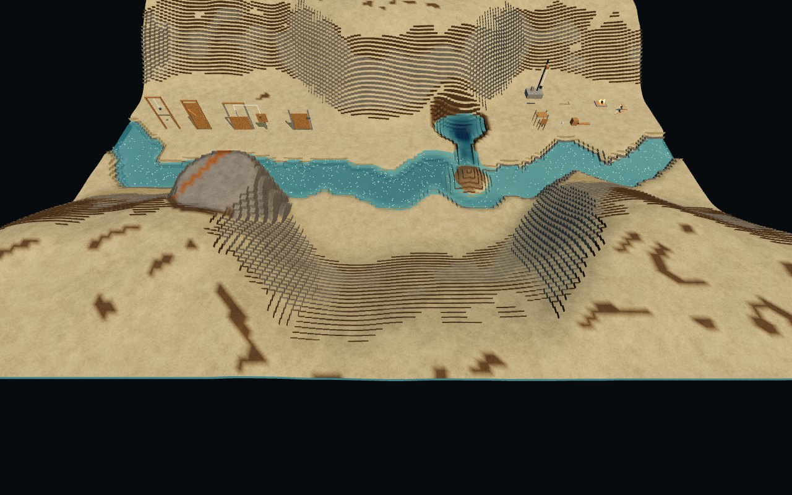

*The main world at `/world`. Every picture in this README is a screenshot of
the running world or one of its pages, taken between 21 and 26 September 2026.
Where there are two, they are the same camera in the same room, so the only
difference in the frame is what the physics did.*

The same world has heat and fire, flowing water, ground you can dig, machines
built from real hinges, ropes, motors and batteries — and machines that decide
things for themselves: a rover that roams a shore, a drone that flies, a mine
that turns ore into wire while you watch. You can talk to any of them. You can
design a new one on a bench, drive it with the arrow keys, and install it in
the world, where it breaks like everything else.

> **Where this is, 26 September 2026.** Banjo is early and experimental, built
> in the open, and it does not have a licence yet. A lot of physics is merged;
> not all of it has reached the world you can walk around in, and this README
> says which is which every time. CI on `main` is currently **red** — see
> [What is not done](#what-is-not-done). Developed on Windows, built on Linux
> in CI, untested on macOS.

**Contents**

1. [The idea: matter that is made of something](#the-idea-matter-that-is-made-of-something)
2. [Eight materials, and what they actually do](#eight-materials-and-what-they-actually-do)
3. [What a break costs](#what-a-break-costs)
4. [Fire that eats the log, and ice that melts into the river](#fire-that-eats-the-log-and-ice-that-melts-into-the-river)
5. [Water, and ground you can dig](#water-and-ground-you-can-dig)
6. [Machines are joints, not animations](#machines-are-joints-not-animations)
7. [Machines that decide for themselves](#machines-that-decide-for-themselves)
8. [Ore to wire: a chain that runs itself](#ore-to-wire-a-chain-that-runs-itself)
9. [Telling a machine what to do, in words](#telling-a-machine-what-to-do-in-words)
10. [The bench: building a thing that does not exist yet](#the-bench-building-a-thing-that-does-not-exist-yet)
11. [Try it yourself](#try-it-yourself)
12. [How the system fits together](#how-the-system-fits-together) ·
    [Design rules](#design-rules) · [What is not done](#what-is-not-done) ·
    [Documentation](#documentation)

---

## The idea: matter that is made of something

A scene is a list of objects. Each has a shape, a size, a position and one of
eight materials, and the whole scene has one **cell size**: the edge length of
the cubes its matter is cut into. Neighbouring cells are joined by bonds whose
stiffness and strength come from the material catalogue
([`src/material/MaterialCatalog.cpp`](src/material/MaterialCatalog.cpp)). An
object's mass, centre of mass and inertia are summed from its cells — never
taken from a render mesh or a collision shape.

Most of the time the bonds do nothing. An object that is not being hit hard
moves as one rigid body in [Jolt Physics](https://github.com/jrouwe/JoltPhysics)
(v5.6.0, double precision), which costs microseconds a step. Only when a blow
could break or dent something does the engine run that object's cells and
bonds, for a few milliseconds of simulated time. Bonds strained past their
strength fail, and whatever is still connected afterwards becomes the new
objects, each with the mass, spin and speed of its own cells. They are rigid
bodies again, and they can break again later.

| Before | After |
|---|---|
| 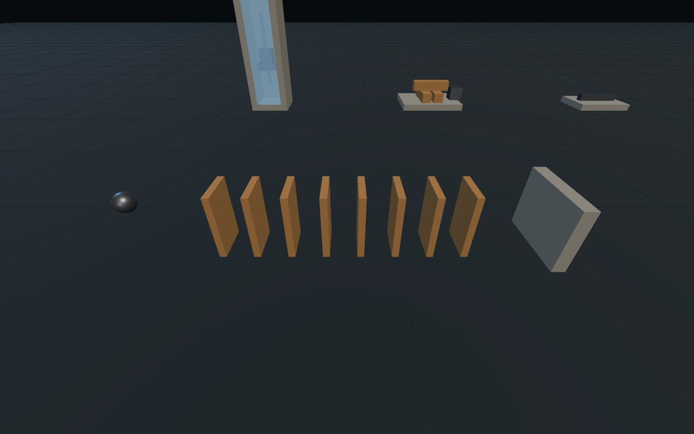 | 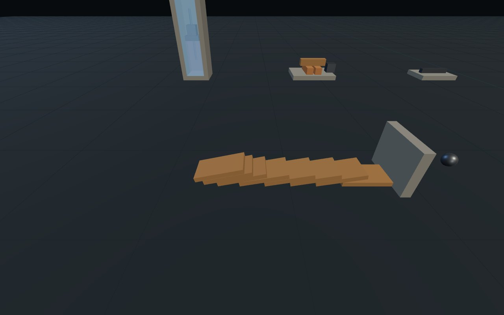 |

*An iron ball rolls into eight oak dominoes at 4 m/s in `/world?scene=tests-motion`.
Nothing is hit hard enough to break, so every domino falls as one rigid body —
and costs about as much to simulate as a crate.*

This split is the whole performance idea. Moving intact matter is nearly free
and barely grows with size: 0.059 ms per 1/240 s step for 492 cells, 0.067 ms
for 16,680. A break costs about 309 ms of lattice time. So the engine pays for
material detail only where a break is possible.

### The step that gets taken back

There is a catch, and the way round it is the most unusual thing in the engine.

Jolt resolves a collision *inside* its step. By the time a collision is
reported, its energy has already gone into bouncing the two objects apart — and
running the cells from that state breaks nothing, however hard the hit. (We
measured it: 171 ms of lattice work that produced exactly one piece.)

So every step is a **reversible trial**. The engine saves Jolt's state, takes
the step, and checks every contact. If a contact could break something, the
step is *undone*: the world goes back to one step before the impact, with the
objects still closing and the clock waiting for the caller to decide. In the C
API, `banjo_step` returns `BANJO_BREAK_PENDING`, and the caller either runs the
break (`banjo_fracture`) or declines it (`banjo_decline_break`). A program that
ignores the question leaves the world frozen at that moment.

The test for "could this break something", `admitRefracture`
([`src/fastlattice/Refracture.cpp`](src/fastlattice/Refracture.cpp)), is a few
multiplications on the closing speed, the two materials' acoustic impedances,
the wave speed and the weakest bond — plus, since September, a third question:
**can this blow pay for a crack across the piece**, at the material's own
fracture energy? That last one is why a chip no longer shatters every time it
lands. It makes the bar depend on size: a 40 mm oak cube needs 8.5 m/s, a
120 mm one only 4.9, because the crack a piece has to open shrinks as the
square of its size while what it carries shrinks as the cube.

| 100 mm iron ball onto a 300 × 40 × 300 mm glass pane | threshold | result |
|---|---|---|
| dropped 0.06 m (0.9 m/s at impact) | 4.5 m/s | below the threshold; holds |
| dropped 1.5 m (5.4 m/s) | 4.5 m/s | above the threshold, but still holds |
| dropped 10 m (13.9 m/s) | 4.5 m/s | breaks into 78 pieces |

The test is deliberately generous: passing it means a break is *possible*, not
certain. The lattice still decides.

| Before | After |
|---|---|
| 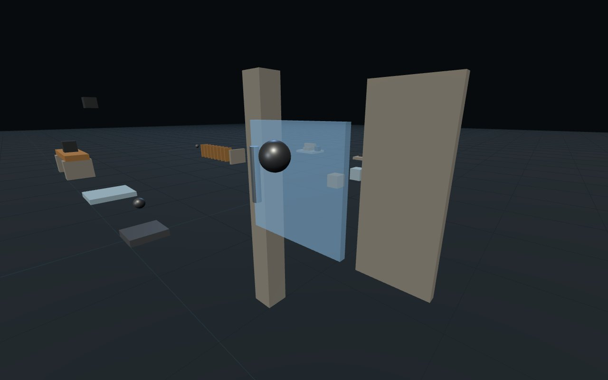 | 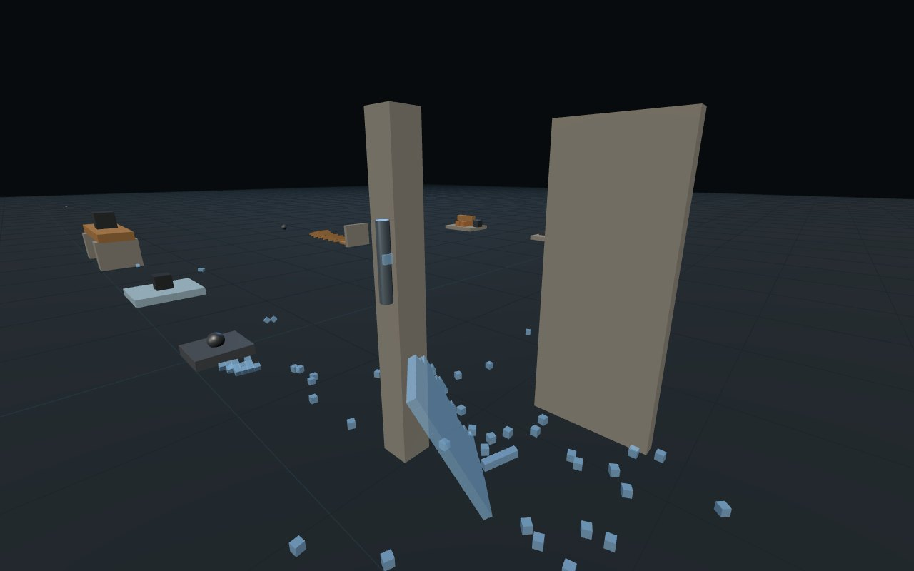 |

*A 120 mm iron ball hits a 640 × 640 × 40 mm glass pane hanging on a pin, at
16 m/s (40 mm cells). The room reported that the pane broke into 18 pieces, and
that one of those was struck again and broke into 52. None of them were cut in
advance: each is a group of cells that stayed connected.*

Two more tricks make breaks feel immediate. **Foresight** looks along the path
of anything moving fast, predicts the speed it will arrive at, and starts the
lattice run *before* the impact — that cut the delay between a glass pane's
impact and its pieces from 856 ms to 127 ms. It also guesses where a held
object would land if you dropped it, and starts that run while the object is
still in your hands, which brings the delay to about 50 ms from any height. And
the break itself runs on another thread, so the world keeps going while it
works.

### Why there is one cell size, and why it matters

Cost grows with the fourth power of detail. Halving the cell size gives eight
times the cells, and the internal timestep halves too, because it is bounded by
the speed of sound in the material (glass needs 0.55 µs). So a room holds at
most 16,000 cells, nothing can be thinner than one cell, and every room picks
one size for everything in it: 10 mm in the armoury, 20 mm on the material
bench, 40 mm in the main world, 50 mm in the machine rooms.

You can see the cell size in the pieces — the pane above broke into 40 mm
cubes. You can also see it in what the grid *cannot* hold, which is most of the
story of [the bench](#the-bench-building-a-thing-that-does-not-exist-yet).

---

## Eight materials, and what they actually do

Glass, ceramic, ice and concrete are brittle: whole, then broken. Iron,
aluminium, oak and rubber have a yield point (200, 276, 45 and 6 MPa) and can
dent before they break. A bond's stiffness comes from the material's Young's
modulus, the strain at which it fails from its strength in tension, compression
and shear, and the strain at which it yields from its yield strength.

| | E (GPa) | density | tensile | compressive | shear | yield |
|---|---|---|---|---|---|---|
| iron | 211 | 7870 | 250 | 600 | 170 | **200** |
| aluminium (6061-T6) | 68.9 | 2700 | 310 | 250 | 207 | **276** |
| glass (soda lime) | 70 | 2500 | 45 | 1000 | 35 | — |
| alumina ceramic | 300 | 3900 | 300 | 2200 | 240 | — |
| oak | 12 | ~700 | 90 | 52 | 11 | **45** |
| rubber | ~0.01 | 1100 | 20 | 15 | 4 | **6** |
| ice | 9 | 917 | 1 | 5 | 1 | — |
| concrete | 30 | 2400 | 3 | 35 | 5 | — |

Strengths in MPa, density in kg/m³. Glass being 22× stronger in compression
than in tension is why it shatters in bending and crushes hard; concrete's
3 MPa in tension is why it is so easy to break and comes apart into so many
pieces.

And here is what that produces. A 100 mm ball of each material, starting just
above a concrete floor at a given speed, 20 mm cells, half a second of world
time — measured on **27 September 2026**. Run it yourself in about eight
minutes: `python scripts/drop-ladder.py`, which drives the engine through the
same [Python binding](#use-the-engine-from-a-program) you would.

| | 5 m/s | 10 | 20 | 40 | 80 |
|---|---|---|---|---|---|
| iron | held | held | **dent** | 9 pieces | 9 pieces |
| aluminium | held | held | held | held | 9 pieces |
| oak | held | held | held | 6 pieces | 12 pieces |
| rubber | held | held | held | held | held |
| glass | held | 6 pieces | 29 pieces | 12 pieces | 12 pieces |
| ceramic | held | held | held | 29 pieces | 12 pieces |
| concrete | 44 pieces | 24 pieces | 29 pieces | 16 pieces | 25 pieces |
| ice | 30 pieces | 16 pieces | 12 pieces | 13 pieces | 12 pieces |

Nothing in that table was chosen. Rubber never breaks because its modulus is
four orders of magnitude below iron's; concrete comes apart at walking pace
because its tensile strength is 3 MPa; the piece counts stop rising with speed
because past a point the ball is already as broken as that grid can represent.
Held and broken are stable — runs of the whole ladder agree on every one of the
forty cells. **The counts are not.** Most repeat exactly; concrete and ice,
which come apart into dozens, swing by up to a factor of two between runs. Nor
do the counts settle as the grid is refined, which is one of the things this
engine cannot yet claim.

| Before | After |
|---|---|
|  | 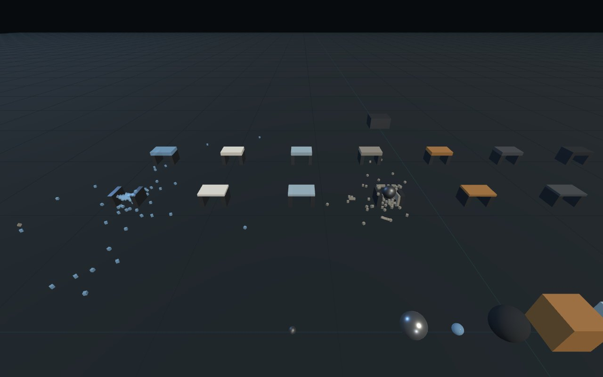 |

*The same thing in the world. In `/world?scene=bench` (20 mm cells), a 120 mm
iron ball was let go 1.5 m above three 20 mm plates in turn: glass (front row,
left), concrete and oak. Glass and concrete break; oak holds.*

**Two of those rows are new.** Until 26 September, ceramic and ice carried
"strain multipliers" — 6× and 12× for ceramic, 5× and 10× for ice — of the kind
that had already been removed from glass as wrong. Ceramics are purely elastic
to fracture, so there is no plastic reserve for a multiplier to stand for, and
ice loads faster than its ductile-to-brittle transition in every case this
engine runs. Both went to 0.9/1.0, and a 20 kg block dropped 5 m now shatters a
ceramic table where it used to do nothing whatever. Oak keeps a multiplier of
2, and that one is *right*: a wooden beam's extreme fibre reaches about twice
its crushing strength before it ruptures, because the compression face yields
and the neutral axis shifts. White oak crushes at 51.3 MPa and its measured
modulus of rupture is 102.3 — a ratio of 1.99.

**What is honest about all this:** the declared numbers are handbook values for
real materials, and they produce differences you can see. What is *not* honest
yet is calibration — nothing here has been checked against laboratory impact
data, piece counts do not converge as the cell size shrinks, and oak's pure
tensile behaviour is uncalibrated and says so in the catalogue. The full
per-material state is in [docs/api/materials.md](docs/api/materials.md); what
each behaviour costs and where you can reach it is in
[what works, and where](docs/what-works-where.md#materials).

---

## What a break costs

Every break now reports its own bill: the bonds the lattice removed, the crack
area they stand for, and the energy that left with them — against what the
material itself takes to crack.

| An oak plank on two piers | The moment it broke |
|---|---|
| 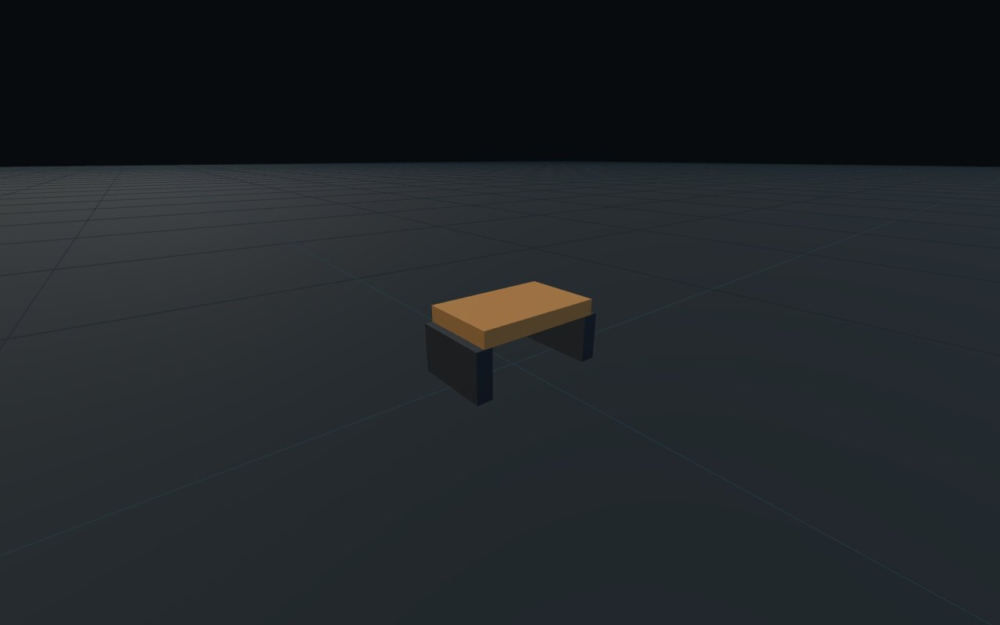 | 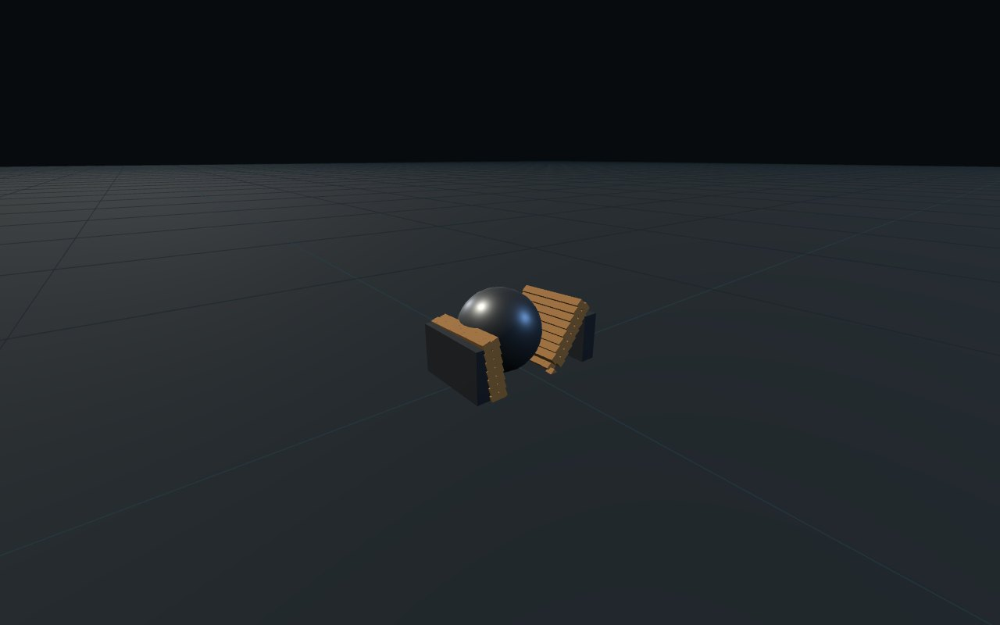 |

*`/world?scene=tests-break`: a 200 mm iron ball dropped a metre and a half onto
the middle of an oak plank. The right-hand picture is held at the instant the
room reported the break, before the pieces fell and broke again.*

The room's own account of it:

> ball hit plank at 5.2 m/s (it bends above 8.3 m/s, breaks above 3.1 m/s). It
> broke into 7 pieces. It cost 4.47 J over 152 cm² of new crack: 294 J/m²,
> where oak itself takes 1,000 J/m² and this room charges 1,000
> (energy-scaled).

That last clause is the interesting one, because for most rooms it is a
confession. The failure law every other room runs charges a crack in oak
**148,500 J/m² at 20 mm cells** and 37,125 at 5 mm, where oak's own figure is
1,000. The charge is a property of the grid, not of the wood. A room can now
ask for the energy-scaled law instead (`"failure_law": "energy-scaled"`), and
then the charge is the material's own at every cell size.
[what-a-break-costs.md](docs/what-a-break-costs.md) has the working.

**Limits worth knowing:** nothing is calibrated against laboratory data; piece
counts do not converge; one break is worked out at a time (up to 16 wait in a
queue); and past about 2,000 bodies the world quietly stops being able to break
anything.

**Matter one cell thick cannot answer a blow struck flat at it.** A sheet one
cell thick has every node's neighbourhood in one plane, so the strain the
engine can state is the stretching of that plane — and hitting a plate flat
loads it in *bending*, which that strain is blind to. A 20 mm glass plate at
20 mm cells loses 40 bonds to a blow that takes 902 out of the same plate
40 mm thick, and never comes apart: what the piece count reports is whether one
20 mm cell happened to lose its last bond, which is why the same plate breaks
from 3 m and 7 m and not from 4, 5, 8 or 10. A plate on piers is fine — in-plane
tension across the span is something a coplanar neighbourhood can see — and so
is anything two cells thick or more. A term that recovers the curvature from
the same neighbours is built and tested, and is **switched off**: it fixes this
case and destabilises a plate that is already breaking.
[plate-bending.md](docs/plate-bending.md) has the measurements both ways.

---

## Fire that eats the log, and ice that melts into the river

Every body carries a thermal lump: a surface layer over a core. Heaters,
conduction between touching bodies, radiation (to each other and to the sky)
and convection to the air move heat between lumps, and one ledger accounts for
every joule.

A body's contents are an inventory, not a flag. Oak is 0.88 dry wood, 0.10
moisture and 0.02 ash, and declared reactions turn what is there into something
else. Wood dries, then burns at the rate oxygen reaches it, so how long a log
burns follows from its fuel and its surroundings rather than from a timer.

Heat also changes the mechanics. Oak, iron and concrete each lose strength and
stiffness as they warm (the Eurocode fire-design curves), oak chars from
300 °C, and the bonds of a heated body are weakened by the same factors — so a
hot beam breaks under a load a cold one carries. Burning removes matter: oak
recedes about 0.4 mm a minute from every face, and a body that burns through
leaves the world as ash.

| Start | 100 s later | The Room tab's Heat panel |
|---|---|---|
| 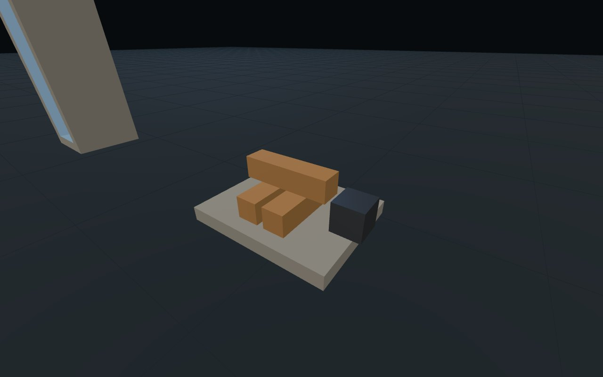 | 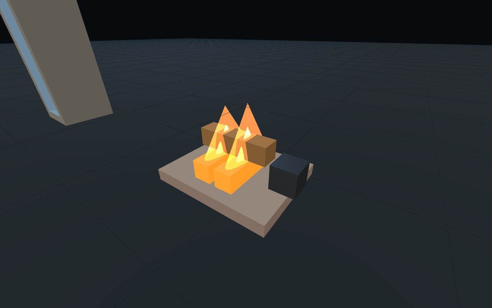 | 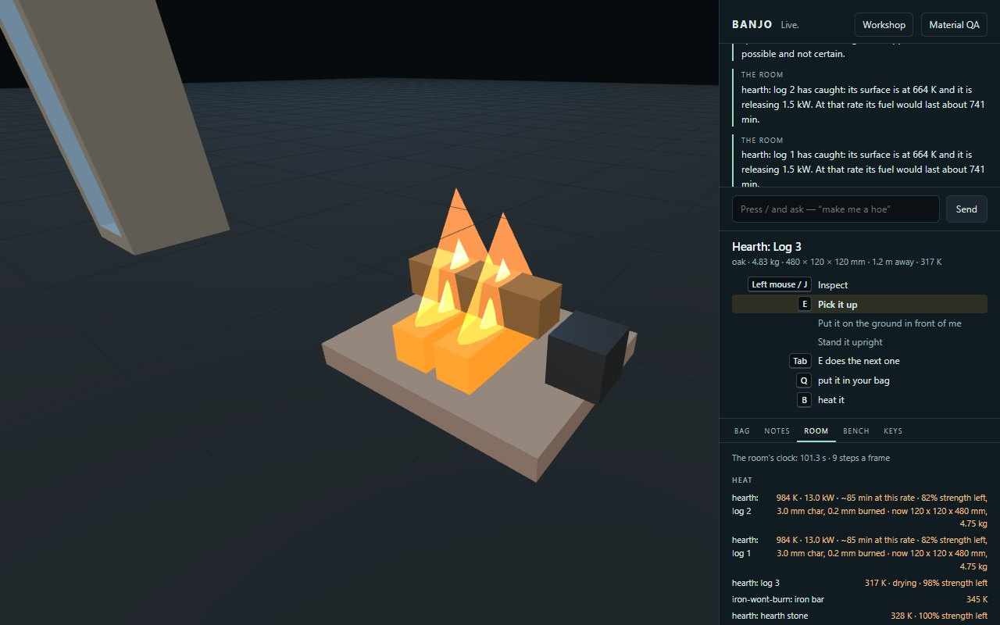 |

*The hearth in `/world?scene=tests-motion`. After 100 s the two lower logs have
caught: each at 984 K, releasing 13 kW, with 3 mm of char and 82% of its
strength left. The log lying across them is still drying at 317 K. The glow and
the flames are pictures of those numbers — the glow follows a log's temperature
and the flame's height its power — and a drawn flame warms nothing.*

Ice melts, and the bookkeeping is strict. While a body has ice in it, it is
never warmer than 273.15 K: the heat that would take it higher melts exactly as
much ice as that heat can, at 333.55 kJ a kilogram, with nothing added and
nothing lost. The block shrinks from every face by what melted, weighs what is
left, and its meltwater runs into the room's water under it, or off across the
floor where there is none.

| Start | After 60 s of heating | The Room tab's Heat panel |
|---|---|---|
| 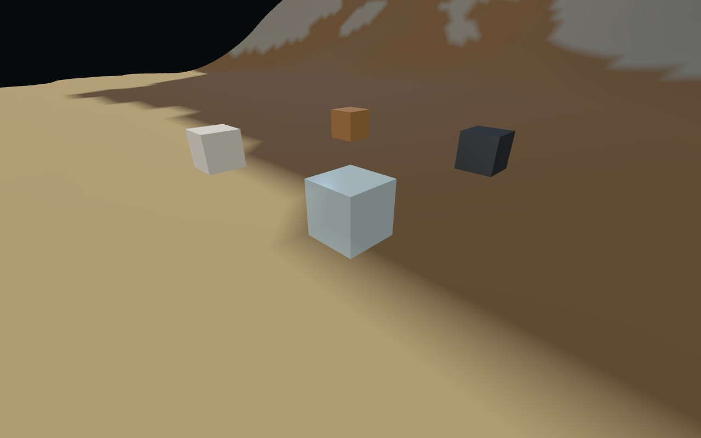 | 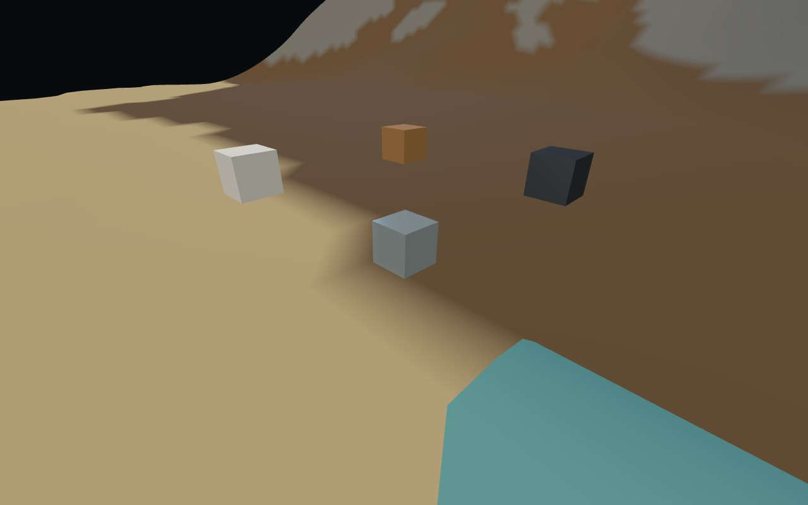 | 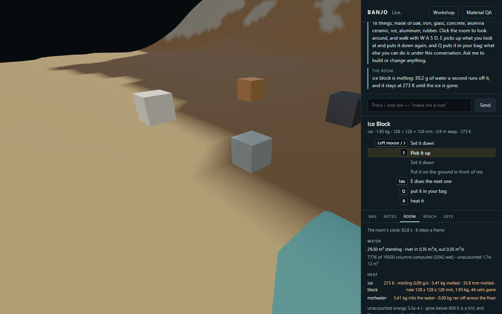 |

*An ice block in the explore room's valley, heated with **B** three times: 30 kW for
60 s. It stayed at 273 K throughout; 5.41 kg of its 7.34 kg melted — 1.8 MJ
over 333.55 kJ/kg — and it is now 128 mm across. Its meltwater ran downhill and
pooled below it, 5.41 kg into the valley's water, whose ledger still closes.*

**Not built:** freezing or boiling in the world (the separate voxel thermal
simulation still has its own, unconnected); fires that go out; thermal
expansion; smoke and airflow; heat into water or into the ground — a burning
log in the river keeps burning; and friction, impact, cutting or motor work
turning into heat.

---

## Water, and ground you can dig

The valley's ground is generated once by drainage and erosion, then kept. Water
is a depth-averaged shallow-water solver that computes only wet tiles and a
ring around them: a lake at rest stays exactly at rest, wet and dry edges move,
and mass is conserved to rounding. Bodies float, drift and dam the flow through
their displaced volume and drag, and that drag pushes back on the water. Oak
floats 70% under, and a dam block carries the pressure difference across it to
the newton.

| Carried to the river | 8 s after letting go |
|---|---|
| 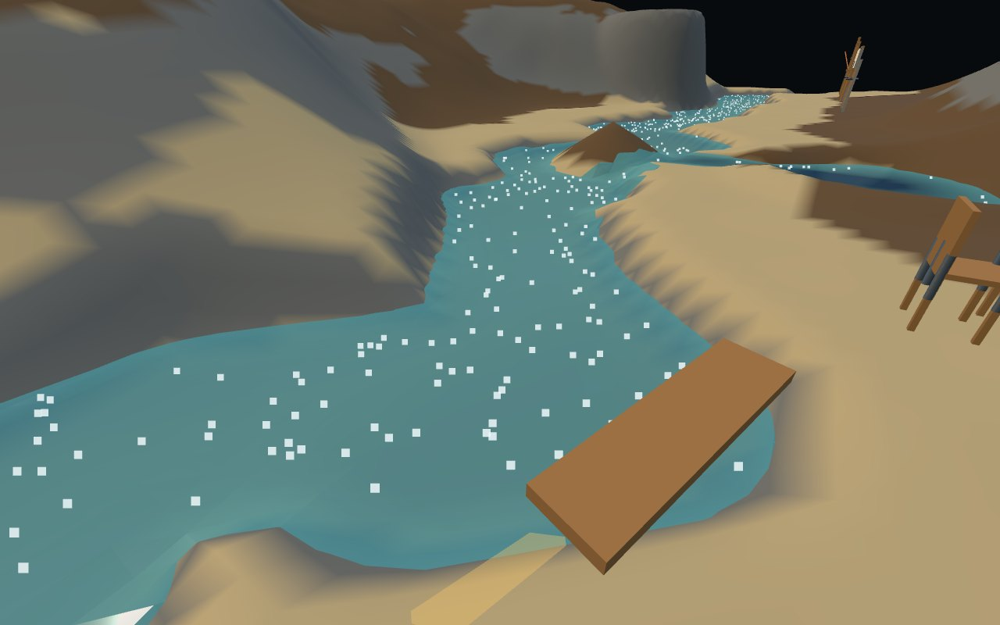 | 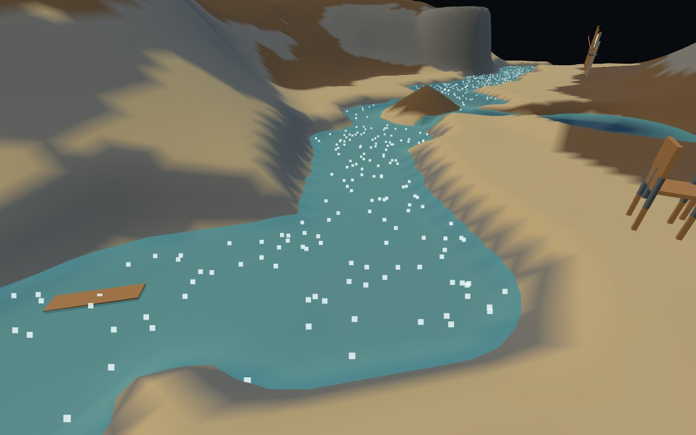 |

When the room's chat was asked to dam the river with nine concrete blocks, the
water behind it rose from 29.5 m³ to 36.2 m³ in 69 s while the outflow fell
from 0.35 to about 0.22–0.25 m³/s. Beyond the valley's edges, rivers continue
as a coarse network of reaches, junctions and lakes, so damming the valley
fills a reservoir upstream.

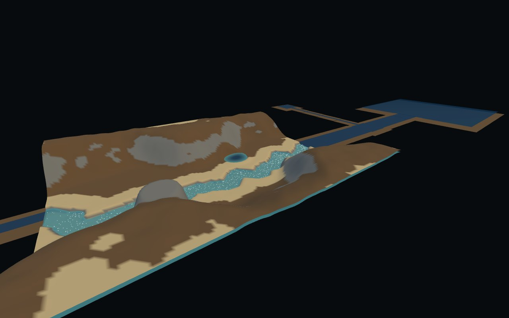

*`/world?scene=watershed`. The valley's river is simulated in detail; the flat
blue strips beyond its ends are the coarse network, running upstream to a
reservoir and downstream to a lake.*

The ground is columns of rock, soil and sand. After an edit, only the columns it
disturbed are checked for stability (Mohr-Coulomb friction, and Terzaghi's
critical height for cohesive soil): a sand pit settles to its angle of repose,
a 0.5 m soil trench stands and a 1.6 m one caves in, and whatever stood on the
ground falls in. Digging one pit rechecked 65 columns, rebuilt 1 of 20 ground
colliders in 0.05 ms and woke nothing else — the cost follows what changed, not
the size of the world.

| Before | After one dig | The side panel |
|---|---|---|
| 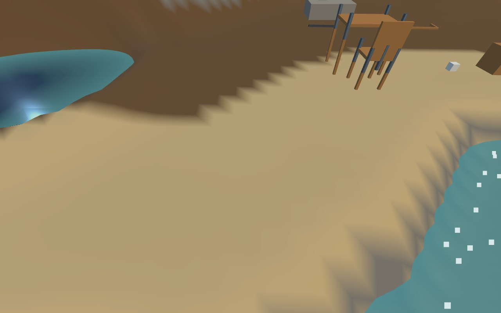 | 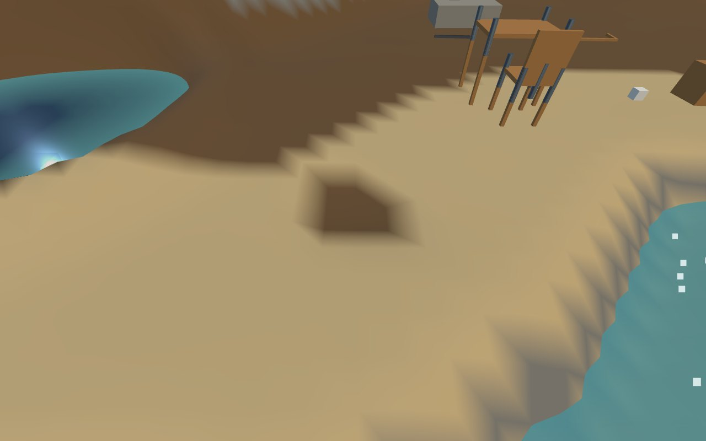 | 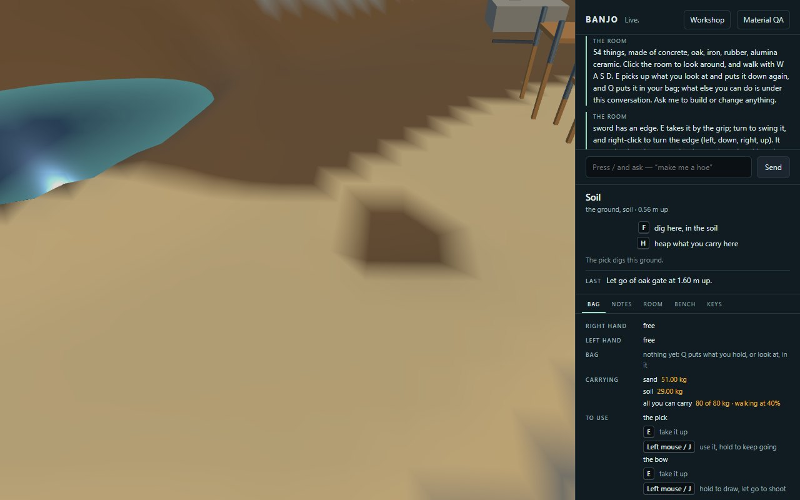 |

*One **Dig here** (F) on the main world's river bank. The panel then reads 51 kg
of sand and 29 kg of soil carried: 80 of the 80 kg a person can carry, so
walking slows to 40% and a second dig is refused. What you dig is carried, and
heaping it puts back exactly what came out.*

**Not built:** waves and wakes, sediment, rain, wet soil, water putting out
fire; breaking rock with a pick, tool wear, landslides that rotate rather than
slump.

---

## Machines are joints, not animations

A door opens because you push it off its pin's line. A bow shoots because its
limbs store energy — there is no bow code anywhere. Joints are held by name, so
a pin whose post is smashed follows the piece it ends up in.

| Before | After |
|---|---|
|  | 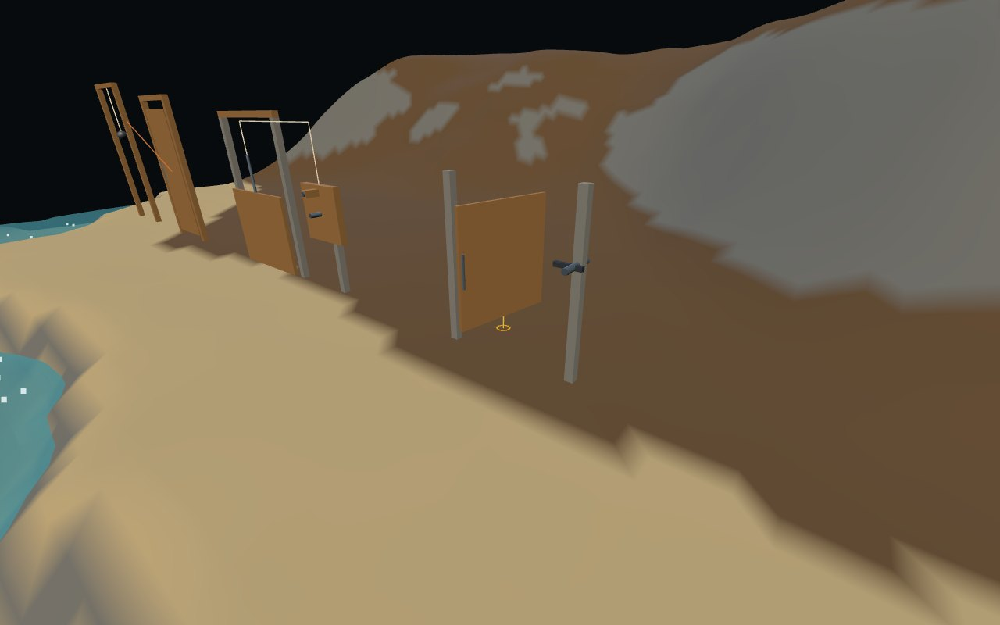 |
| 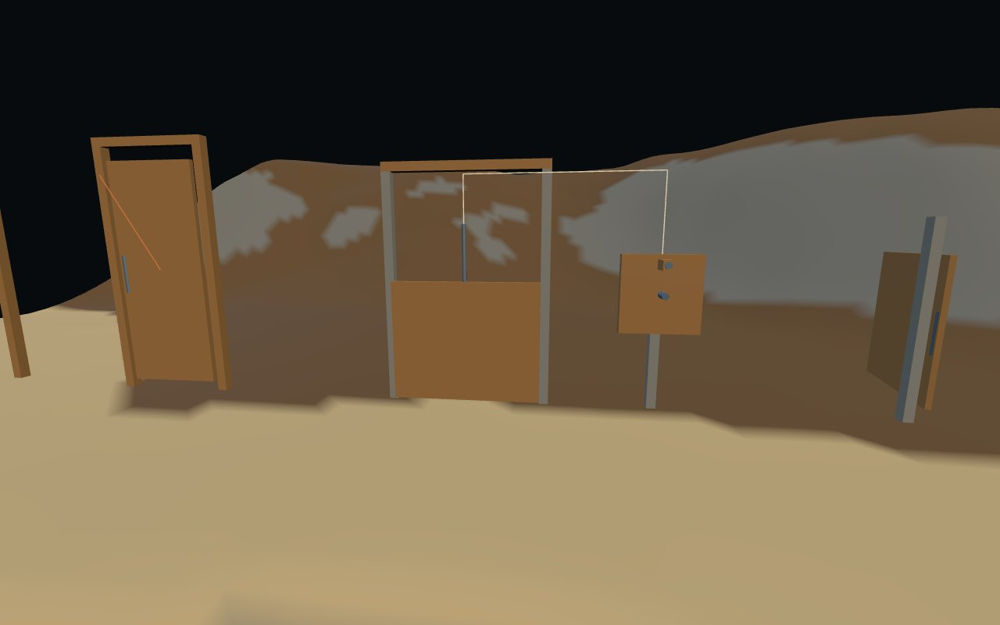 | 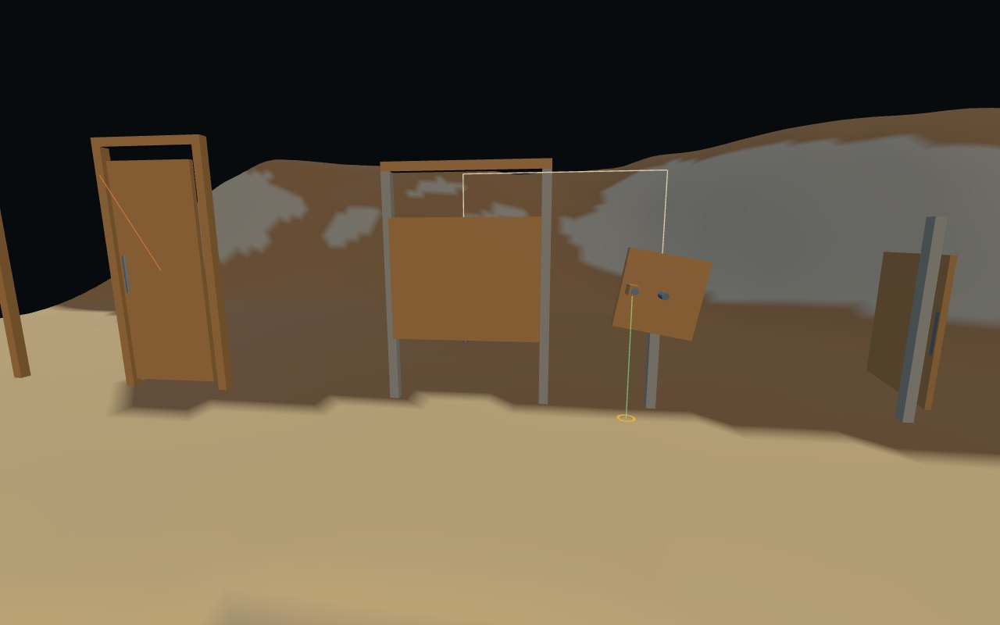 |

*Top: release the latch and choose **Open the gate**; the hand pushes the leaf
round its hinge pins. Bottom: **Raise the portcullis**; the hand turns the
winch, the rope winds on, and the portcullis rises in its frame.*

Every control is a bounded hand, never a velocity: 800 N of pull, 60 N·m of
wrist, and 2 kg of moving mass of its own, so it can lift at most 73 kg. A
throw is the hand's force over the hand's stroke, so a light ball leaves faster
than a heavy one.

Motors and batteries are accounted the same way — every joule in, every joule
out.

| Before | After | The Room tab's Machines panel |
|---|---|---|
| 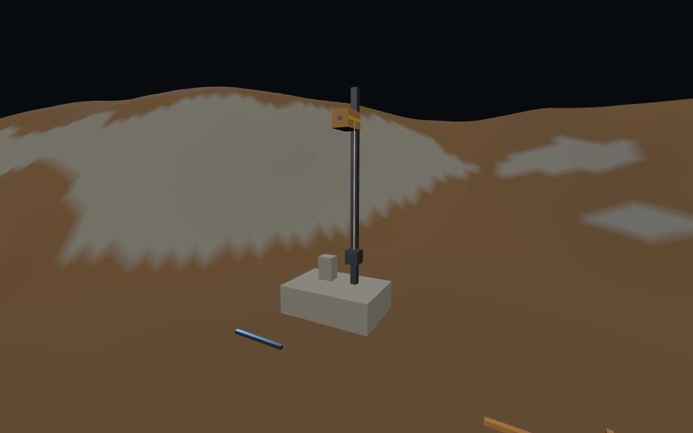 | 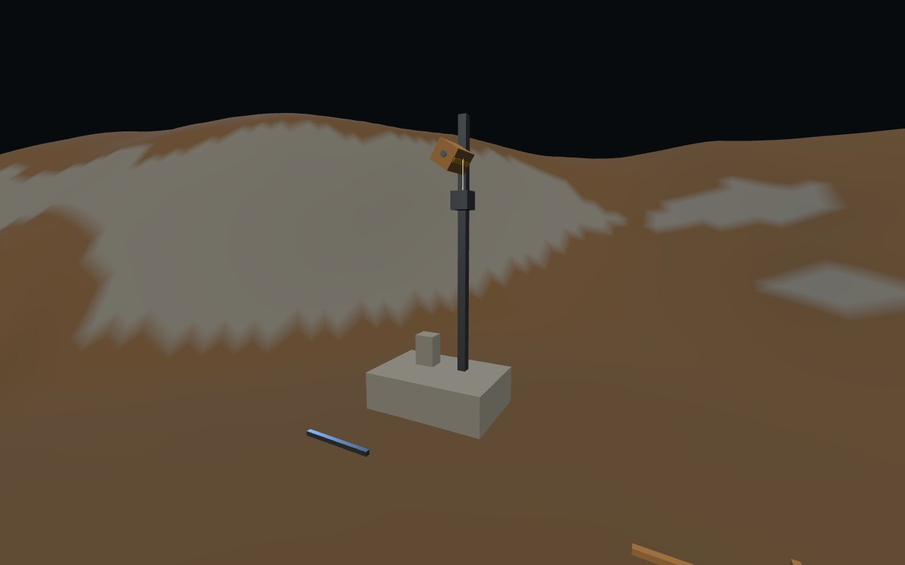 | 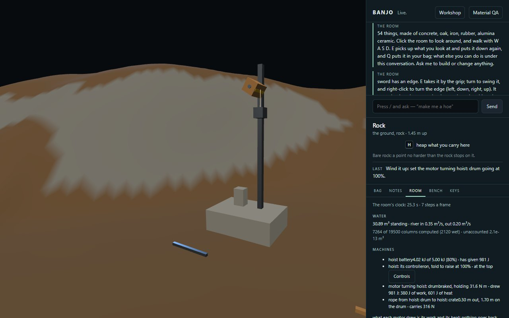 |

*The battery hoist: **Wind it up** (E on the drum) lifts the crate up the mast.
The motor drew 981 J from the battery, of which 380 J became work and 601 J
heat, and the rope now carries 316 N.*

| Before | After |
|---|---|
| 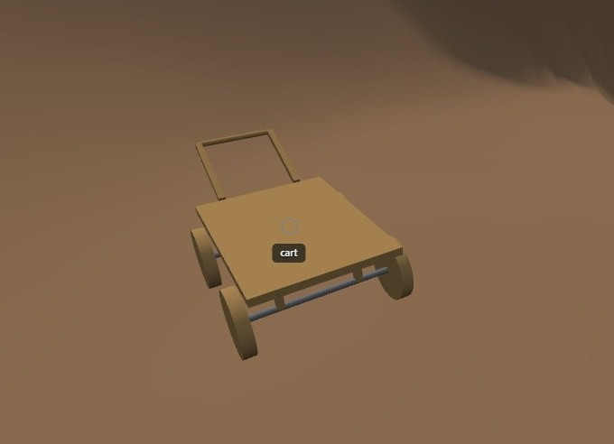 | 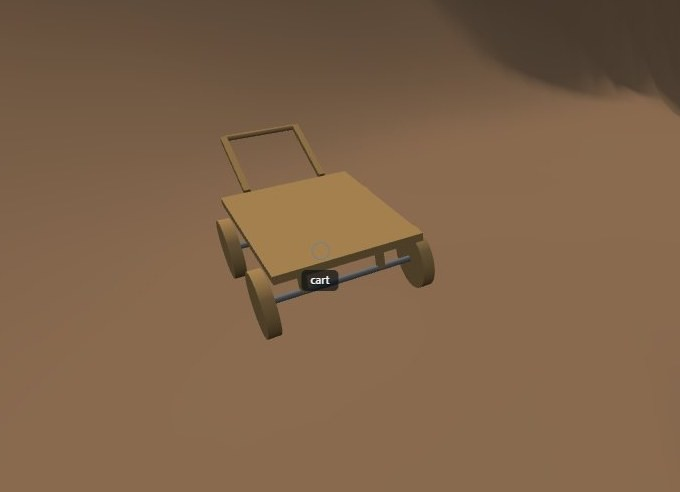 |

*The cart in the explore room is three exact bodies — a chassis and two wheelsets,
each an iron axle through oak wheels — on two free pins. **J** pushes it and it
rolls: when it was added, a push moved it 0.404 m while its wheels turned 145
degrees, which is 0.405 m of rim. It rolls rather than slides, and nothing in
the code says so.*

"Exact bodies" are compounds of boxes and cylinders with no cells, each part of
its own material, joined by real pins. They cost nothing in the cell budget and
share rooms with ground, water and bodies made of cells — but they cannot
break, dent or heat, and water does not hold them up yet.

---

## Machines that decide for themselves

This is where most of September went. A machine in Banjo is not scripted: it
has controls (a motor on a shaft, with a brake), senses (what its sensors
report), and a **program** that works its own controls exactly as a person
works the panel. Nothing it does bypasses the physics.

**It stops when a sensor says so.**

| Turned on, at the top of the shore | Six metres later, at the water |
|---|---|
| 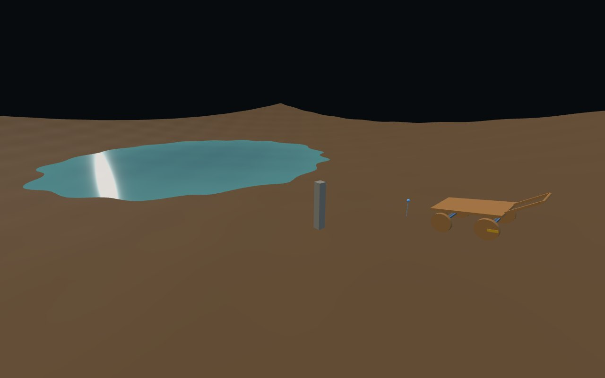 | 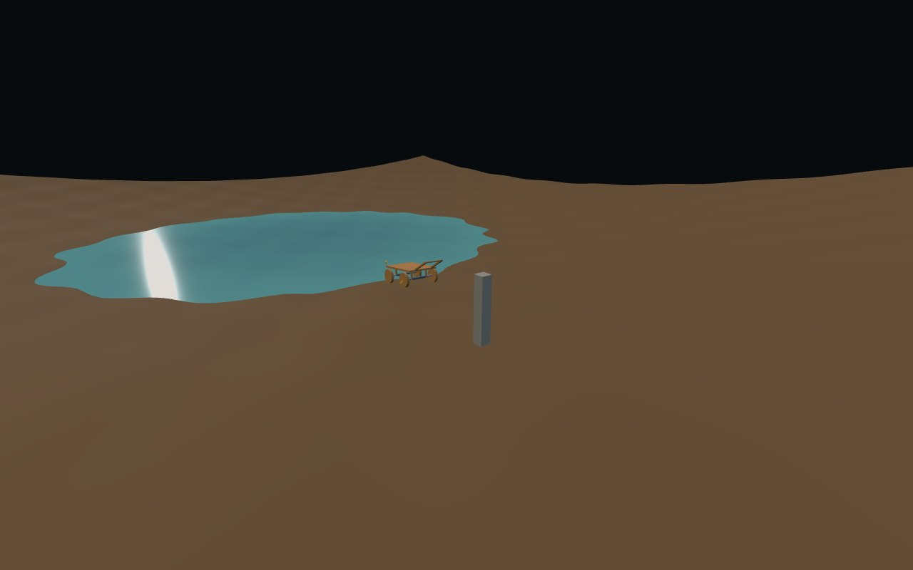 |

*`/world?scene=tests-cart`: the same cart, with a 24 V battery, a motor and
brake on its back wheels, and a controller whose water sensor looks at the
ground 0.6 m ahead of the deck. The bead on the thread is the sensor; it turns
amber when the water under it is deeper than 10 mm, and the controller brakes.
It went 6.0 m in 5.2 s and stopped with its front wheels 0.13 m short of the
water. Going downhill the motor mostly held it back: the battery gave 26 J, the
motor's work was −83 J, and 110 J became heat.*

**It finds its own way.**

| A sensor finds the water | Seconds later, turned away |
|---|---|
| 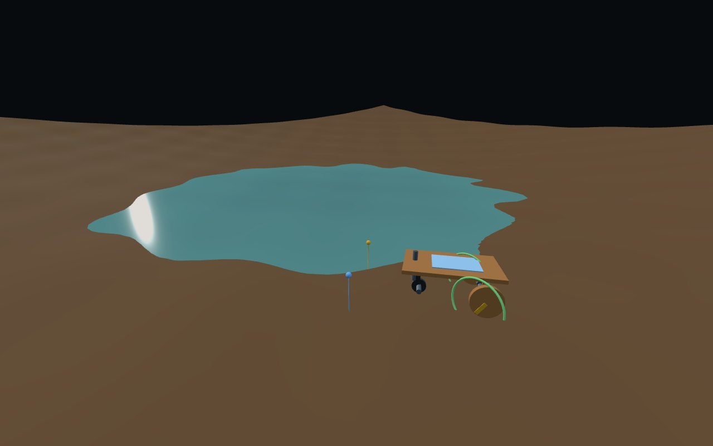 | 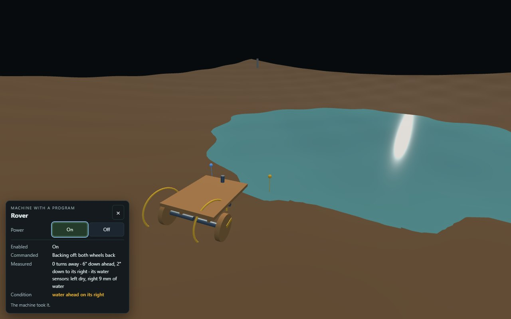 |

*`/world?scene=tests-rover`: a motor on each back wheel, so it steers by driving
them differently, and a caster in front that swings round to follow. Nothing
tells it where the lake is. In the engine it roamed 50 m of shore in a minute,
turned away 5 times, and never had a wheel in the water. It also turns downhill
where the ground is steeper than 8 degrees.*

**It is told where a thing is, and goes and uses it.**

| Told where the stool is | Sitting on it |
|---|---|
| 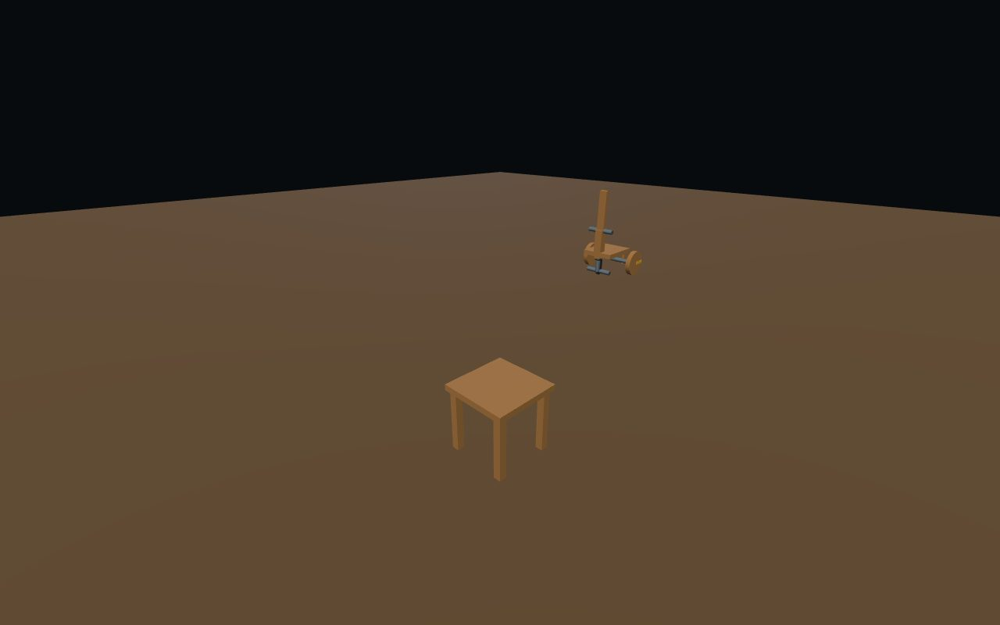 | 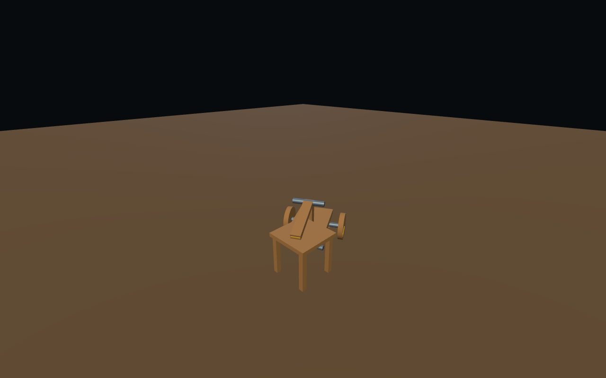 |

*`/world?scene=tests-sit`. Nothing tells it how to get there, and nothing
animates the sitting: it drives to the stool and puts its torso down, and the
stool holds it because a stool holds things. Between these two frames its torso
went from 1.25 m to 0.94 m above the ground. The same shape of program digs in
`/world?scene=tests-dig`: dig the site until the hopper is full, carry the load
to the depot, dump it, go back.*

**It runs out of power, and waits for the sun.**

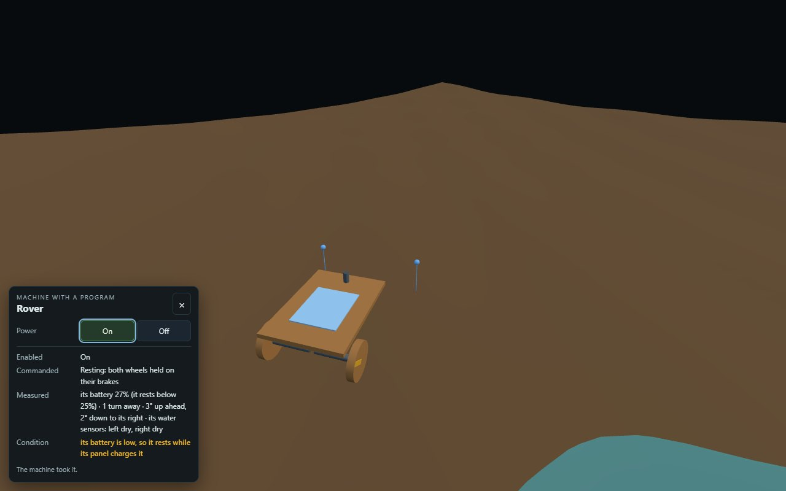

*`/world?scene=tests-solar`. The room declares a sun, 50 degrees up at
1000 W/m². The glass panel on the rover's deck puts into its battery the
sunlight on its face — irradiance × area × the cosine of the angle to the sun —
times its efficiency, and nothing in shade. Roaming draws more than the panel
gives, so at a quarter charge the rover stops where it is and rests until the
sun has brought it back to three fifths. Standing still is all there is to see
of it, which is the point.*


*The joules are the one thing the room cannot show you, so here is the Room
tab's Machines list at that moment — the whole account in seven lines. The
panel is turning 29 W out of the 147 W of sunlight falling on it; the battery
holds 28% and has taken in 382 J of it. What a battery holds is always what it
began with, plus what it took in, less what it gave.*

**And the sun sets.**

| Four in the afternoon | Ten to seven, after sunset |
|---|---|
| 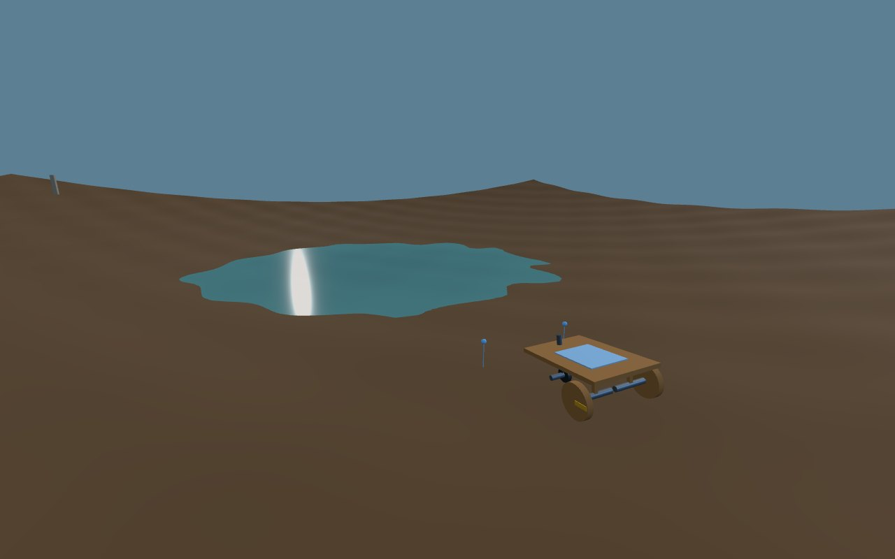 | 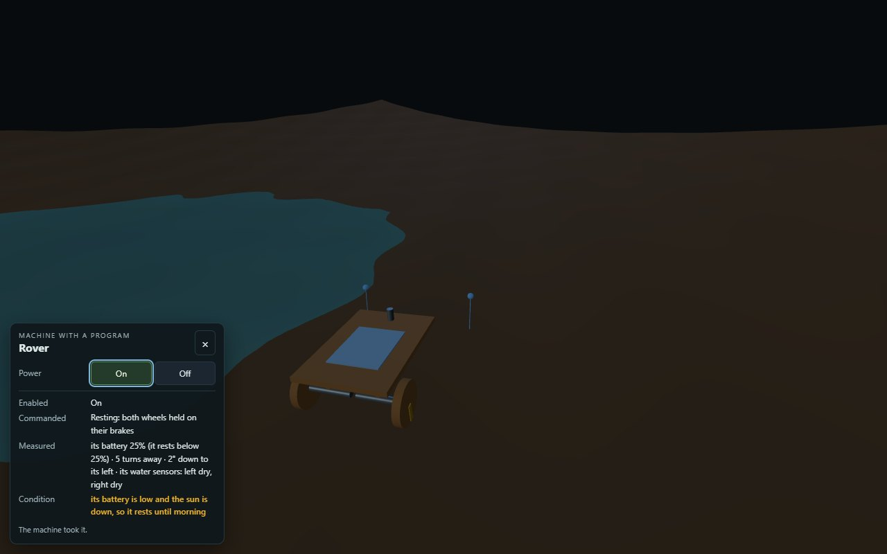 |

*`/world?scene=tests-day`: the room's sun goes round in four minutes, rising in
the east, highest in the south at noon, setting in the west. Nothing moved
between these two pictures — the rover is switched off, the camera has not
moved — so the only difference is the light. They are 28 seconds of the room's
time apart, which is nearly three hours of its day. Low in the sky, less of the
sun's light gets through the air; below the horizon, none does. In the engine
the sun set 20 s in, the rover rested at 20:34, and it woke at 11:00 once the
morning sun had charged it to two fifths.*

### Three faults that only turned up by running it for a long time

**A machine can get nowhere while everything looks fine.** In the mine, the
rover stood in one spot for 232 s of a seven-minute run, driving and turning
the whole time. It had dug 1.3 m ahead of itself, then had to drive over its
own hole, and sat against the spoil heap on a slope. Its wheels turned freely,
so no motor was ever overloaded and the stall that stands in for a bump sensor
never tripped. No sensor saw water. Its battery was full. Every layer above was
told, truthfully, that it was "approaching" the vein — for four minutes.

The fix is a sense and a reflex. While a machine is told to go somewhere, the
engine keeps where it stood when it was told and how long it has been inside
half a metre of there. **The circle is the measure** — not standing still, and
not the wheels, because in a hole a machine drives and rocks and turns busily
and gets nowhere. Twenty seconds of that and it backs out: reverse, turn 110
degrees, reverse again, 4 s then 8 then 12, turning the other way each time.
Three tries at one place and it stops, holds its wheels, and says it cannot get
itself out — rather than butting the same thing all day. Being stuck does not
make it deaf, so a person who comes to get it out can. Two metres from that
place ends the episode, and a saved room brings a machine back where it gave
up.

**A machine that digs where its nose happens to point digs itself in.** The
rover used to bite 1.3 m straight ahead of wherever it stopped, so four trips
to one vein left four holes 10–18 cm deep spread over 2 m of ground it then had
to cross. Now the dig tool takes a *place* and works that place, by rules of the
world rather than settings:

- It bites the place it was sent to, never its own nose.
- It stands off, because that place is about to be a pit — 2 m, and `go_to`
  takes a `stop_at_m`, since a machine told to stop "a metre off" rolls on
  while its brakes take hold.
- It will not dig the ground under itself: closer than 1.2 m and it backs off
  first and says so.
- Each spot is scooped once. A bite goes into the highest ground it can reach,
  and only while that ground is within 30 mm of the ground around it, so the
  working spreads the way an open pit is worked and no hole is deepened. Biting
  always at the middle instead sank a shaft 600 mm deep and 1.1 m across in ten
  minutes — which a machine on 160 mm wheels can only fall into.
- A place is as wide as the deposit it sits in. Half a metre gives three loads
  and is then worked out, and a machine on a step it cannot finish roams while
  it waits; the vein is 3 m across, so the place is too. Ten minutes of digging,
  against the old bite-at-the-nose: 1 load becomes 6, and the working goes from
  1.1 m across and 185 mm deep to 3.3 m across and 140 mm deep — an open pit it
  can drive over rather than a shaft it falls into.
- Worked out is *said*, not scraped at.

**And a third: a machine with a driven wheel each side cannot brake while it
turns.** The two wheels push against each other and nothing pushes back along
its way, so one that starts a turn while still rolling coasts through the whole
turn. Measured: it spun up to 108 degrees a second, sailed 50 degrees past the
mark, then travelled 1.6 m at up to 80 degrees off its way while it came round
— about a metre of drift every trip, which is how the mine's rover kept ending
up in the shallows with its water reflex turning it away. Told to go to a place
or face one, it now stops before it turns on the spot, turns from rest, and
stops again before it goes on. The roaming reflexes are untouched: getting
clear of water, or of a hole, is still one decisive turn at full effort. Two
other fixes were tried first and thrown away — aiming at where the nose *will*
be (the braking kills the swing it predicted, so it stopped 35 degrees off and
called itself faced) and easing the turn as it closes (at three tenths effort
it could not come round on rough ground at all) — and both are written down in
[machine-world.md](docs/machine-world.md) rather than quietly dropped.

### A machine that flies

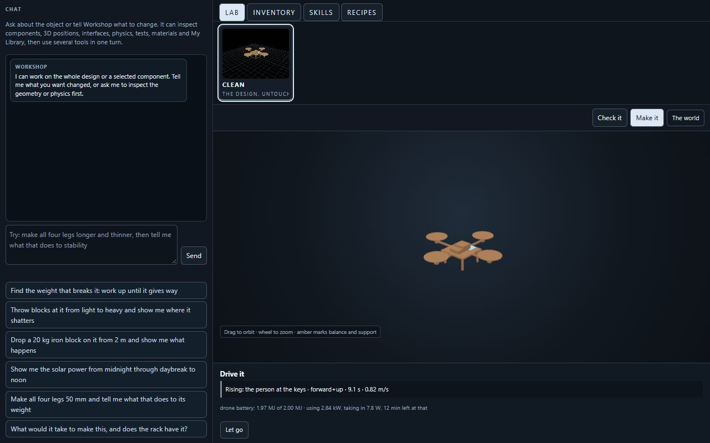

*The drone, driven by hand. Space takes a person up in the world and
Shift+Space down; they now do the same to a machine that flies. The two asks
move the height it **holds**, at 0.8 m/s — a little under the 1 m/s its climb
is limited to, so the machine keeps up with the target, and letting go leaves
it hovering where it got to, the way a flown machine answers a stick. Held all
the way down, it sets itself on the ground.*

Landing costs what landing costs: a flying machine asked all the way down used
to sit on the ground with its rotors still at hover throttle, fighting the
floor for 2.65 kW, because the height loop had nothing to say about being held
up by the ground. Sat down with the height it holds at zero, it is *landed* —
the rotors stop and its draw falls to nothing until rising lifts that height
off zero again.

The line under the picture is new too, and it is in both panels now: what the
battery holds of its capacity, the watts its motors are asking this step, the
watts its panels are putting back, and how long that leaves at this rate.
Hovering, the drone asks 2.84 kW of its 2 MJ battery — about twelve minutes.
Switched off, it asks for nothing, and the panel says "using nothing".

More on all of this: [machine-world.md](docs/machine-world.md), and
[what works, and where](docs/what-works-where.md#joints-machines-and-energy).

---

## Ore to wire: a chain that runs itself

`/world?scene=tests-mine` is four machines, a copper vein and four heaps of
ground, and nobody drives any of it.

| Every program switched on | Eighteen seconds later |
|---|---|
| 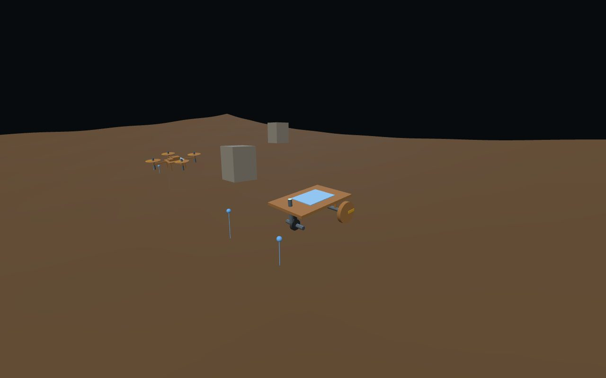 | 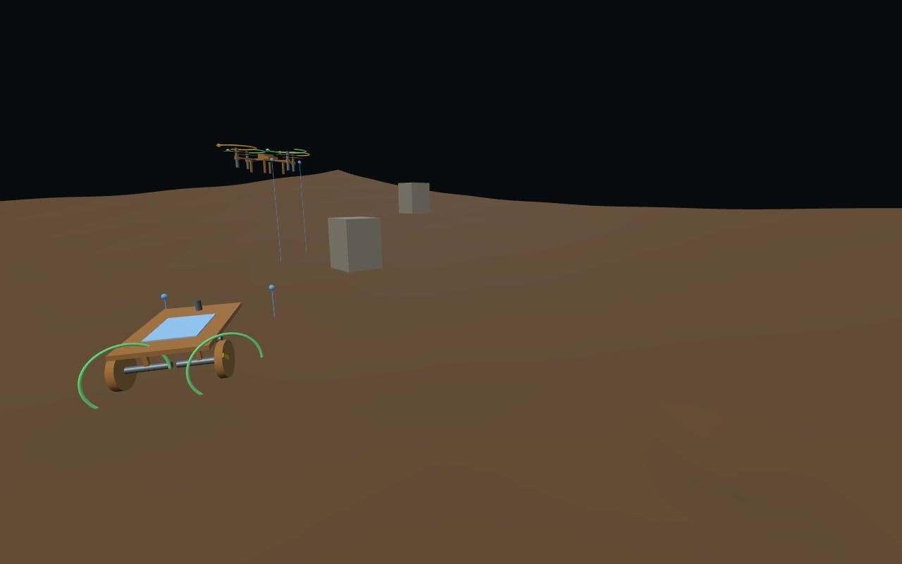 |

The rover's whole job is five steps, written in the routine language: *go to the
vein and stop 2 m off; dig there until the hopper's 40 kg are full; back off for
1.5 s; go to the smelter's intake; dump until you are empty.* The smelter goes
nowhere — it works a recipe, 1 kg of copper ore into 0.3 kg of copper at 2,000 J
and 2 seconds a kilogram, and puts the copper on its output heap. The drone
hauls: it hovers at 1.5 m, lifts up to 20 kg from that heap, carries it to the
mill's intake and drops it. The mill draws wire (1 kg of copper into 0.98 kg of
wire) straight onto the heap marked as the Workshop's rack, so what lands there
becomes material you can build with.

Measured on 26 September from a fresh room: **the first 1.47 kg of copper wire
reaches the rack about half a minute into the world's time**, and over twenty
minutes of it the rover brings in 8 loads and 18.2 kg of wire lands on the rack.
The vein holds 400 kg of ore at a grade of 0.3 and is nowhere near empty at the
end of that.

None of those numbers were true a day earlier, and the reasons are the sort of
thing only a long run finds. The vein read as empty because its reserve was
being read off a field the deposit does not have. The haul went nowhere because
of the faults described above — the hole it dug itself into, and the turn it
could not brake. Twenty minutes of the same room before and after them:
3 loads became 8, 7.1 kg of wire became 18.2, and the time the rover's reflexes
spent hauling it out of the shallows fell from 288 seconds to 35.

**Be clear about what is physics here and what is bookkeeping.** The digging is
real: the rover's scoop moves the ground's own columns, the pit is in the
terrain, the spoil is heaped, and the rover has to drive over what it leaves
behind — that is how the getting-nowhere bug above was found. The *substances*
are a ledger. A deposit is a patch of ground where a scoop brings up ore with
the soil at a stated grade, a stockpile is what a machine dumped at a place,
and a recipe is a declared conversion with a mass balance, a time and an energy
cost. Ore, copper and wire are not drawn in the world and have no cells. The
room's recipes are the only chemistry there is: nothing in the engine knows
what copper is.

That honesty is the point of the design, not an apology for it — the ledger
moves with the room, is read by every sense, and is checked against the ground's
own accounts of what was exported. It is also what makes the chain something
the Workshop can spend.

---

## Telling a machine what to do, in words

Machines take orders. A routine is a list of steps in a small language over the
places, substances and recipes the machine knows — go here, dig, take, drop,
process, wait, rise, descend — and the steps are checked before they run.

Two things make that more than a macro:

**A step can carry a condition.** `when` skips it unless something holds;
`unless` skips it while something holds. The conditions read the same senses the
machine's own reflexes read: the hopper, the battery, a stockpile at a place or
within reach, water ahead, a person near, a place reached, night and day, a
stall, a knock, resting, being asked by someone — and `not`/`all`/`any` over
them.

**A routine can watch.** `watch: {when, do, then}` interrupts whatever the
machine was doing the moment its condition comes to hold — once per rising
edge, never while its own steps are running — and afterwards it resumes the
interrupted step or restarts its round. The runner keeps its work as frames:
the round at the bottom, interruptions above it, run first.

And a person's words can be a job. Walk up to a machine and talk to it: the
chat's model writes what you said as steps of that same language, against a
strict schema. Plain words cover the common shapes without a model at all —
bring or fetch from one place to another, dig and dump, go to, make N batches.
The steps are checked exactly as a routine's are, queued as an order that runs
before the machine's round, answered with the plan it intends to follow, listed
when you ask "what are you doing", dropped on "never mind", and reported in the
chat when they are done. A machine that cannot move takes only batches and
waiting, and says so: asked to come here, the smelter answers that it goes
nowhere.

In the engine's own test of this, the mine's rover left its digging to go where
it was told, said "Done", and went back; a watch held it when a person walked
up; the drone took an order, described it and dropped it; and the smelter
refused to move.

---

## The bench: building a thing that does not exist yet

Everything above is matter the world already holds. The bench
(`/world?workshop=1`) is where a new thing gets in. It has four tabs — **Lab**,
**Inventory**, **Skills**, **Recipes** — and a chat beside every one of them,
which can do anything the controls can.

**1. Take it apart and look at it.**

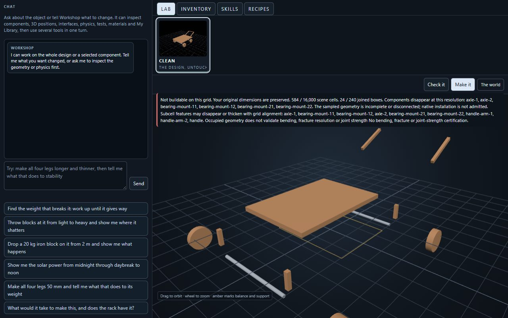

*The Lab, with the **Apart** slider dragged out. The cart is 14 parts and 35.895 kg: a deck,
two axles, four bearing mounts, four wheels, two handle arms and a handle, each
with its own material.*

**2. Ask whether it is a machine.** *Check it* answers two different questions,
and the first is not about physics at all: are the concepts there? Is every
part fastened to another; does every wheel have something to turn on; does
something stand still for the rest to move against; does it say which part you
take hold of? A missing concept is reported and never guessed at, because
guessing there would be designing on your behalf.


The second question is whether the room can carry it as drawn. Usually not: the
world keeps matter on a 40 mm grid, and sizes that read well to a person are
rarely sizes a grid can hold. So the bench redraws it, and says every change it
made and why:

| the redraw | why |
| --- | --- |
| nothing thinner than two cells | a part thinner than a cell shares that cell with whatever else reaches into it, and the grid hands the cell to one of them |
| every face on a cell boundary | a face inside a cell leaves a part with no cells unarguably its own, and two parts bonded solid never share a cell face |
| a shaft through its mounts becomes a stub per bearing | no lattice body can carry a hole for another body to turn inside — true at 40, 20 and 10 mm alike, so the grid-legal bearing is a stub butted to its mount |
| one material to a moving group | the compiler carries a group as one body, and a body is one material |
| a strut is rebuilt between its anchors | a member that spans two things *is* its two anchors; the moment either end moves, a resized strut is the wrong length and pointing the wrong way |

The cart takes 37 of these. Its through-axles come out as four stubs, each
butted to its own mount and carrying its own wheel — which is how the rover's
wheels are built in the world already. The bench says so on screen: *"Components
disappear at this resolution: axle-1, axle-2, bearing-mount-11…"*, and
*"584 / 16,000 scene cells"*.

**It is not written against any particular object.** The rules know about
cells, bearings, materials and struts, and nothing about carts:

| built from components | redraws | comes out as |
| --- | --- | --- |
| a cart: deck, mounts, axles, four wheels, handle arms and a handle | 37 | four 5.02 kg wheels on four hinges to a 47.40 kg frame |
| a door: two posts, a lintel, a leaf on one bearing | 4 | a 103.04 kg frame and a 23.30 kg leaf on one hinge |
| a well pulley: two posts, a headstock, a drum, a rope, a bucket | 6 | a 36.56 kg headstock and a 33.15 kg drum, rope and bucket turning on it |
| a mace: a haft and an iron head that turns on it | 2 | a 2.87 kg haft and a 4.03 kg head on one hinge |

*(Measured 26 September through `workshop_fitting.check_validity`, the call
`tests/workshop_fitting_tests.py` makes.)*

Only the cart was tuned for. The well pulley was built through the same four
tools an AI model is given (`add_part`, `remove_part`, `set_joint`,
`check_validity`) and turned up a refusal the cart never hit. The mace turned up
a better one: every other machine braces against a frame, and a hand-held one
has none — so the part it says you take hold of *is* the frame, and the check
now reads "you hold the haft, so that is the frame". Without that it is refused
for being all moving parts.

**3. Drive it.** The owner's words, of an earlier panel of controls and a Do it
button: *"I don't understand what turning the left wheel to reverse and hitting
do it means... allow me to become the object and control it with the keys."* So:
take the keys, and W A S D (or the arrows) go, back, turn left, turn right, in
a little world with ground and a sky, kept on the server and stepped an eighth
of a second at a time as the keys arrive. The keys are put to the thing's
program as the asks a panel makes in the world, so a rover and a drone drive the
same way; a machine with wheels and no program is driven by its wheels' own
controls. Driven by hand for 10.9 seconds, the drone pictured earlier went
7.55 m.

**4. Every run is kept as a take.**

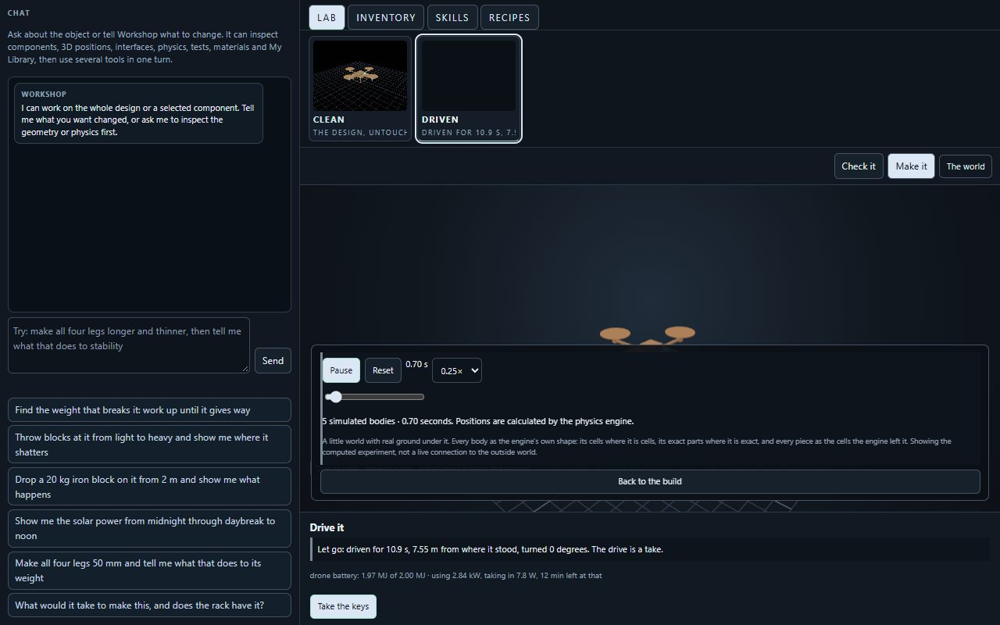

*The first take is **Clean** — the design as it is, untouched. Every run,
whether the chat asked for it or the controls below did, becomes a take beside
it with its picture and its verdict. A run never replaces the thing: click a
run's take for its replay, click Clean and the design is back.*

**5. Find out what it would take, and make it.** The rack holds what the
workshop has, per material, in kilograms. Every design says what making it
would take against what is there, and what is short. A design is drawn,
measured and driven whatever the rack holds; only *making* it draws stock.

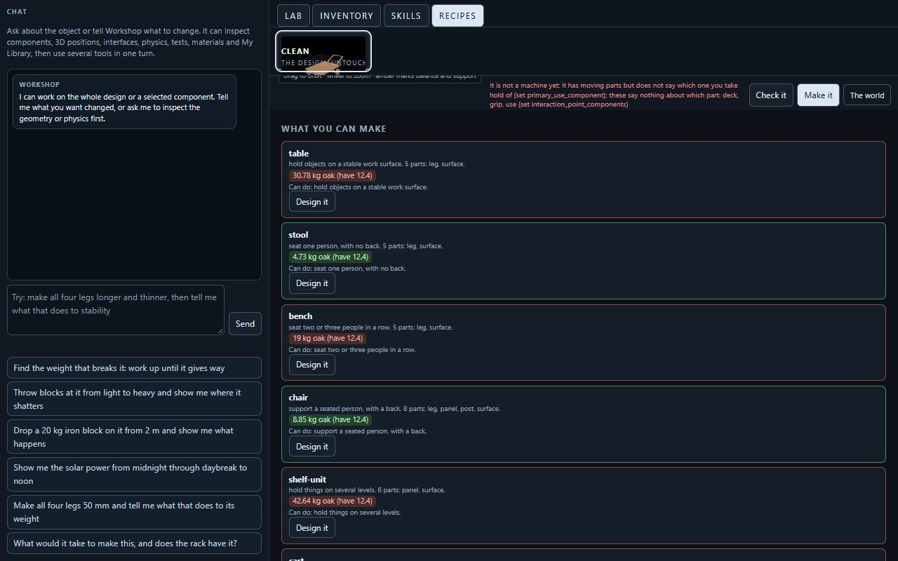

*Green where the rack has it, red where it does not.*

*Make it* finds ground nothing else has claimed, takes the material out of the
rack — all of it or none — and installs the machine. It arrives as separate
bodies that keep their joints, and the room describes it in its own words:
**turns on a pin**, with *take hold of it and work it by hand*, *turn it all the
way*, *turn it half way*.

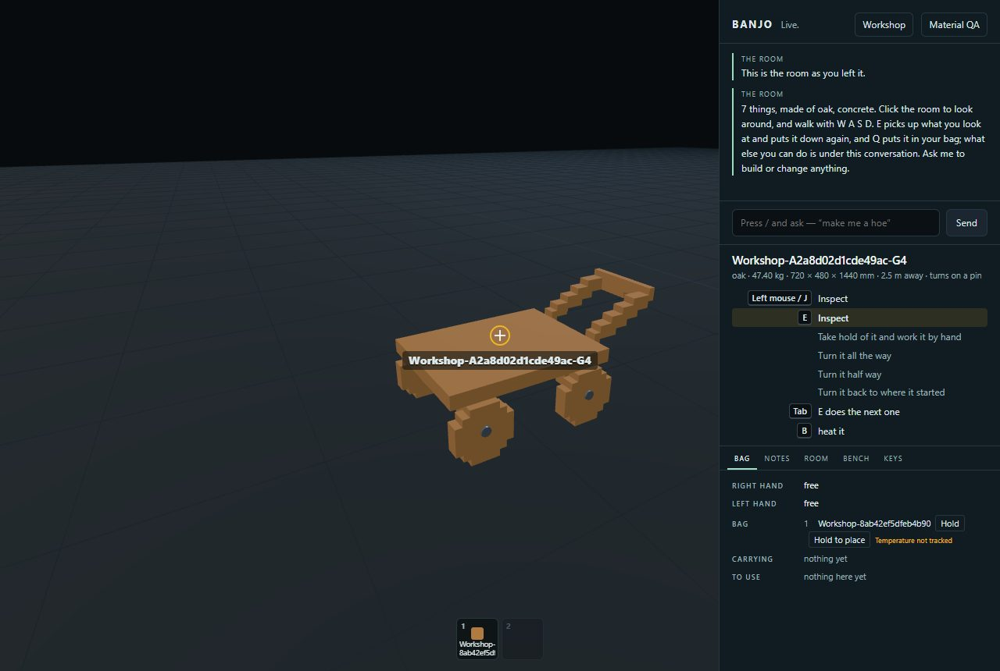

Because it is lattice matter throughout rather than one rigid lump, it is still
breakable: the parts that turn are separate bodies, and each of them can dent,
crack and shatter like anything else in the world.

**Not built:** only *goods* fill the rack from the world — the mine chain above
does, through its rack stockpile. No chopping, quarrying or reclaiming puts
oak, iron or stone back, so a design's materials are still stocked by hand on
the bench. Taking a made product back apart happens in the world's physics, by
breaking it; the bench has no intake that reclaims one. And a machine still has
to name the component you take hold of and bind each place you touch it; the
templates declare neither, so both are set through the chat.

---

## Try it yourself

### What you need

- **CMake 3.25+ and a C++23 compiler**: Visual Studio 2022 on Windows, where
  Banjo is developed, or GCC 12+ / Clang 16+ on Linux, where CI builds it.
  macOS is not built or tested. Before CMake 3.27, the first build stops once
  and asks you to configure again.
- **Python 3**, with nothing to install. CMake uses it to check the build's
  floating-point settings, and the server, the MCP servers and the Python
  binding use only its standard library.
- **Git and network access for the first configure.** CMake downloads Jolt
  Physics v5.6.0 and nlohmann/json (and raylib 6.0 for the desktop lab).
- **An OpenAI API key, only for the chats** (the room's, the bench's, a
  machine's) and the model-graded QA. Put `OPENAI_API_KEY=...` in a `.env` file
  at the repository root; `OPENAI_MODEL` changes the model from the default
  `gpt-5-mini`. Everything else runs without a key.
- **Chrome**, only for the browser tests.

### Build

The world needs four programs: `banjo_c` (the shared library, `banjo.dll` or
`libbanjo.so`), `banjo_live_world_run` (the world's engine),
`banjo_platform_cli`, and `banjo_network_lab` (the desktop studio). The older
lab and QA pages need more; build without `--target` to get everything.

Windows:

```powershell
cmake -S . -B build/integration -G "Visual Studio 17 2022" -A x64 -DBANJO_BUILD_LAB=ON
cmake --build build/integration --config Release --parallel 8 --target banjo_c banjo_live_world_run banjo_platform_cli banjo_network_lab
```

Linux, the way the container builds it:

```bash
cmake -S . -B build/linux -G Ninja -DCMAKE_BUILD_TYPE=Release -DBANJO_BUILD_LAB=OFF -DBANJO_BUILD_HEADLESS=ON -DBANJO_BUILD_PRECOMPUTE=OFF -DBANJO_BUILD_TESTS=OFF
cmake --build build/linux --parallel 2 --target banjo_c banjo_live_world_run banjo_platform_cli
```

(Two compile jobs on purpose: one per core ran an 8 GB build machine out of
memory.)

### Run

The server looks for the engine in `build/win-joint-double/Release` unless you
tell it otherwise, so point it at your build:

```powershell
python playground/server.py --port 8765 --engine build/integration/Release/banjo_platform_cli.exe --studio build/integration/Release/banjo_network_lab.exe
```

```bash
BANJO_LIBRARY=$PWD/build/linux/libbanjo.so python3 playground/server.py --port 8765 --engine build/linux/banjo_platform_cli
```

It listens on `127.0.0.1` only and keeps its rooms in
`build/playground-rooms/<port>`. Open `http://127.0.0.1:8765/world`.

| Address | What it is |
|---|---|
| `/` and `/world` | the main world, with the chat and the side panel |
| `/world?workshop=1` | the bench: design one product at a time, drive it, and make it |
| `/world?scene=<room>` | any of the 26 rooms ([the list](docs/what-works-where.md#the-rooms)) |
| `/debug` | not the game: every room one click away, what the engine reports, the QA suites |

That is the whole site. The Explorer, the fabrication page, the three QA pages
and the older fracture lab were taken out: what a person opens is the world,
and the bench inside it. Nothing they held is lost -- their rooms are still
there as `/world?scene=explore` and `/world?scene=fabrication`, and the
measurements the QA pages drew are made by `scripts/material_qa.py`,
`scripts/mechanics_qa.py`, `scripts/tool_qa.py` and `scripts/fabrication_qa.py`
in CI, which never needed a browser to do it.

What did need a screen is on **`/debug`**, linked from the world's header and
from nowhere else. It is one page, and it is where any screen built for
debugging goes from now on: the alternative is a page per job, which is how
there came to be seven. It lists every room as a link, says what `/api/status`
reports the engine is set up with, and shows the three QA suites -- how many
cases each holds, whether it can run here, and a button for one case when you
want it now and watched rather than in CI.

The main world stands on a generated valley with a river and a pond, and holds
a latched gate, a portcullis on a winch, a self-closing door, a bell on a rope,
a crate, a ceramic pot, a plank, a rubber ball, a bow, an iron sword, a pick, a
hearth with an iron pot and two burning logs, a table and chair, and a battery
hoist.

| The west terrace | The east terrace |
|---|---|
| 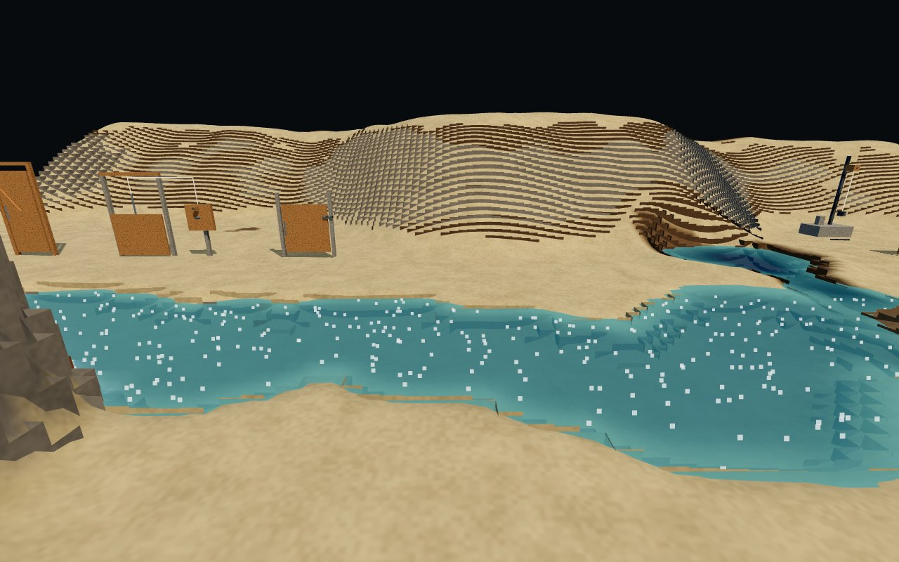 | 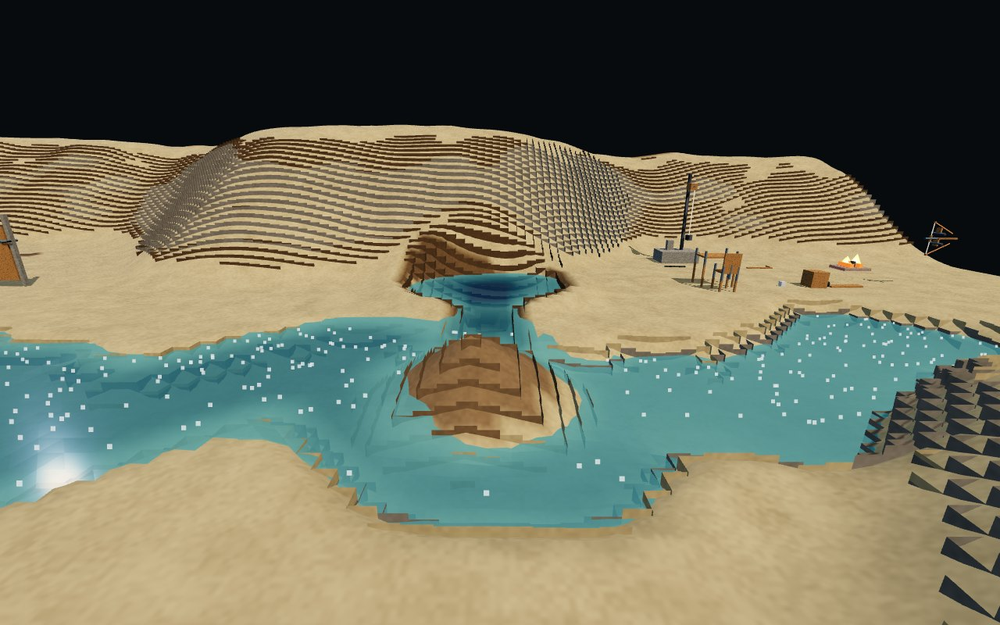 |

**Twenty-four other rooms exist, and the menu offers two of them** —
everything else opens by typing its address, which is the single biggest gap
between what is built and what you can find.

### Controls on `/world`

| Key | Does |
|---|---|
| W A S D, mouse | walk and look |
| E | pick up what you look at, or do what the side panel marks with E; with something held, put it down where the see-through copy shows |
| Tab | move E to the next action |
| Q, 1–9 | put it in the bag; take a bag slot into the hand |
| Left mouse (hold, release) | wind up and throw; draw and loose the bow; swing a sword or a pick |
| J | use the thing you hold or look at for what it is for |
| Right mouse | lower, let down, pry with the pick, or turn a sword's edge |
| R | release a latch |
| F, H, B | dig here, heap here, heat it |
| Space, Shift+Space | up and down |
| / | talk to the room's chat |

And: W A S D walk, drag or the arrow keys look, E takes or puts down, J uses a
thing, Q bags it, G sweeps up loose pieces, X lets go, and the mouse wheel
pulls the camera back.

| Looking at it | Holding it |
|---|---|
| 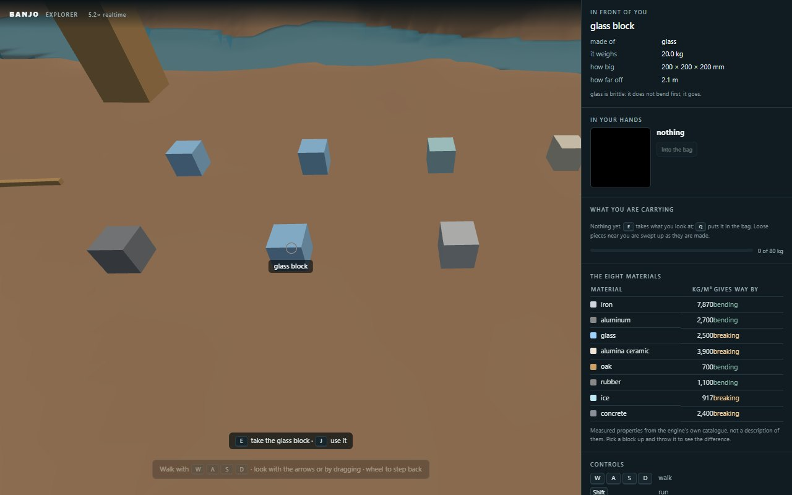 | 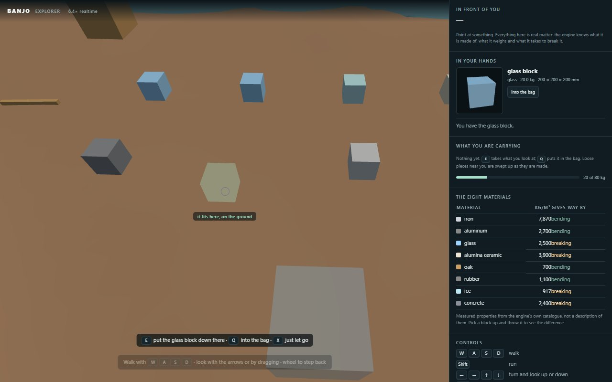 |

*The explore room. Looking at a block, the panel shows what the engine knows about
it: glass, 20.0 kg, 200 × 200 × 200 mm, 2.1 m away. After **E** it is in your
hands, a see-through copy shows where **E** will put it down (the engine has
checked that it fits), and the carrying bar counts its 20 kg against the 80 kg
limit.*

### Use the engine from a program

```c
#include "banjo/banjo.h"
#include <stdio.h>

int main(void) {
    banjo_world *w = banjo_open(
        "{\"bodies\":["
        " {\"name\":\"slab\",\"shape\":\"box\",\"material\":\"concrete\","
        "  \"dimensions_m\":[1.0,0.2,1.0],\"center_m\":[0,-0.1,0],\"anchored\":true},"
        " {\"name\":\"ball\",\"shape\":\"sphere\",\"material\":\"glass\","
        "  \"dimensions_m\":[0.1,0.1,0.1],\"center_m\":[0,10.0,0]}]}",
        0.02);                                    /* 20 mm cells */
    if (!w) { fprintf(stderr, "%s\n", banjo_last_error()); return 1; }
    for (int i = 0; i < 900; ++i) banjo_advance(w, 1.0 / 120.0, 0.003);
    printf("%d bodies now\n", banjo_body_count(w));  /* more than two if it broke */
    banjo_close(w);
    return 0;
}
```

A 100 mm glass ball falls 10 m onto a concrete slab, arriving at 14 m/s, and
breaks into 36 pieces — so this prints `37 bodies now`, the same three times
running. Dropped from 3 m instead it arrives at 7.7 m/s, below glass's bar, and
the program prints 2. That is the second row of the [materials
table](#eight-materials-and-what-they-actually-do), reached from C.

Build against an installed library (`cmake --install build/linux --prefix
/somewhere`, then `cc drop.c -I/somewhere/include -L/somewhere/lib -lbanjo`), or
use `find_package(Banjo)` and link `Banjo::banjo_c`. From Python, with the same
scene as a dictionary:

```python
import sys; sys.path.insert(0, "bindings/python")
from banjo import World

with World(scene, cell_size_m=0.02) as world:
    for _ in range(600):
        world.advance(1 / 120)
    for body in world.bodies():
        print(body.name, body.material, body.position_m)
```

The binding finds the library through `BANJO_LIBRARY`, or in
`build/integration/Release`, `build/Release`, `build` or `bin`. The material
table earlier in this README was measured through exactly this path. The full
reference is [docs/api/](docs/api/README.md).

### Give an AI model the tools

```bash
claude mcp add banjo -- python /path/to/banjo/mcp/banjo_mcp.py
```

`mcp/banjo_mcp.py` has 89 tools for building and running worlds;
`mcp/banjo_platform_mcp.py` adds the bench, material QA and physics trials, for
115. Both speak MCP over stdio, need the built library, and call no model
themselves. See [docs/api/mcp.md](docs/api/mcp.md).

### Host it

The [Dockerfile](Dockerfile) builds the engine for Linux and runs the same
server on every network interface, which it refuses to do without
`BANJO_PASSWORD`. Set `BANJO_PUBLIC_HOST` to the one hostname it should answer
to, give it `OPENAI_API_KEY` as a secret, and mount a volume at `/data`.
[docs/deploy.md](docs/deploy.md) covers Fly.io and Render. The container builds
only the three programs the world needs, so the lab and QA pages do not work
there.

---

## How the system fits together

```text
 a person in a browser                            an AI model or agent
 /world  /explore  the bench  lab and QA pages    (MCP over stdio)
          |  HTTP + JSON                                  |
          v                                               v
 playground/server.py  --- the room's chat --->  mcp/banjo_mcp.py        world tools
 one live world per server, rooms saved           mcp/banjo_platform_mcp.py  + the bench
 to disk, the 1.1x realtime rule                          |
          |  JSON lines over stdin/stdout                 |  ctypes
          v                                               v
 banjo_live_world_run  ---------------------->  the engine (C++23), also built as
 (the world's engine process)                    libbanjo with a C API, ABI 25
```

- **The engine** is C++23. `LiveWorld`
  ([`src/fastlattice/LiveWorld.cpp`](src/fastlattice/LiveWorld.cpp)) runs the
  world: Jolt for rigid motion and joints, the cell lattice for breaking and
  denting, and the heat, water, ground, machine and program systems.
- **The C library** (`libbanjo`, [`include/banjo/banjo.h`](include/banjo/banjo.h))
  exposes the engine to any language that can call C. The Python binding
  ([`bindings/python/banjo.py`](bindings/python/banjo.py)) is plain ctypes.
- **The server** ([`playground/server.py`](playground/server.py)) holds one live
  world at a time. The world runs in its own process, driven over JSON lines, so
  a crash in the world does not take the server down. Rooms are saved as they
  change and come back after a reload or a restart: moved, broken, dented and
  cut things, joint angles, the ground, heat, what you carry, and where a
  machine gave up. A saved world that cannot be restored whole is set aside,
  never deleted.
- **The pages** draw only what the engine reports. An object with cells is drawn
  as its cells, so a broken thing looks broken. The page steps the world against
  the real clock, about thirty times a second; with no page open, the world
  waits.
- **The chat, the machines' chats and the MCP servers share one set of tools.**
  The room's chat builds in its own copy of the room and the room is then
  reopened with everything the change did not touch kept as it was. A declared
  structure — a staircase, a ski jump — is measured before the chat may call it
  finished.

---

## Design rules

1. **Physics decides; names never do.** No pre-cut pieces, no shatter
   animations, no explosion impulses, no rules like "iron + glass = shatter".
   Material, shape, state and a declared law decide what happens. A property the
   engine does not model is reported or refused, not faked.
2. **Real time, or refused.** Nothing may take more than 1.1 times the simulated
   time of the whole interaction, including settling. The server refuses such a
   job before it starts.
3. **Done means you can watch it in 3D.** A measurement or a passing test is not
   finished work until it can be seen in the world.
4. **Nothing resets.** A reload, a restart or a chat edit keeps everything that
   was not changed.
5. **One world, built by asking.** The world's contents are built through the
   chat and the same tools any program can use, not placed by hand. (The
   explore room's valley is the exception so far: a script lays it out.)
6. **Simple controls, real physics.** A control is a bounded hand, never a set
   velocity.
7. **Knowledge unlocks plans; physics decides results.** Progress teaches a
   player what they can make. It never makes the same object stronger.
8. **Say what was measured.** Designed, implemented, experimental and validated
   are kept apart, with numbers and their conditions. A green build is not a
   validated material.

---

## What is not done

The project's own checklist of 30 player capabilities
([progression/physics-capabilities.json](progression/physics-capabilities.json))
stands at **1 complete, 26 partial and 3 planned**. In rough priority order:

**Get what is built into the world.** The menu shows 2 of 25 rooms, so breaking
under load, the gas piston, fine cells for cutting, the plates of every material
and the whole watershed are reachable only by typing an address. The explore
room still rebuilds its valley on every load, so nothing done in that one room
is kept. Freezing exists only in a separate voxel thermal simulation with no link
to the world's heat. Circuits run in the engine but the room refuses them.
Different cell sizes in one world are not built, and the scene format, scene
builder and renderer all assume one size.

**Physics still to build.** Heat: freezing and boiling in the world, fires that
go out, thermal expansion, smoke and airflow, heat into water and ground,
mechanical work turning into heat. Water: waves, sediment, rain, wet soil, water
putting out fire, containers and pouring. Ground: breaking rock, tool wear,
rotational landslides. Machines: gears, motor heat, hinges with a strength,
joints that fail by bending or prying, a bump sensor that feels a knock rather
than a stall. Breaking: calibration against laboratory data, converged piece
counts, a failure path for thin parts. Scale: a cell size per object, refining
on demand, dormant regions, beyond 16,000 cells a room and 2,000 bodies.
Handling: two hands, grip and use points.

**Known defects.**

- **CI on `main` is red**, and has been since the `agent/fracture-truth` merge
  on 26 September. Two tests in `tests/workshop_bench_engine_tests.py` fail —
  both about a kettle holding water and heat. The C++ suites are not what is
  failing; it is that one Python step. The nightly long-physics job is a
  separate, older failure: it has failed every night since 14 September.
- Using "Manufacture parts" locks the main world: once starting stock is set up
  on `/fabrication?scene=world`, the server treats the world as a funded room
  and refuses the chat, heating, grabbing, throwing, sweeping and latch release.
- Bonds reach across a one-cell gap (`buildBonds`, `src/matter/Lattice.cpp`), so
  two sides of a slot are joined through it.
- A crack inside a body that stays whole heals on its next run. A fix is
  uncommitted on `agent/shard-rest`, waiting for the owner.
- A thing of several parts set down on a slope goes down as one upright shape;
  where its feet span more than the engine's 6 cm look-down it is refused.
- Holding the cart counts only its 21 kg chassis against the 80 kg carrying
  limit; the bag counts all 43 kg.
- Open issues [#17–#21](https://github.com/lrspeiser/banjo/issues): a curved
  skin sinks a part into the floor; a glass table skids and never breaks; the
  stool, chair and shelf cannot be simulated at 40 mm; declared joint weakening
  has no numbers; a loaded oak table chars through and never gives.
- `playground/rooms/world.json` was made by a script that is not in the
  repository, so the main world cannot be rebuilt from source.

**Before others use the code.** There is **no licence**, and without one nobody
may legally use this — that is the first thing, along with a `NOTICE` for Jolt
Physics (MIT), nlohmann/json (MIT), raylib (zlib) and three.js (MIT). Then: a
green nightly run (the long-physics job has failed every night since
14 September); one build folder per platform instead of fifteen scripts pointing
at `build/win-joint-double`; docs that are current (`docs/` has 211 markdown
files, most of them dated checkpoint notes, and several contradict the code); a
release with tags and installable packages (the shared library is versioned
4.0.0 while its ABI is 25); and CI on more than Ubuntu with GCC.

**Before hosting it for other people.** Accounts instead of one shared password.
A world per person — one server runs one world for everyone, a second tab takes
it over. Chat cost controls: measured turns
use 62,000 to 2.76 million input tokens with no per-person budget. Robustness: a
world process that stops answering blocks the server, and a chat turn can hold
the world for 420 s. And a real host — the copy on Render is on the free plan,
so every deploy or idle spin-down deletes the rooms.

**Decisions waiting on the owner:** the licence; the hosting plan; which
fracture solvers to keep; joint-strength numbers; whether charred wood keeps a
little strength. (Whether the Explorer replaces `/world` is settled: the site is
the world, and the Explorer's valley is one of its rooms.)

**In progress on branches:** `agent/throw-aim` (where a throw would land, drawn
before you let go), `agent/room-surfaces` and `agent/room-looks` (how the room
is lit and how things are drawn), `agent/journey-auto-placing` (a stricter
put-down for the browser journeys).

---

## Documentation

Most of `docs/` is a development log: a checkpoint note records one piece of
work as it stood that day. **Where a note disagrees with the code, the code is
right.** Start with these:

| Topic | Read |
|---|---|
| What works and where you can reach it | [what-works-where.md](docs/what-works-where.md) |
| The C API and materials | [docs/api/README.md](docs/api/README.md), [c-api.md](docs/api/c-api.md), [materials.md](docs/api/materials.md) |
| The MCP tools | [docs/api/mcp.md](docs/api/mcp.md), [machine-networks.md](docs/api/machine-networks.md), [workshop.md](docs/api/workshop.md) |
| The live world and why it works as it does | [a-world-that-keeps-running.md](docs/a-world-that-keeps-running.md) |
| Heat, fire and strength | [thermal-mechanics.md](docs/thermal-mechanics.md), [thermochemistry.md](docs/thermochemistry.md) |
| Water and ground | [terrain-and-water.md](docs/terrain-and-water.md), [watershed.md](docs/watershed.md), [ground-work.md](docs/ground-work.md) |
| Machines, programs and goods | [machine-world.md](docs/machine-world.md), [machine-circuits.md](docs/machine-circuits.md) |
| Cutting and handling | [cutting-model.md](docs/cutting-model.md), [interaction-profiles.md](docs/interaction-profiles.md), [placement-and-interaction-points.md](docs/placement-and-interaction-points.md) |
| The bench and products | [workshop-mode.md](docs/workshop-mode.md), [workshop-deep-dive.md](docs/workshop-deep-dive.md), [product-framework.md](docs/product-framework.md) |
| Building from language | [building-from-language.md](docs/building-from-language.md) |
| Breaking: what it costs, and what is not calibrated | [what-a-break-costs.md](docs/what-a-break-costs.md), [plate-bending.md](docs/plate-bending.md), [criterion-energy-scaled-checkpoint.md](docs/criterion-energy-scaled-checkpoint.md), [glass-drop-benchmark.md](docs/glass-drop-benchmark.md) |
| Every mechanic and its evidence | [mechanics-scorecard.md](docs/mechanics-scorecard.md) |
| The pages and HTTP routes | [playground/README.md](playground/README.md) |
| Hosting | [deploy.md](docs/deploy.md) |
| The long-term plan | [project-master-plan.md](docs/project-master-plan.md), [roadmap.md](docs/roadmap.md) |

### Repository layout

```text
include/banjo/banjo.h      the C API (ABI 25)
src/
  fastlattice/             LiveWorld (the running world), the cell lattice, fracture
                           admission, exact bodies, machine programs
  rigid/                   Jolt: rigid bodies, contacts, joints, the rope drum
  matter/  material/       cells cut from shapes; the material catalogue
  fracture/                bond failure, pieces, fragment geometry, statics
  thermo/                  heat, burning and strength loss in the world
  terrain/  water/         ground columns and digging; shallow water, rivers
  machines/                circuits
  capi/                    the C API
  numeric/                 the floating-point profile
  physics/ modal/ thermal/ world/ platform/ precompute/ prediction/
                           other solvers, references and older lanes
  sim/ viewer/ app/ creator/ core/ persistence/
                           desktop apps, command-line tools, shared helpers
bindings/python/           the Python binding
mcp/                       the MCP servers, and the bench and product model
playground/                the server, the pages, the rooms, goods and routines
tools/                     the world's engine process, builders, probes
scripts/                   build guards, QA runners, benchmarks
tests/                     C++ and Python tests, browser tests
progression/               the 30-item capability checklist
docs/                      design notes, API reference, checkpoint log, evidence
examples/                  a C example, the authoring client, physics trials
```

### A lot of the code is research that did not become the world's path

- **The older "network" solver** (`src/platform/NetworkWorld`): deformable cell
  networks with per-object resolution and directional (grain) materials. Its
  fracture does not converge.
- **Fracture solvers tried for speed**: implicit Newton/GMRES, a modal basis, a
  quasi-static solve (its static solver is reused for breaking under load), a
  GPU (CUDA) lattice, and three algorithms, of which 1 and 2 were not adopted
  and are not on `main`.
- **Reference solvers**: cohesive interfaces, tetrahedral contact, a coupled
  sphere-and-mesh contact reference, continuum pressure with J2 plasticity, and
  orthotropic elasticity.
- **The separate voxel thermal world**, with melting and freezing.
- **Desktop applications**: the original ball lab (`banjo_lab`), the bowl lab,
  the creator workshop and the starter game (raylib).

Each needs a decision: bring it into the world, keep it as a reference test, or
archive it.

## Contributing

Read [AGENTS.md](AGENTS.md) first. In short:

- Check `git worktree list` and the open branches before starting; several
  people and agents work on this repository at once.
- Compare any material claim across at least glass, oak and iron under the same
  conditions, and never loosen a tolerance to make a test pass.
- Every source file must be built by a CMake target;
  `python scripts/check-source-registration.py` checks this, and CI runs it.
- Something is finished when it can be watched working in the world, in 3D, at
  real time.
