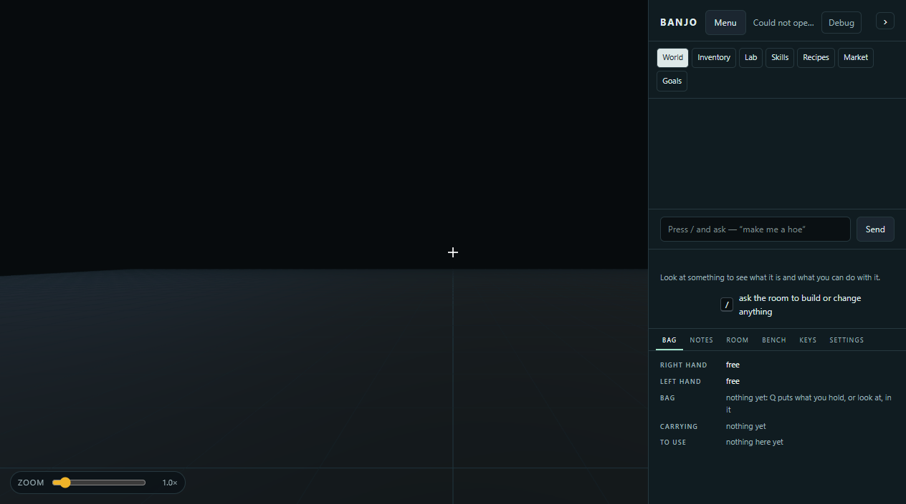

# AI player playthrough review — September 30, 2026

**Follow-up implementation:** [P0 persistence repairs](player-persistence-checkpoint.md) address the recorded save and packed-state failures. [Personal machine learning](player-learning-checkpoint.md) now demonstrates one technique through an explicit nearby observation action, with restart recovery and world-aware guidance. The historical run below still records what happened at its stated revision. Automated post-camp progression, the first gathering tool and the next goal chain remain unfinished; no live-provider trial has been performed.

## Result

**The character finished first camp, but earned 0 of 9 techniques.** I then
continued planning for that same character through normal player APIs. Gathering,
further banking and further construction were blocked. The world subsequently
refused a fresh browser rejoin.

| Measured result | Value |
|---|---:|
| Opening goals | 4 / 4 |
| Personal techniques | 0 / 9 |
| Automated decisions | 10 |
| Opening run, including movement and observation | 22.970 s |
| Energy banked successfully | 1,000 J |
| Oak bought | 3 kg |
| Oak purchase cost | 744 J |
| Finished item | Camp stool, 2.5088 kg, in the character's bag |
| Remaining personal oak | 0.4912 kg |
| Final settled wallet | 256 J |
| Successful continuation purchases/builds | 0 |

The opening loop works. **There is not yet a playable connection from that loop
to the personal tech tree.** These are observations from one generated world,
not a claim that every seed or every possible route was tested.

## How I played

I created a separate world, **AI progression review - Sep 30**, and an **AI
playtester** character with its own avatar, hand, bag, wallet and notebook.
Terrain seed: **7**. Goods seed: **851269742**. Source and native build:
`f50cdcd23671eef24250328f3e0abdcd37e6e6a7`, Windows 11, Python 3.13, MSVC Release,
native subprocess runner from `build/agent-xray/Release`. The normal world clock
was enabled; I did not accelerate it or seed additional resources.

**No OpenAI provider key was configured.** The app's explicitly labeled
**Reference bot** performed the opening loop, with zero model calls. After it
stopped, I supplied the planning myself and used authenticated player requests
for the same character. Its private identity was read locally from the server's
own character record; no other player's identity was used. Tokens and local
private state are excluded from the published evidence.

The continuation used the existing terrain survey, movement, tool inspection,
structure inspection, Market and recipe preview APIs. I did not grant skills,
edit the journal, alter physics, inject stock, bypass payment, or commit a
refused preview. The controller's saved 10-decision history covers first camp;
my continuation attempts are recorded separately in the evidence.

This is a real HTTP/native gameplay smoke run plus an assistant-guided audit.
It does **not** measure live-provider planning quality or an autonomous agent's
ability to explore the full tree. Short movement uses the game's current visual
avatar model, with terrain surveys and increments of at most 0.4 m; it does not
establish collision-aware physical walking.

## What happened

### 1. First camp succeeded

The character deposited 500 J, bought four oak lots, deposited another 500 J,
bought two more lots, built the curated stool and packed it. All 10 actions
received committed receipts. The six oak prices were **120, 122, 123, 125, 126
and 128 J**. The native installation charged resources and reported 2.5088 kg.

The observer's wallet remained **0 J** and its bag remained empty. Watching
showed the AI character's stool and **4 / 4 goals**, alongside **0 / 9 techniques**.
The separate player state is useful and visible here; this was not a simultaneous
multiplayer stress test.

The bank draws from the world's shared solar store, which begins with charge.
This run does not establish that all 1,000 J were generated after the character
arrived, or that it owns a separate solar installation. A successful stool
installation is not a seating, joint-strength or fracture certification.

### 2. The suggested learning routes did not advance personal knowledge

| Route tried or checked | Actual obstacle |
|---|---|
| Gather with the current equipment | Tool API: “Take up a tool first: look at it and press E.” The character had no tool. |
| Study the starter wooden pick | Skills says to study the pick “you were given”; the generated world and bag contain no such pick. Its shaping route also reports an unsupported process, missing stock and no workbench. |
| Approach and inspect the working copper smelter | I moved the character beside it and inspected its actual structure. Personal skills remained 0 / 9. |
| Learn smelting/drawing from machine work | The shared archive held successful batch records and both techniques, while this character's personal notebook remained empty. Named worlds have no machine witness attribution rule. |
| Follow the next skill suggested by Market | It suggested Burning lime, but this generated world has programs for rover, copper smelter and mill; no operating lime kiln. |

The graph marks several root techniques **within reach** because their skill
prerequisites are satisfied. That is not the same as an executable route in this
world. The user-facing claim needs a world/equipment/action check.

The background machine records use declared recipe yields and work requirements,
not measured chemistry. They are useful evidence of ledger activity, not new
material realism evidence. Their presence in the shared archive must not be
reported as this player's achievements.

### 3. Continuing the economy hit a save failure

Market recommended a **copper wire coil** toward a **processor**, while separately
suggesting Burning lime. A coil costs 330 J; the character had 256 J, so I tried
to bank another 500 J before buying it.

The response was:

> The banked energy awaits a durable world save; retry this request id

I retried **the same request id**. It still failed, with “The banked energy still
awaits a durable world save.” No new wallet credit or coil purchase was counted.
The server logged **“Raw returns do not match native ground receipts.”** Its
ground-stock validator requires the receiving return ledger to match the native
ground's returned volumes. That invariant was not met in this running world.

At a captured checkpoint the persisted world was at **66.142 simulated seconds**,
while the live watch state was at **190.454 seconds**. The live simulation had
continued despite failing saves. I did not restart it to test recovery or erase
the pending deposit. The exact producer of the mismatch still needs a regression
investigation; the error alone does not establish it.

### 4. Further construction was refused

I prepared the existing **processor** and **bench** catalog recipes through the
same candidate/preview path used by Recipes → Make. Both previews failed with:

> Staging changed existing physical state for workshop-60f504af89d74e35; installation refused

That body is the stool already packed in the character's bag. The preservation
guard correctly refused the mismatch. I made no commit and did not weaken the
guard. This run does not identify which preserved body field changed; test
staging with parked inventory before diagnosing a fix.

The processor was also far from affordable as a complete item: at the earlier
continuation checkpoint it lacked **88.4 kg oak, 17 kg copper, 4.26 kg glass and
0.1 kg wire**. Market's `covers_gap` flag referred only to the wire shortfall.
Buying that coil would not make the processor ready or earn the unrelated skill.

### 5. Rejoining failed

A separate headless Chrome session, using the existing observer's identity,
could not open the world. It displayed **“The player could not be saved.”**
The existing in-app watch tab continued to show the character at the smelter.
The watch URL is therefore an identifier for this test world, not a reliable
fresh-session demo until saving/rejoin is repaired.

## Player experience review

**The best part:** energy → supplies → a visible object → your own bag is a
clear, verifiable loop. The compact watcher separates goals, energy and skills.
It gives us a useful foundation for repeatable playtests.

**Where it loses me:** finishing the stool has no useful next activity attached
to it. “Ready for another goal chain” suggests continuation, but no next chain
exists. Skills offers unavailable lessons and machines. Recipes says **Skill:
None required** for current Workshop construction, while the tech graph describes
skill-dependent manufacturing. They currently describe different systems.

Inventory also combines personal resources with shared starter stock. This
character personally had 0.4912 kg oak after building, but Recipes could use
**12.8912 kg**, including the shared 12.4 kg. That is legal current behavior;
it weakens the connection between collecting, owning and building unless the
screen clearly labels which pool will be spent. The carried product is named
`Workshop-60f504af89d74e35`, rather than Camp stool, making the result harder to
recognize.

Of the 15 built-in recipe entries inspected, eight reported fit for both grids;
seven needed changes. A new player's default catalog should prioritize recipes
they can use, with repair work in an explicit design/experimental section.
Readiness alone still does not prove installation or function: the previews in
this run failed after that check.

## Recommended work, in order

| Priority | Change | Acceptance check |
|---|---|---|
| P0 | Repair ground-return/save consistency without relaxing the invariant. Expose failed saves clearly. | In a generated realtime world, let the starter rover work and return material, bank repeatedly, reload and restart. Ground receipts, wallet deposits and the persisted native snapshot agree; no duplicate credit. |
| P0 | Preserve packed objects during recipe staging. | Make and pack the camp stool, then preview/commit a bench elsewhere. Existing body state, bag membership and mass remain unchanged. Also cover several guests' packed items. |
| P1 | Give the starting area one reachable, usable gathering tool and implement a personal machine witness rule. | A new player earns its first technique by an actual attributed action. Another guest watching elsewhere earns nothing. Reload retains the right journal. |
| P1 | Connect the next goal chain to that first technique. | Camp → obtain/study tool → gather a measured resource → build a useful work surface → perform one supported process. Every step is possible through ordinary player controls and has a receipt. No unsupported shaping operation hidden behind a goal. |
| P1 | Check skill guidance against this world's equipment and implemented actions. | Skills and Market name a reachable location and action, or explicitly show the missing prerequisite. Never tell a player to study a nonexistent gift. |
| P1 | Expand the AI action catalog after camp. | The character can select targets, move, inspect, acquire tools, use them, observe a batch and compare recipes. Test live provider play separately from the reference policy across seeds and shortages. |
| P2 | Make Market recommendations complete and relevant. | Show “Wire gap covered; oak/copper/glass still missing,” estimated total cost and the associated reachable goal. Prefer an affordable next capability over one small gap in a huge unrelated item. |
| P2 | Simplify resource and product labels. | “Camp stool,” personal/shared quantities, predicted debit source, and an explicit next use. Retain ids and detailed diagnostics in expandable debug views. |

For the AI, keep the existing rule that **receipts decide success**. Its prompt
should state: pursue the next reachable capability; inspect current prerequisites;
use only offered actions; verify receipts and personal skill changes; retry
idempotent transactions with their original id; stop and report the specific
blocker. It must never resolve these failures by editing saves, teaching itself,
creating free inputs or bypassing admission.

## Evidence and boundaries

- [Sanitized receipts, attempts, skill routes and archive comparison](evidence/ai-progression-review/playthrough.json).
- [AI controller contract](ai-characters.md), [opening goals](starter-goals.md),
  [knowledge model](knowledge-and-progression.md).
- Relevant sources: [controller](../playground/ai_player.py),
  [personal attribution and world persistence](../playground/server.py),
  [ground receipt validation](../mcp/fabrication.py),
  [installation preservation](../playground/workshop_install.py),
  [Market guidance](../playground/market.py).

World: `14d568103b12486594e48247cf444a05`. Character:
`f9120bfdfffd4fe080a06a801c76f935`. Local watch URL:
`http://127.0.0.1:8768/world?world=14d568103b12486594e48247cf444a05&watch=f9120bfdfffd4fe080a06a801c76f935`.
Runtime data remains under ignored `build/xray-preview-rooms`; it is not stored
in Git and the URL requires that local server.

The physical world reports 50 mm cells; movement requests used the existing
1/240 s, 48-step interface, subject to the shared realtime step budget. No
resolution, timestep or material law was changed. This review adds no strength,
fracture, conservation or manufacturing certification. It is not a complete
tech-tree achievement benchmark, scalability qualification, restart test or
cross-platform validation. The reported failures remain open.
