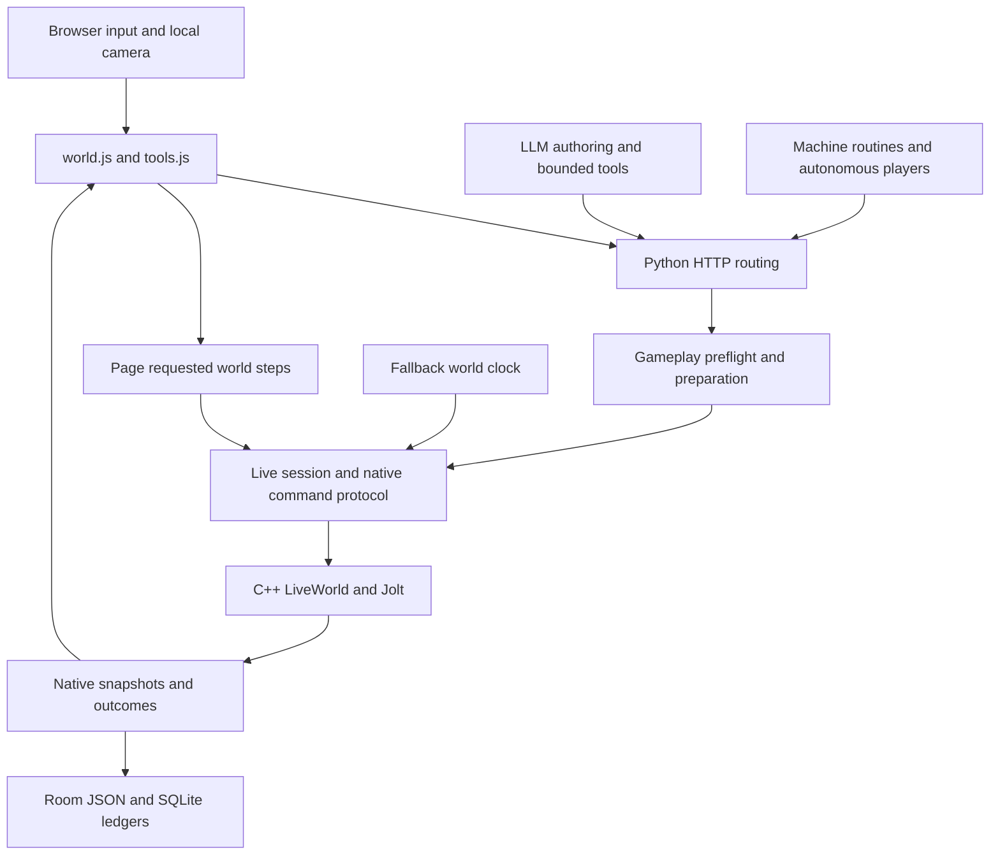
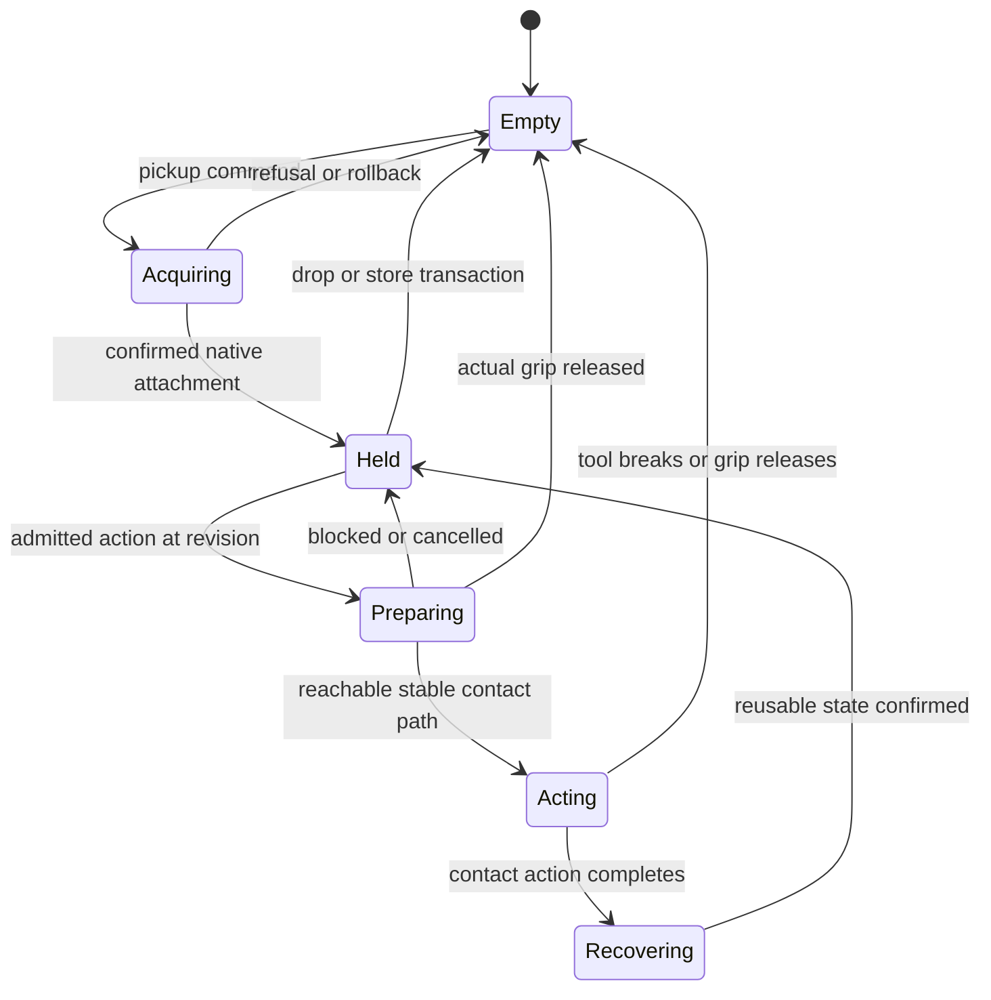
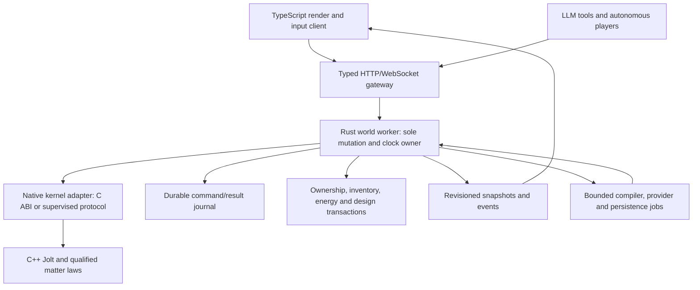

# Banjo codebase audit and rewrite specification

**Audit date:** October 6, 2026. **Original source baseline:** `5988f8b970b4e165216cdaaf42599836e064cdf6` on main. **Current review baseline:** `fbeb020517e5c560089950054e63e1d0a1910bfd`. Sections 1–22 preserve the original architecture audit; [section 23](#23-current-review-rewrite-progress-and-remaining-defects) reviews the implementation added since then and supersedes its next-step/status statements. This document update changes no simulation law and deletes no production code.

This document answers three questions: why the current gameplay remains unreliable despite many repairs, what the replacement must change, and which code can be removed without losing useful capabilities. It covers the browser, Python host, native C++ engine, authoring, persistence, multiplayer, AI, tests and operations. The [original machine-readable inventory](evidence/rewrite-audit-2026-10-06.json) preserves the first baseline. The [expanded current inventory](evidence/rewrite-audit-current-2026-10-06.json) includes Rust, browser templates/styles, build/deployment configuration and textual fixtures/declarations. Both contain file hashes, line counts, Python imports, duplicate function bodies and static reference candidates. The [audit tool](../scripts/audit-codebase.py) regenerates an inventory without starting or stopping a server.

**Recommendation:** keep C++/Jolt and the independent physics tests; replace gameplay control around one Rust world owner, one native tool controller and one durable transfer protocol. Six private helpers are immediate deletion candidates after focused verification. Larger reductions require migrating live callers and old saves. Rust clock/pickup foundations now exist, but the current browser still uses the older host and cannot yet test the replacement gameplay loop.

### Reading guide

- [Current review and executable backlog](#23-current-review-rewrite-progress-and-remaining-defects): what exists now, what remains and what is safe to remove
- [Decisions](#1-decisions), [scope/evidence](#2-scope-and-evidence) and [priorities](#5-findings-and-priorities)
- [Tool/input rewrite](#6-tool-pickup-and-input-rewrite) and [matter/physics rewrite](#7-matter-ground-thin-geometry-and-contact)
- [Removal ledger](#8-code-removal-ledger): six small cleanup candidates, consolidation and twelve gated retirement paths
- [Rust/native architecture](#9-replacement-architecture-and-rust-boundaries), [contracts](#10-commands-snapshots-and-stable-identity), [storage](#11-persistence-recovery-and-long-lived-worlds) and [diagnostics](#12-diagnostics-and-replay)
- [Recipes/LLM customization](#13-products-recipes-manufacturing-and-llm-customization), [progress/energy/construction](#14-progress-energy-and-construction), [machines/water](#15-machines-robots-ai-players-and-water), [chat/voice](#16-llm-and-voice-integration) and [mobile/screens](#17-browser-and-mobile-simplification)
- [Multiplayer/deployment](#18-multiplayer-security-and-deployment), [test gates](#19-tests-that-establish-the-game-works), [ordered checkpoints](#20-ordered-migration-and-deletion-checkpoints) and [subsystem dispositions](#21-subsystem-disposition-index)

## 1. Decisions

1. **Replace gameplay orchestration around one authoritative world worker.** The server owns simulation time, actor state, command ordering, tool state and persistence. Browsers render snapshots and submit intents. Human players, AI players, chat tools and tests use the same command API.
2. **Use Rust for the new application runtime and contracts; keep C++/Jolt physics initially.** Wrap Banjo's C interface where it covers the operation; retain a supervised native worker protocol where it does not. Close that gap deliberately. Rewriting every numerical solver in Rust before fixing pickup would extend the period of unusable gameplay.
3. **Replace the tool controller as a system.** Pickup, equip, hand ownership, target admission, preparation, contact, release and results need one state machine. Additional tool-name exceptions and browser/Python preparation sequences will preserve the failure mechanism.
4. **Make constituent matter authoritative across excavation, fragments, storage and manufacture.** The present measured-work cut path is a useful bounded implementation, but it does not qualify the requested general constitutive terrain fracture model. Keep it explicitly labeled during migration.
5. **Keep physics reference programs and their tests.** Registered, separate sphere, patch, tetrahedron, contact and material experiments provide independent oracles. They are not automatically redundant because the game has another solver.
6. **Remove proven dead helpers in small checkpoints; retire larger paths only after migrating their callers and saved data.** This audit finds a handful of strong local deletion candidates. It does not support deleting thousands of lines immediately on an “unused” assumption. The large reduction comes from retiring overlapping controllers, adapters and persistence protocols after replacement.
7. **Make ordinary gameplay a required regression gate.** A source guard, mocked API response or scripted free camera cannot certify that a native player can tap a pick, retain it, aim at rock, remove material and retrieve the result on a phone.

That was the original opening checkpoint recommendation. Contracts, retained diagnostics, an isolated native-backed clock and native pickup admission have since been added; their limits and the current carry/use priority are recorded in section 23. More progression, construction or catalog content should wait until the complete ordinary pickup/use slice passes.

## 2. Scope and evidence

### Method

The review combines the four required project documents, current main/PR state, tracked-file inventory, Python syntax/import analysis, exact function-body comparisons, repository-wide symbol searches, CMake registration, configured CTest discovery, CI and deployment review, and source tracing of the user-facing failure paths. Particular attention went to `world.js`, `tool_use.py`, `live_session.py`, `LiveWorld.cpp`, `ToolTerrain.cpp`, `GroundExcavation.cpp`, Workshop facades, private ledgers and diagnostics.

This is a broad architecture and source audit with deeper inspection of critical paths. It is **not a statement that every line in all 934 inventoried files was manually reviewed**, a formal proof that every unused function was found, or new physical validation. Native experiments already documented in checkpoints are cited as prior evidence, with their limitations retained.

The snapshot excludes local `.env`, credentials, player rooms, run logs, build products, dependency caches and vendored source. It excludes 79,617 lines of tracked Three.js under `playground/vendor`; those files are third-party dependencies, not Banjo rewrite targets. It includes tests and research applications intentionally. Line counts include comments and blank lines and should not be used as removal quotas.

### Repository and runtime identity

Main was fetched before review and was clean at the source baseline. [PR #2](https://github.com/lrspeiser/banjo/pull/2) is now **merged**, with merge commit `29254bd0a0f8287ac6470f5c1d5af5fad32d6161`. The September pinned status saying it was an open draft is historical. The [contact checkpoint](contact-checkpoint.md) remains relevant for its experiment boundaries; neither its old branch status nor its small original test count describes the current whole project.

The user's local demo is a separate checkout/build under `C:/play`, with application code installed at `c29d8ade` before the later documentation checkpoint. A main commit, the files served by that process and the native binary compiled into that process are three separate identities. This audit leaves the existing demo and saved world unchanged. Future bug reports must capture all three identities automatically.

### Measured inventory

| Tracked area | Source files in inventory | Lines | Role |
|---|---:|---:|---|
| `src` | 283 | 88,103 | Native numerical models, world and physics integration |
| `playground` | 132 | 76,053 | Browser game, Python HTTP host, gameplay and authoring |
| `mcp` | 56 | 22,804 | Bounded external authoring/tool interfaces and shared schemas |
| `tools` | 44 | 15,794 | Native runners, CLI, benchmarks and developer workflows |
| `bindings` | 1 | 2,954 | Python C API wrapper |
| `include` | 1 | 1,903 | Public C ABI |
| `tests` | 366 | 130,292 | Native, host, client, browser and scenario tests |
| `scripts` | 36 | 5,535 | Existing automation and verification scripts |
| `examples` | 12 | 2,321 | Declared examples and integration samples |
| CMake root and helpers | 3 | 2,166 | Build registration and numeric configuration |
| **Total** | **934** | **347,925** | Selected tracked code, excluding vendor |

The newly added audit tool is outside the baseline inventory until it is committed. No Python parse errors were found in the scanned files. `scripts/check-source-registration.py` passed: 305 sources under `src/` and `tests/`, all 305 registered, no intentional exclusions. That proves target registration, not execution or live-game reachability.

The configured `build/local-cell-tools` Release directory lists **248 CTest entries**. Its JSON discovery has **149 entries without a resolved executable command**, corresponding to missing built executables in this partial build. The audit did not build them or run the full suite. A successful `ctest -N` listing must never be reported as a full regression pass.

### Concentrated complexity

| File | Lines | Why it matters |
|---|---:|---|
| [LiveWorld.cpp](../src/fastlattice/LiveWorld.cpp) | 17,463 | Time advancement, hands, player bodies, matter, tools, machines and handoff share a large implementation |
| [world.js](../playground/world.js) | 13,050 | Input, native movement, camera, terrain, tools, UI, chat and network state intermingle |
| [banjo_mcp.py](../mcp/banjo_mcp.py) | 8,379 | External tool surface also contains substantial orchestration |
| [workshop.js](../playground/workshop.js) | 5,703 | Catalog, editing, preview, tests, manufacture, carried items and navigation |
| [JoltWorld.cpp](../src/rigid/JoltWorld.cpp) | 4,594 | Important engine adapter and custom contact/constraint behavior |
| [server.py](../playground/server.py) | 4,195 | Routing, world lifecycle, authentication, saves and many subsystem integrations |
| [fracture_lab.py](../playground/fracture_lab.py) | 3,210 | Scene compilation, geometry and experiments; retain useful compiler behavior |
| [live_world_run.cpp](../tools/live_world_run.cpp) | 3,139 | Native command protocol; operation parity must be tracked |
| [live_session.py](../playground/live_session.py) | 2,442 | Host-side protocol, state merge, actor scope and stepping |
| [workshop_install.py](../playground/workshop_install.py) | 2,289 | Installation, recovery, ownership and persistence coordination |
| [workshop_chat.py](../playground/workshop_chat.py) | 2,068 | LLM prompts, tool execution and authoring state |

Splitting these files into smaller files alone would not resolve the failures. Each replacement module needs explicit ownership of state and a bounded public contract; the old caller must then disappear.

## 3. First principles and the opening loop

### Product requirements to preserve

Banjo is an editable physics platform with a playable world. A product's material, geometry, connectivity, state and implemented laws determine its behavior. LLMs can author designs and explain or invoke bounded commands. The runtime decides whether they are valid and what happened. A material name, assistant sentence, capability badge or saved thumbnail cannot confer a physical law or successful action.

The default gameplay should expose World, Inventory with Market, Build with Recipes/Lab, and Progress with Skills/Goals. The world opens with no unsolicited sidebar; `/` opens chat. Hands are clear thumbnails. Targets are readable, and supported actions acknowledge promptly. Gameplay materials are inorganic under the current owner policy, including coal; historical oak laboratory comparisons remain available independently.

The player should be able to:

1. Walk to an obvious starter tool and pick it up with one deliberate click or tap.
2. See the correct hand slot fill, with the same whole product identity.
3. Aim at nearby ground, see supported readiness and a useful refusal if blocked.
4. Use the tool repeatedly without a bespoke spinning animation or a queue of old targets.
5. See the actual cut and actual physical output at that cut, then collect nearby matter easily.
6. Open Build, choose a useful recipe or ask chat for a new tool, see material/skill/readiness values, and review a paid make.
7. Equip or place the resulting product; use it through its declared capabilities.
8. Receive earned progress from measured results, with a link to the next relevant action.
9. Leave/rejoin without losing product identity, inventory, holes or progress.
10. Perform those actions independently alongside another player, in the same or a separate world.

These are the rewrite's initial acceptance scenarios. Greater catalog breadth does not compensate for failures at steps 1–5.

### Separation of facts

Every screen and AI response must distinguish:

| Fact | Example | Authority |
|---|---|---|
| Authored intent | “This blade can loosen soil” | Design declaration, pending validation |
| Validated capability | Grip/contact frame and supported ground law compile | Admission report tied to design/model hash |
| Current readiness | Held, within reach, selected material supported, unobstructed | Current authoritative world query |
| Measured outcome | Removed 0.004 m³, released source cells, spent work | Simulation event |
| Paid ownership | Stored matter or made product belongs to this actor | Durable ledger transaction |
| Earned skill | Evidence predicate satisfied by that outcome | Progress evaluator |
| Explanation | “Move closer; the working edge cannot reach this face” | Local explanation or LLM grounded in these facts |

The present system implements parts of this distinction well. The rewrite should preserve it consistently across all routes.

## 4. Current system and the conflicting responsibilities



### Several legitimate representations have become several control paths

Native geometry, browser render data, Workshop authoring, sampled grids, local clipped cells, raw stock, machine goods and private Inventory have different roles. They cannot all be replaced by one mesh. However, a single product currently passes through several serializers and recovery adapters. Different layers reconstruct identity, grips, readiness and success independently. Every additional fallback increases the chance that the thing shown, held, saved and acted upon differs.

The goal is **one canonical product and matter contract**, with read-only projections for each UI and experiment. A Lab draft, a compiled physical product and an owned instance remain different objects with explicit relationships.

### Stepping has two owners

[world_clock.py](../playground/world_clock.py#L60) runs unattended time in 0.25 s slices at a 1/240 s requested substep. It yields to a page that has stepped within two seconds. [live_session.py](../playground/live_session.py) accepts page step parameters and associated hand/camera requests. Existing locks coordinate these routes; this audit does not prove that every page causes an extra simultaneous tick.

The architectural problem is that input delivery, visibility, network stalls and simulation advancement are coupled. Preparation routines depend on someone advancing the world while they wait. Different callers must understand who currently owns time, and installs must suspend the right combinations of stepping and state access.

**Replace:** one server-owned fixed-step scheduler; player input carries sequence/tick information, never permission to advance time. Unattended activity uses that same scheduler. CPU overload slows or queues declared work within a bounded policy; it never silently advances incompatible clocks.

### Actor scope is spread across locks and mutable context

[world_access.py](../playground/world_access.py) provides a world gate and state lock, [live_session.py](../playground/live_session.py) uses locks plus thread-local actor selection, and modules coordinate callbacks such as `keep_world`. This is purposeful synchronization, not inherently broken Python. It nevertheless makes it difficult to prove that a long build, chat, preparation or save leaves other actors responsive.

**Replace:** one world actor owns mutation. It processes short ordered commands, advances native state and emits immutable snapshots. Expensive compilation, provider requests and persistence encoding run as bounded jobs on copied inputs. Their completion submits a command with expected revision and actor identity. Only the world actor can accept it.

## 5. Findings and priorities

| ID | Priority | Finding | Evidence | Required change |
|---|---|---|---|---|
| F01 | Critical | Tool readiness, preparation and native grip state do not form one reliable transaction | [tool preparation](../playground/tool_use.py#L721), [observed grip loss](gameplay-interaction-trace-checkpoint.md) | Native action state machine with shared read-only admission and explicit final result |
| F02 | Critical | The requested general constituent terrain law is unfinished | [ToolTerrain](../src/fastlattice/ToolTerrain.cpp), [ground audit](ground-matter-audit.md), [free patch](../src/fastlattice/SolidMatterPatch.hpp) | Qualify anchored tool/patch coupling and material laws; retire bounded geometric cuts after migration |
| F03 | High | Browser/page and fallback clock ownership complicate input, replay and multiplayer | [world clock](../playground/world_clock.py#L60), [live session](../playground/live_session.py) | One authoritative scheduler and command queue per world |
| F04 | High | Diagnostics cannot reconstruct long or pre-install sessions | [trace implementation](../playground/interaction_trace.py#L24), [client queue](../playground/world.js#L6906) | Durable indexed interaction journal with full build/config identity and retained outcomes |
| F05 | High | Save correctness spans native state, room JSON and SQLite compensating transactions | [room writes](../playground/room_store.py#L197), [stock reservation](../playground/fabrication_stock.py), [market](../playground/market.py) | Journal/checkpoint transaction protocol with crash injection and idempotency archival |
| F06 | High | Regression discovery and focused passing suites do not certify the whole installed demo | [CI](../.github/workflows/ci.yml), [current regression runner](../scripts/regression.py) | Build manifest, required ordinary journeys, explicit full-suite results and isolated process ownership |
| F07 | High | Thin local tools preserve shape but do not gain all lattice laws | [local tool checkpoint](local-cell-tools-checkpoint.md), [authoring contract](tool-authoring-contract-checkpoint.md) | Capability/law admission matrix shared by runtime and authoring |
| F08 | High | Long-lived histories hit caps or lose old idempotency detail | [learning cap](../playground/player_learning.py#L22), [goods claims](../playground/world_goods.py#L19), [native cut receipts](../src/terrain/GroundExcavation.cpp) | Archive without forgetting paid operations; bounded hot cache backed by durable indexed records |
| F09 | Medium | Workshop facades and core modules rely on implicit re-export/override behavior | [Workshop API](../playground/workshop_api.py), [trials](../playground/workshop_trials.py) | Explicit compiler, authoring, trials and instance service interfaces |
| F10 | Medium | Old and new UI/terrain/test assumptions coexist | [quick tool tests](../tests/quick_tool_tests.py), [world client](../playground/world.js), chronological status documents | Active contracts separated from archival experiments and migrated assertions |
| F11 | Medium | Multiple resident worlds have no demonstrated production scale envelope | [WorldHub](../playground/server.py#L1150), [Fly configuration](../fly.toml) | World routing, ownership leases, measured per-world budgets and lifecycle policy |
| F12 | Medium | LLM tools share concepts but use separate role/context/config handling | [world chat](../playground/world_chat.py), [Workshop chat](../playground/workshop_chat.py), [voice](../playground/voice_api.py) | Shared typed command tools with role permissions, grounded state and event-driven invocation |

Critical means central to the owner-reported unusable loop. These priorities do not imply every listed component has a newly reproduced bug in this audit.

## 6. Tool, pickup and input rewrite

### Current route

The active ground-use route is browser input → `tools.js` → `/api/world/tool/use` → Python preflight/preparation → native hand/controller → `ToolTerrain` resistance/work → `Environment` extraction → native matter → physical-matter rendering/collection. LLM calls are outside this critical path.

[tool_use.py](../playground/tool_use.py#L267) protects active use per player and closes that state in `finally`. That is useful; there is no evidence here that only one global player is intentionally permitted. The preparation code still lifts, turns, lowers, establishes targets and waits through multiple native states. It mixes native elapsed-time limits and wall deadlines. [LiveWorld.cpp](../src/fastlattice/LiveWorld.cpp#L6810) can release a grip beyond the physical shoulder reach. A trace has observed that release during preparation. Python's desired tool pose is therefore not a promise that the native body retained its grip or reached the target.

The host's approximately two-metre targeting allowance and the native 1.8 m shoulder arm limit measure different things. Merely equalizing those constants would not solve the geometry. Admission must evaluate the actual shoulder, grip, working edge, orientation, obstacle path and force/torque bounds together.

### State machine



Each transition produces an event with a reason, actor, product instance, command ID and native tick. “Picked up” is emitted only after physical attachment and ownership have both succeeded. “Done” means the action ended; it must not imply positive removal. `NoContact`, `UnsupportedMaterial`, `InsufficientWork`, `BlockedPath`, `OutOfReach`, `GripReleased`, `TargetChanged` and `Cancelled` are explicit outcomes.

### Native controller requirements

- One bounded target controller drives the tool from its current actual state. Native time owns preparation and recovery; no HTTP handler sleeps to move the hand through stages.
- Compute feasible contact frames and paths using actual geometry. Preview is read-only and shares admission code with execution. It cannot reset the tool, advance simulation or modify damage.
- Revalidate the target and state revision before action start. A green preview can become stale because another actor moves the item or removes the cell; return `TargetChanged` and refresh.
- Keep force, torque, actuator work and body reaction limits explicit. Do not assign continual no-slip velocities or teleport the tool to hide a controller defect.
- Separate idle carrying collision from authorized cutting. A tool merely passing through terrain while walking cannot excavate it. A declared action selects bounded eligible matter; motion/contact still decides the result.
- Do not queue stale repeated taps. While acting, at most retain the latest intentional next target under a documented policy. Let pointer cancellation, drop, world change and disconnection cancel unstarted actions.
- A generic product with a valid grip and supported action capability enters the same machine. Pick, shovel, hoe and an unfamiliar cutter must not use different pickup implementations.
- Held-fracture behavior must be explicit: update connected working-edge identity, release disconnected fragments, preserve mass and publish the changed capability. Until qualified, expose unsupported held fracture rather than fabricated durability.

### Input and rendering

Desktop click and phone tap both create a target ray from the exact displayed camera state and press location. Pointer ownership, cumulative drag threshold, cancellation and multitouch need independent tests. The touch movement pad never steals an action finger; navigation and chat never rotate the camera accidentally.

The current input fixes around [world.js](../playground/world.js#L7380) are worth preserving as behavior. Move them into a small typed input adapter. It emits `Aim`, `BeginUse`, `CancelUse`, `Pickup`, `Drop`, `MoveIntent` and `OpenChat`; it does not mutate hands or decide success.

Render hands as product thumbnails. Hide the local first-person held mesh if desired, while other players still see the actual tool. Highlight supported targets consistently; show a brief reason for a blocked action. Outcome feedback should use the actual released matter and server events. Any optional highlight, sound or toast must not become another damage/particle simulation.

## 7. Matter, ground, thin geometry and contact

### What currently exists

[GroundExcavation.cpp](../src/terrain/GroundExcavation.cpp) tracks constituent source cells, slab mass properties and bounded receipts. [ToolTerrain.cpp](../src/fastlattice/ToolTerrain.cpp) measures contact work and admits selected-column cuts through the `work-cut-v2-measured-contact` path. [physical_matter.py](../playground/physical_matter.py) funds/collects finite matter through private stock and work orders. This is substantially more than a purely cosmetic particle animation.

However, a measured work budget authorizing geometric cell extraction is not a calibrated constitutive prediction of fracture, cohesion, granular flow or tool abrasion. Current cut paths have representation and wet/mixed-material limits. Native receipt capacity and component limits can stop excavation. The free [SolidMatterPatch](../src/fastlattice/SolidMatterPatch.hpp#L12) is explicitly a free, applied-force reference, not terrain activation, an anchored boundary, soil law or live tool adapter. Copying its force and tiny timestep into the live game would not establish realistic or fast digging.

### Canonical matter model

The new matter store must retain:

- Stable constituent/source IDs and parent provenance through detachment, collection and manufacture.
- Material definition/version and numerical-law version, not just material display name.
- Occupied geometry, local/world frame, volume, density-derived mass, centre of mass and inertia.
- Bond/connectivity and damage state where the implemented law requires them.
- Temperature, phase, plastic/internal state only for laws that actually implement those fields.
- Ownership/location: terrain, active patch, rigid aggregate, world fragment, stored stock, manufacturing reservation or owned product.
- Transfer receipt, event/tick and source revision, so the same matter cannot occupy two places.

Storage can be effectively unlimited from the player's perspective. Internally it needs compact aggregated batches plus a provenance/damage representation appropriate to reuse. Do not keep every stored loose voxel as an active Jolt body. Do not erase identity or magically repair damaged matter when aggregating it. The valid aggregation conditions must be part of the schema and tests.

### Adaptive sizes

Use larger compressed uniform regions for untouched ground and finer local representation around tool contact, cuts, water boundaries and product features. Compression stores a region that is fully occupied by a declared material; it does not alternate material and air or reduce density. Refinement preserves occupied volume, mass, material state, momentum and work history.

Thin tools should have local clipped geometry or a qualified mixed-dimensional representation, independent of the coarse world storage cell. A 3 mm blade must not become a 50 mm blade for admission. The current local-cell path solves shape/pickup for bounded rigid products; it explicitly does not qualify internal bending, fracture, thermal behavior or wear. Those require a separately implemented and tested model, or a clear refusal.

Drawing, target picking, contact/collision and excavation must consume one terrain revision. Smooth original hills and sharp excavations are rendering views of that state. Newly exposed faces cannot retain the old top-layer material skin. Water and collision must see the same opened channel as the rendered hole. Erosion is a future physical update, not immediate smoothing that hides the player's cut.

### Required physics decomposition

| Module | Owns | Must not own |
|---|---|---|
| Matter store | Constituents, connectivity, representation transfers | Chat, inventory UI or tool gestures |
| Terrain topology | Spatial occupied/empty state, regional refinement | Player-specific success messages |
| Material laws | Constitutive updates and calibrated validity | Product-name behavior switches |
| Contact coordinator | Pair owner, impulses, torque/work accounting, activation | Double response by Jolt and patch solver |
| Rigid adapter | Jolt lifecycle and validated proxies | Authoring defaults or market prices |
| Patch scheduler | Bounded activation, substeps, rollback and completion | Cached topology chosen for visual similarity |
| Water coupling | Surface/volume transport and supported solid interaction | Browser-only filling effects |
| Matter transfer service | Durable world/storage/manufacture location changes | Unmeasured fragment launch impulses |

[JoltWorld.hpp](../src/rigid/JoltWorld.hpp#L94) already declares Jolt versus external contact ownership. Preserve that central idea and make ownership transitions auditable. One contact receives one authoritative physical response. Every external reaction and torque must reach the coupled body or be counted as external support/work.

### Qualification before removing the old ground route

Run glass, oak and iron under identical declared contact experiments, retaining iron rather than replacing earlier comparisons. Add actual ground substances separately; oak's historical comparison does not admit wood into gameplay. Measure source volume/mass, momentum/angular momentum, kinetic and internal energies, fracture/contact losses, actuator work, support/gravity work, water transfer and numerical correction. Compare timestep and spatial refinement and explain all tolerances.

Qualification needs anchored ground with neighboring attachment, finite tool and player/actuator reactions, release and settling, recontact, collection and manufacture. Pairwise momentum tests and mass sums are necessary but do not prove the full pipeline. Unsupported ductile plasticity, soil cohesion, fatigue, abrasion, wet fracture and anisotropy remain explicitly unsupported until their experiments pass.

A 10 ft hole is **3.048 m deep**, but depth alone is not an excavation quantity. The speed gate must specify footprint, material/layers, tool geometry/material, actuator/power, starting stock/energy, collection policy and travel. For example, a 1 m × 1 m × 3.048 m shaft removes about 3.048 m³ before side-wall/support effects. A five-minute target is a proposed usability gate, not a measured result or license to remove matter without work. If a hand tool cannot reach it under the declared law, offer an adequately powered inorganic tool/actuator with accounted energy, and test that route.

## 8. Code removal ledger

### Deletion rules

“Remove now” below means a small, reviewable follow-up is justified by this audit; **this documentation checkpoint does not delete the code**. Search again at the deletion commit because main changes concurrently. Delete the complete definition and any now-unused import only after checking module exports, event bindings, dynamic lookup and the focused tests named here. Preserve unrelated code in the same file.

A single token occurrence is a candidate, not a proof. Python decorators, CLI entry points, public integrations, HTML bindings, C exports and immediately invoked JavaScript functions can run without a second ordinary identifier reference. The audit deliberately counts comments/strings too, which produces false negatives as well as candidates. Reachability and coverage require additional analysis.

### Strong local candidates: remove now after focused verification

| ID | Definition at baseline | Evidence and deletion boundary | Verification |
|---|---|---|---|
| D01 | [_overlap_mm](../playground/fracture_lab.py#L2221), lines 2221–2241 | Private top-level helper; its definition is the sole identifier occurrence in the scanned code and whole-repository text search. No decorated/exported dispatch found. Remove this function, not scene compilation. | Geometry/compiler and overlapping-component tests; import/syntax check |
| D02 | [_how_hot](../playground/machine_tools.py#L964), lines 964–968 | Private helper, sole occurrence. Process code uses current chamber/readiness paths instead. Remove function only. | Machine processing and sense/readiness tests |
| D03 | [drawDesignMatterFallback](../playground/workshop.js#L356) | Sole occurrence; an old translucent design-matter fallback has no caller. Its “used until preview” comment is stale. Keep `drawMatterCells`, precise rigid/local geometry and preview error handling. | Build/Lab preview, component selection, failed compilation and local thin-tool journeys |
| D04 | [missingRemakeGoods](../playground/workshop.js#L3594) | Single-line function, sole occurrence. Do not remove actual remake supply/readiness evaluation. | Fabrication/remake and paid Build journey |
| D05 | [openTalk](../playground/world.js#L3294) | Uncalled old machine-panel chat opener. Shared chat uses other paths. Keep `talkTo`, current chat target routing, history and cancellation until separately traced. | Rover typed chat, World `/` chat, shared voice routing, reload |
| D06 | [groundUnderfoot](../playground/world.js#L5252) | Uncalled descriptive string builder for complete ground runs. Keep terrain runs, native material survey and current target/material UI. | Target material/preview and terrain rendering/client tests |

This is a small removal, substantially under thousands of lines. It is evidence-based cleanup; it will not repair the central controller defect by itself.

### Apparent dead code that must stay or be deprecated first

| Definition/path | Reason |
|---|---|
| [makePickedCard](../playground/world.js#L5296) | **False positive:** a named function expression is immediately invoked with `()`. It builds the selected-item card and its press/rebuild guard. Keep it unless replacing that UI behavior. |
| [live_inprocess.scene_for](../playground/live_inprocess.py#L525) | Four-line non-private helper with no in-repository caller. It may be an external toolkit convenience. Verify/document public use and deprecate before deleting; the static scan cannot discover external callers. |
| Native `.cpp` files and tests | All 305 `src/tests` sources are registered. Registration is not usage, but absence from a live-game trace is not proof of obsolescence. Independent oracles remain valuable. |
| Historical oak/rubber lab rooms and material definitions | Owner's inorganic gameplay policy does not erase comparative material experiments. Keep them isolated from playable catalog policy. |
| Developer camera, screenshot and experiment code | Needed for controlled experiments and captures; move behind developer/lab entry points instead of silently removing behavior tests depend on. |

### Genuine duplication: consolidate, then remove a copy

| Definitions | Proof | Replacement |
|---|---|---|
| [machine_ports._turn](../playground/machine_ports.py#L113) and [vessels._turn](../playground/vessels.py#L104) | Identical Python AST bodies after dropping docstrings; both have live callers | Shared quaternion/vector function with explicit quaternion order and unit tests for identity, rotations, normalization policy and invalid input. Migrate callers, then delete one implementation. |
| [machine_goods.number](../playground/machine_goods.py#L314) and [machine_ports._float](../playground/machine_ports.py#L192) | Manually inspected matching bounded-number validation body; one is nested, so omitted from the top-level duplicate report | Shared numeric validation where caller semantics match. Preserve finite/bool/coercion behavior intentionally; avoid silently changing accepted saved inputs. |
| Material choices/defaults in authoring and gameplay policy | [game_materials.py](../playground/game_materials.py) and Workshop chat contain distinct catalog/prompt defaults, including historical organic examples | Central versioned gameplay policy and generated authoring schemas. Keep laboratory material catalog separate. Remove gameplay prompt defaults that select unsupported organic stock after migration. |
| Repeated JSON field mapping across line protocol, ctypes and HTTP | Same concepts hand-written in [live_world_run.cpp](../tools/live_world_run.cpp), [live_inprocess.py](../playground/live_inprocess.py), [banjo.py](../bindings/python/banjo.py) | Schema/code generation and capability matrix; adapters remain distinct transports but cannot diverge silently. |
| UI navigation and shared-chat orchestration | World and Workshop own overlapping layout/route concerns | Shared shell/input/chat transport with screen-specific content modules. Remove old shell/event registrations after mobile and legacy URL gates. |

Do not collapse different physical models merely because their functions have similar names. Consolidation requires equivalent contracts and preserved experiment boundaries.

### Large retirement targets after migration

| ID | Current code/path | Retire when | Retain or replace first |
|---|---|---|---|
| R01 | Page-requested stepping and fallback clock handoff | World worker owns time under humans, AI, idle, join/leave and overload tests | One fixed-step server scheduler; declared offline-time policy |
| R02 | Python lift/turn/lower and polling/sleep preparation in `tool_use.py` | Native state machine passes repeated tool-family and real input journeys | Read-only admission, force/work limits, cancellation, actual refusal/outcome events |
| R03 | Browser reconstruction of authoritative hand/tool readiness | Snapshot-driven hands/targets pass desync/reconnect tests | Small prediction for cursor display only, with revision-aware server admission |
| R04 | Geometric work-authorized cell extraction as the default physics claim | Conservative anchored terrain coupling and dry gameplay performance qualify | Preserve saved cuts/source IDs and temporary compatibility extraction behind a model version |
| R05 | Host-positioned legacy excavation piles and decorative ground receipt flights | Native constituent fragment/collection route migrates all old loads and peers/restart tests pass | Existing machine intake/output/load visualization and actual goods transfers |
| R06 | Workshop star-import facades and implicit override aliases | Explicit compiler/editor/trial interfaces cover all specialist callers | Current plan/compile/run behavior, preserved paid make/save/recovery contracts |
| R07 | In-process versus subprocess schema copies | Generated interface covers live gameplay operations and errors | Both transports only if needed for labs/isolation; prove parity for supported operations |
| R08 | Ad hoc JSON/SQLite paired-save coordinators | Durable journal/checkpoint/recovery protocol proves crash consistency | Importers, escrow recovery and old receipt interpretation |
| R09 | Game camera movement alternatives intertwined with native locomotion | Native player is sole gameplay movement; developer camera moved to lab tools | Explicit fly/admin mode and experiment fixtures; never migrate a test by teleporting the gameplay actor |
| R10 | Chronological status duplication and obsolete active instructions | New current-contract docs/index cover all active behavior and links | Historical evidence archived with commit/date/model, not deleted as if experiments never existed |
| R11 | UI-specific LLM tool execution implementations | One typed command service supports role-scoped World/Build/rover/voice tools | Independent permissions, actor ownership, durable drafts and repair limits |
| R12 | Old fixed-click/pile/rate assertions | Replacement tests assert actual physical output and current UX | Every meaningful scenario, especially fast repeat use, rock, touch, retry and ownership |

Expected large simplification is concentrated in R01–R03, R06–R08 and R11. The audit does not yet provide a reliable removable line count for those paths: they mix live responsibilities and compatibility contracts. Track deleted code per completed migration, not a speculative quota.

### Tooling to change immediately

At the original baseline, [scripts/regression.sh](https://github.com/lrspeiser/banjo/blob/5988f8b970b4e165216cdaaf42599836e064cdf6/scripts/regression.sh#L60) force-killed all matching native Banjo processes and then broadly killed compiler processes, before its `--list` branch. That behavior was removed in `7997bc19`: the current wrapper delegates to [regression.py](../scripts/regression.py), whose list mode is read-only and cleanup owns its children. Retain this correction in the rewrite.

Never reintroduce global process-name cleanup. If a binary is busy, report its owner or use another build directory. Keep the explicit long-test tier, artifact availability checks and exit-code propagation. The six helper removals listed above remain unperformed.

### Whole directories not authorized for deletion

`src/physics`, `src/fracture`, `src/fastlattice`, `src/modal`, `src/prediction`, `src/precompute`, `src/numeric`, native viewer/headless apps, `mcp`, `bindings`, `tests` and third-party dependencies are not wholesale deletion candidates. Some contain reference models, analytical projections or external interfaces rather than default gameplay. Document their role, build them under the appropriate profile, and retire an individual implementation only with caller/experiment migration evidence.

## 9. Replacement architecture and Rust boundaries

### Target structure



Use a modular monolith first. A separate network service for every concept would add deployment and failure boundaries before the game loop is stable. Isolate heavy native simulation in a process if crash containment is needed; the world worker remains the authority above it. A gateway routes to a single worker for each world. Multiple worlds can run independently; a single world is not distributed across hosts until measured need and a physics partition protocol justify it.

### Proposed runtime modules

| Module | State it owns | Public surface |
|---|---|---|
| `contracts` | Versioned schemas, IDs, SI quantities, errors | Generated Rust/TypeScript/adapter DTOs; validators |
| `world_worker` | Native handle/process, tick, revision, command queue | Submit command; subscribe snapshot/events; checkpoint |
| `actors` | Players, sessions, native body/hand references | Join/resume/leave, movement intent, ownership checks |
| `interaction` | Acquisition/use/recovery transitions | Query admission; pickup/use/drop/cancel |
| `matter_transfer` | Location/provenance and transfer transactions | Collect/store/reserve/consume/release |
| `products` | Compiled product versions and owned instances | Instantiate/equip/place/inspect/recover |
| `authoring` | Immutable draft revisions and accepted edits | Create draft, propose edit, validate, save, prepare make |
| `economy` | Energy ledger, orders, source deposits, price policy | Query offers, bank, buy, release/refund |
| `progress` | Evidence, predicates and next-action graph | Evaluate measured event; read current project/skill |
| `machines` | Jobs, controllers, routing and recovery state | Submit/cancel job; read measured progress and blockage |
| `ai_gateway` | Model jobs, context versions, tool grants, budgets | Explain, propose, request bounded commands |
| `persistence` | Journal/checkpoint indexes and migration state | Append/commit/load/recover/archive |
| `diagnostics` | Attempt traces, manifests and export indexes | Correlate intent/admission/outcome; bounded export |

These are target module boundaries. Current `runtime/src/contracts.rs`, `world.rs`, `native.rs` and `main.rs` implement only the bounded contract/clock/actor/pickup subset described in section 23; most services in this table remain proposed.

### C++ kernel decomposition

Extract interfaces from `LiveWorld.cpp` gradually while retaining the same numerical code and comparisons. Separate world stepping, contact activation, rigid lifecycle, hand/actor control, tool action, terrain/matter transfer, machines, thermal/water coupling and serialization. Make the state they mutate explicit. Keep extraction commits distinct from law changes so a new regression can be traced to structural versus physical differences.

The native kernel should not know catalog prose, hotkey labels, AI prompts, room paths, wallets or player messages. It does know finite bodies, constraints, contact state, sources, physical ownership handles and measured outputs. Actor authorization belongs in the application worker; physical hand/body ownership still belongs in the kernel.

### Jolt and C ABI constraints

Current [CMake](../CMakeLists.txt#L208) pins Jolt v5.6.0 through the existing build, defaults double-precision positions on, uses the audited [floating-point profile](../cmake/FloatingPointModel.cmake), preserves custom constraint compilation and MSVC runtime alignment, and turns off raylib custom frame control/busy-wait. Preserve those settings. Rust does not require replacing Jolt.

Banjo's [C header](../include/banjo/banjo.h#L39) already defines an opaque world handle, ABI check, thread ownership and returned-string lifetime. The current header ABI is **26**. A safe Rust wrapper must:

- Check ABI/build/model compatibility at startup and reject mismatch explicitly.
- Own and close the native handle with RAII on its opening thread. Do not mark the handle `Send`/`Sync` merely to make async code compile. Send commands to its owning thread instead.
- Copy returned strings/data before another call invalidates them; copy error details immediately on the same thread.
- Catch all native exceptions at the C boundary and turn them into typed errors; never unwind through Rust.
- Handle `BANJO_BREAK_PENDING` through the required fracture/decline protocol or use an advance API that completes it. Ignoring it freezes physical time.
- Bound counts, buffer lengths, names, serialization sizes and operations. Test bad/stale handles and buffer contracts without undefined behavior.
- Record native library hash, numeric profile, material/law versions, Jolt pin and options in replay/checkpoint metadata.

The current ctypes/in-process lane is **not a demonstrated drop-in replacement for the whole named-player game**. [live_inprocess.py](../playground/live_inprocess.py) covers many older world/hand/thermal operations; the newer player, cutting authorization and constituent operations must be mapped operation by operation against [live_world_run.cpp](../tools/live_world_run.cpp). Keep the protocol worker until native ABI support and equivalence tests close the gaps.

Do not introduce a generic Jolt Rust crate solely to obtain an attractive dependency graph. It may wrap a different Jolt version, precision mode or feature subset, and Banjo relies on custom contact/constraint and matter integration. A later native-port decision needs numerical equivalence and maintenance evidence.

## 10. Commands, snapshots and stable identity

### Command envelope

The proposed envelope contains protocol version, world ID, authenticated actor ID supplied by the server session, command ID, client input sequence, expected world/entity revision, optional proposed tick and typed payload. Units are explicit SI quantities. The gateway ignores a client-supplied claim to be another actor.

Examples:

```text
Pickup(instance, ray, camera_revision, hand)
BeginUse(instance, capability, target_entity_or_cell, target_revision)
CancelUse(action_id)
MoveIntent(direction, run, jump, input_sequence)
Collect(source_batch, expected_source_revision)
PrepareMake(design_version, stock_selection)
ConfirmMake(review_id, expected_stock_revision)
Place(instance, proposed_frame, support_revision)
SubmitMachineJob(machine, typed_job, expected_job_revision)
```

Query commands such as `Inspect`, `PreviewUse` and `ExplainBlocker` do not mutate simulation. Read-only queries return the world revision they observed. Mutating commands receive `Accepted`, `Rejected` or `AlreadyApplied` with a stable event/result ID. A transient delivery error can leave an accepted operation; retry the same ID and query its result instead of issuing a new paid action.

### One product identity across screens

Use stable IDs for `Design`, `DesignVersion`, `CompiledArtifact`, `ProductInstance`, `Component`, `Capability`, `Actor`, `MatterBatch`, `Transfer` and `World`. Names are editable presentation. The product “camp light” is not recovered by comparing display text to recipe defaults; it points to its exact compiled source/version and component map.

Lab edits create a new draft revision. Saving creates a design version. Making consumes/reserves finite materials and creates a new owned product instance. Applying an edit to an existing item is a separate explicit transformation with a material/work/ownership review. Returning to World cannot silently overwrite an owned lamp with an unpaid draft. Inventory shows actual products; Build shows recipes, saved designs and drafts.

Snapshots contain the authoritative local actor hands/inventory summary, visible physical entities, relevant terrain/chunk revisions, current action/admission state, machine job summaries and event cursor. They do not expose other players' private stock, tokens or chat. Send incremental updates by stable entity ID and revision, with a full resync path. Different nearby clients may receive different interest sets but must agree about shared entities.

### Ordering and cancellation

Within a world, the worker sequences mutations. A use command and a competing pickup for the same item resolve once against ownership. Moving input is replaceable and bounded; paid operations are durable and idempotent. A new world or session invalidates old local predictions and unstarted commands. A missing peer does not freeze the world. Installing a compiled item is a short mutation against a validated artifact; compiling it never holds the simulation thread.

## 11. Persistence, recovery and long-lived worlds

### Current strengths and boundaries

[room_store.py](../playground/room_store.py) supports versioned saved rooms, native state, authored sources, player Inventory, pending receipts and quarantine/recovery. It writes a temporary file and publishes with `os.replace`; its path/read locks address Windows replacement behavior. [workshop_library.py](../playground/workshop_library.py) stores design versions, tests, racks and project data in SQLite. [fabrication_stock.py](../playground/fabrication_stock.py), [world_goods.py](../playground/world_goods.py), [physical_matter.py](../playground/physical_matter.py) and [market.py](../playground/market.py) use reservations and settle/retry logic to coordinate transfers.

Retain these recovery semantics and tests. The issue is their distribution across native state, JSON and SQLite rather than one explicit transaction protocol. Atomic rename prevents readers seeing a partial published JSON file; it is not by itself a demonstrated power-loss durability guarantee. The inspected room write does not include explicit file/directory `fsync`. Add a documented durability policy and fault tests appropriate to Windows/Linux instead of claiming atomicity solves every crash.

### Storage plan

Start with transactional SQLite for a single-host world worker, with explicit tested durability/busy behavior, schema migrations and backups. Store authoritative ownership, transfers, commands/results and references to immutable snapshots/artifacts there. Native snapshots and large geometry can be content-addressed blobs committed before the database points to them. Checkpoint records bind native tick/state hash to the matching application ledger revision.

If worlds are hosted across machines, move durable metadata/routing to an appropriate shared transactional store and keep each world under one active owner lease. SQLite on one local persistent volume is not a multi-writer cross-host database. Choose that migration from measured deployment needs, not as a prerequisite to testing pickup locally.

### Required transaction phases

For collection, manufacture, placement and banking:

1. Validate actor, source/instance ownership, revision and supported capability.
2. Persist the command/reservation with a unique request key.
3. Apply the native operation at a recorded tick with a stable result identity.
4. Persist the native result and receiving ledger transition as one recoverable checkpoint boundary.
5. Publish success only with a result state that can be queried/recovered after restart.
6. On crash/retry, finish or compensate the recorded operation; never guess from a name or repeat a debit blindly.

The exact native snapshot/database ordering must be designed and fault-tested. A kernel mutation cannot become magically atomic with a SQL transaction; use a journal and replay/reconciliation protocol with explicit phases. Keep both native and ledger evidence until reconciliation completes.

### Receipt caps and archival

Current examples include a 4,096 native excavation receipt limit, 2,048 world goods claims, 1,024/2 MB pending learning limits and a 64-install recent window in room saves. These limits are deliberate safety bounds, not infinite history. Some stop admission at capacity; some retain recent entries. Do not claim each cap already causes duplicate spending, but test retry beyond the hot window explicitly.

Replace unbounded active arrays with indexed durable records and bounded working sets. Archive old completed operations without forgetting their idempotency keys/results. Pending or disputed transfers stay recoverable. Compact matter batches only when material, state, ownership and provenance rules permit it. A large player Inventory should not require thousands of active rigid bodies or a multi-megabyte JSON room rewrite per click.

### Migration guarantees

- Back up original saves and databases. Import old data into a new version; keep the original until validation succeeds.
- Preserve actor identity, private materials/products, energy, goals, authored designs, terrain edits, source matter and pending reservations.
- Quarantine unsupported/corrupt objects with an actionable report; do not replace the world with a fresh starter and silently duplicate supplies.
- Migrate unassigned legacy loads through a visible recovery ownership policy; never award the same load to each joining player.
- Compare total quantities, source allocation and request outcomes before/after migration, including peers and restart.
- Version the importer and make repeated import idempotent. A rollback restores a coherent old native/ledger pair, not one file from each revision.

## 12. Diagnostics and replay

### Present limitation

The following describes the original trace path. Indexed retention and broader build identity were subsequently added; section 23 distinguishes those implementations from the still-missing native event journal and incident viewer/export.

[interaction_trace.py](../playground/interaction_trace.py#L24) allowlists diagnostic fields, separates browser observations from server outcomes, hashes actor identity and redacts credential-shaped strings. Those are good properties to keep. It rotates an 8 MB current file to one previous file. The client has a 64-event bound and a 12,000-character send batch, with periodic delivery and bounded retry. Historical targets before logging existed cannot be reconstructed.

The current code ID hashes four Python/JavaScript files. It does not identify the native runner/library, all relevant source/config, compiled model, viewport or saved-world schema. A trace can explain a recent preflight/grip failure while still being insufficient for replaying a long session or identifying which binary a phone reached.

### New journal contract

Every interaction records:

| Phase | Fields |
|---|---|
| Input | Attempt ID, pointer kind/sequence, pressed screen coordinates, viewport/device pixel ratio, camera pose/revision, ray, tool instance and selected capability |
| Admission | World/terrain/entity revision, native actor/hand/edge frames, reachable bounds, supported law, obstruction, reason code and preview result |
| Execution | Accepted tick, action states, queue/coalescing decision, grip changes, contact owner, measured impulse/force/torque/work, released matter and source revisions |
| Storage | Transfer/reservation/result IDs, debit/credit/source quantities, checkpoint revision and persistence outcome |
| Delivery | Client event cursor, response received/retried/discarded, rendered target/result revision |
| Identity | Application/client/native build hashes, protocol/ABI, material/model/numeric versions, world seed/schema and relevant declared experiment configuration |

Maintain a durable indexed command/result journal and bounded diagnostic detail segments. Retention must be stated in time/size, visible in diagnostics and configurable; do not promise “all history forever.” Keep compact action/result records longer than high-frequency aim samples. Record rejected inputs too, since a player can spend minutes trying something the game never accepts.

Export a redacted incident bundle by time/world/attempt, containing manifest, relevant snapshot, commands and outcomes. Provide an operator view that answers “what did the player try, what did the server admit, what did the native engine do, what did the browser show?” A gap is recorded as a gap, not guessed away.

Full deterministic replay requires the appropriate native/numeric build and sufficient state. If cross-platform numerical equivalence is unqualified, offer replay on the recorded environment and comparative tolerance checks elsewhere. An event log of input alone does not prove bitwise determinism. Add a persistent browser outbox for important pending interaction records if offline gaps need support, with bounded size and no credentials or raw audio.

## 13. Products, recipes, manufacturing and LLM customization

### One compiler with several supported physical representations

Current authoring has strong useful pieces: [interaction_profiles.py](../mcp/interaction_profiles.py), [tool_gestures.py](../mcp/tool_gestures.py), [workshop_local_cells.py](../mcp/workshop_local_cells.py), Workshop admission/trial code and paid stock reservations. Preserve their bounded declarations and the rule that failures retain drafts. The rewrite centralizes them into a compiler with explicit representation/law choices rather than allowing facades and fallback geometry to choose behavior implicitly.

A compiled artifact includes design/version hash, material policy, unit-normalized dimensions, component graph, occupied geometry, connection definitions, hand frames, working frames, action capabilities, power/ammunition/stock requirements, physical model versions, mass properties, supported tests, admission results and limitations. UI thumbnails are generated from that artifact. The native product and Lab preview must reference the same artifact.

| Representation | Existing purpose | Admission must say |
|---|---|---|
| Sampled lattice | Finite sampled matter/connectivity experiments | Lost/thickened features, cell resolution, implemented material laws, contact/strength boundaries |
| Precise rigid assembly | Intact joined shapes and bounded rigid behavior | Exact proxy geometry and joints; which deformation/fracture laws are absent |
| Local clipped constituent cells | Thin products preserving actual occupied volume | Shape/mass/pickup supported; internal laws absent unless separately implemented |
| Future adaptive/constitutive product | Qualified refined matter under contact | Applicable material/scale/state range, transfer invariants and solver budget |

A “buildable” flag must not mean “every intended use is simulated.” Give separate `geometry_admitted`, `supplies_ready`, `skills_ready`, `placement_ready`, `capabilities_supported` and law/test status fields. Screens can summarize these as a small icon/value set, while chat or explicit Details explains a blocker.

### Recipe contract

Every playable recipe must have:

1. Stable recipe ID/version and compiled design source.
2. Intended capabilities and the named supported runtime action, without product-name dispatch.
3. Bill of materials from occupied volume and material density, and finite input/work/energy requirements.
4. Process/station requirements only where a real supported process exists.
5. Skill predicates and a reachable way to earn them; no circular “make the missing example to learn to make it” gate.
6. Allowed geometry/material ranges and clear thin-feature admission.
7. Pickup/equip/place/retrieve/drop/reload behavior and component/source identity.
8. Ordinary successful use tests plus refusal/unsupported cases.
9. A next-step purpose in the current progression graph.
10. An explicit experimental designation if it cannot complete the full paid route.

Keep recipe and design creation separate from ownership. Asking “build me a stone pick” should create or select an admitted design, show finite rock and inorganic handle/joint requirements, then offer a paid make. It must not give stock for free or silently require a hidden wooden stock-shaping engine. If shaping/sintering/fastening is represented by a simplified manufacturing rule, declare and bound that model; do not present it as calibrated real manufacturing physics.

### Authoring instructions for the LLM

The prompt should be generated from the same current schemas and capability registry as the compiler. Give the model the selected draft/version, inventory stock summary, gameplay material policy, action templates, supported laws, local geometry constraints and allowed edit scope. Require structured proposals and prohibit unsupported fields.

An authoring instruction should require the following:

```text
Create/edit a versioned design, never mutate an owned product directly.
Use allowed gameplay materials and explicit SI quantities.
Define components, occupied geometry and connections.
Define grip frames on actual connected matter and working frames on the edge/point.
Choose supported action capabilities and required stock/power/ammunition.
State unsupported requested behavior; do not invent a law or special tool name.
Compile and inspect admission. Preserve a refused draft with its exact blockers.
Prepare a material/work review before paid manufacture.
Report success from compiler/native/ledger results, never from the proposal text.
```

For “turn this into a push-button pottery wheel,” the assistant should inspect the selected object, propose a rotor/deck/support/drive/control design, identify power and connection requirements, compile it, test the supported rotation/control behavior and show a make/apply review. If the motor/control law is unavailable, explain that exact blocker and save an honest draft. A generic response listing possible editing tools is insufficient interaction, but a visually rotating disk alone would also be insufficient physics.

For an unfamiliar metal bow and arrow, authoring needs a qualified elastic energy-storage model, connected limbs/string or supported equivalent, two-hand/ammunition control, release/projectile contact and ownership/reload. Existing draw-and-release declarations are a starting point, not proof that the full portable gameplay route works. Until those capabilities qualify, admit a draft and explicit experiments, not a falsely playable weapon. This is how the system generalizes without tool-name exceptions.

### Edit/make transaction UX

Build opens with useful recipe thumbnails, saved designs and a single chat thread. Selecting a design opens its actual components and a compact material/skill/readiness summary. Nothing selected means an empty Lab. Chat can select, inspect, modify, test, undo, save or prepare a make through typed tools. Make review contains inputs, energy/work, expected product/capability and blockers. Confirmation returns a durable product result that can be equipped or placed.

Remove material filters that lead to unusable designs, inert Design→World controls, raw schema names and unexplained detailed panels. A raw-material Inventory tile may open Build with that material context; it must have an obvious All control and recommend actionable recipes. Advanced dimensions and numerical diagnostics belong behind deliberate Details or an experiment view.

## 14. Progress, energy and construction

### Evidence-driven skills and goals

[player_learning.py](../playground/player_learning.py), the progression registry, playable recipes and [player_guidance.py](../playground/player_guidance.py) should become one evidence/predicate/next-action service. Keep pending receipt/retry semantics. A skill is earned from actual successful measured work, not a button in Progress, a chat claim or viewing a recipe.

Progress shows one current objective and its practical steps, with status values and navigation to where each action is performed. While a tool is used, show its relevant skill progress and emit a short achievement event once, then the next supported step. Known skills should not appear blocked merely because a historical optional example is unavailable. Future skills and experimental recipes should not obscure the current route.

Graph validation must check cycles, impossible prerequisites, unpaid shortcuts and missing actions. Run an AI player through the same public command routes using the same native body and finite stock as a person. Compare actual outcomes with the predicates. A privileged scripted helper may validate an API, but it does not prove the opening is understandable or achievable under ordinary play.

### Energy economy

[market.py](../playground/market.py) implements stock, orders, wallets and banking; retain paid idempotency/recovery tests. Centralize the energy ledger and unit conversions. Physical energy is joules; UI may display Wh or kWh with consistent conversions. If legacy “credits” pricebook fields remain in laboratory/library APIs, do not silently mix them with the gameplay energy wallet.

Automatic solar banking should transfer **measured available energy** through a declared bank interface and ownership relation. A solar panel or generic generator needs a supported production law and a bank/feed capability; merely naming a component “solar” cannot print currency. Deposits preserve source receipts and debit the physical account once. Tool assistance, manufacture, processing and market purchases debit appropriate funded accounts with separately reported work/losses.

Prices can initially use a bounded deterministic policy based on finite stock, replenishment, recipe utility and the player's next reachable project. Model explanations can suggest choices; the model should not invent prices each frame. Define floor/ceiling, stock changes, restock source/sink and transaction units. A growing solar energy supply does not itself create metal, ore or other finite matter.

Do not make repetitive banking/collecting the main activity. Show stored energy and actual income rate with a clear source summary. Keep simulated production, projected rate and offline credited income as separate facts. A stopped host produces no simulated energy unless a declared offline accrual policy applies; that policy needs a funded/limited source model and idempotent elapsed-time handling.

### Construction

The construction path should be a project with explicit supports, footprint, steps and capabilities: prepare site → place foundation/supports → attach deck/device → test use. The planner can highlight proposed spots with labels and links to real actions. Native admission decides support/collision/reach. LLM guidance explains the current blocked step or adapts a bounded plan when requested.

Do not require a skill merely to click an otherwise unsupported spot. Skill predicates should unlock a supported capability or technique, and the opening must demonstrate how to acquire it. Posts, pillars, beams and fastening need actual admitted geometry and connection models. A declared joint strength is not calibrated bending/buckling/fracture; intact rigid supports remain explicitly limited until those laws qualify.

## 15. Machines, robots, AI players and water

### Rover architecture

[machine_navigation.py](../playground/machine_navigation.py#L1) is a bounded local planner over observed geometry; native motors drive motion. It is not a teleport path. [machine_recovery.py](../playground/machine_recovery.py#L1) uses a nearby bounded grip with durable acknowledgement. [machine_routine.py](../playground/machine_routine.py), [machine_tools.py](../playground/machine_tools.py) and native programs coordinate jobs, sensor reflexes, finite loads and processing. These layers are useful but need a clearer common job state and measured progress contract.

Represent each job as `Queued`, `Navigating`, `Working`, `Delivering`, `WaitingForInput`, `Blocked`, `Recovering`, `Completed` or `Cancelled`, with destination, load, last measured progress, reason and next action. Stuck detection derives from displacement/heading/contact/job progress over a declared time window. A decider's confident “not stuck” answer cannot override that measurement. Exhausted recovery retains the job/load and pauses with an honest reason.

Keep navigation off the native step and bound its survey budget. Cache only against relevant terrain/entity revisions. The current local six-metre window and 4,096-survey cap are limits, not a global pathfinding guarantee. Test mined pits, water, decks/legs, narrow gaps, unreachable goals and finite wheel traction. Recovery neither launches the machine with a cosmetic impulse nor teleports it free.

The user-facing rover view needs name, job/progress, energy, load and blocker, plus chat. Raw sensor/contact/constraint dumps belong in explicit operator Details. Chat submits typed job commands and reports actual accepted/results. “Collect rock and bring it to the furnace” must produce the same job a direct UI action would, with finite input/output handling.

### Machine processing and finite matter

[machine_process.py](../playground/machine_process.py), [machine_goods.py](../playground/machine_goods.py), [machine_ports.py](../playground/machine_ports.py) and native thermo/machine modules must distinguish process recipe bookkeeping from implemented thermal/chemical laws. Inputs, outputs, losses, energy and elapsed time are declared and conserved within that model. A generic “working” animation is not evidence of melting, chemical conversion or mechanical crushing.

For the visible flow, show actual input batches approaching or entering an admitted port and actual produced outputs with collection ownership. Keep underlying finite transfers authoritative. Decorative meshes for a machine's stored load can remain projections of quantities; they must not be described as a settled physical granular pile. If individual output voxels are physical, snapshot/collection uses their real source IDs and positions.

### AI players

[ai_player.py](../playground/ai_player.py#L1) already intends to use authenticated HTTP actions and measured progress, with caps on decisions/agents. Preserve that principle. The current AI/view pose route is not sufficient proof that every autonomous player uses the same native body/hand mechanics as a human. Bind AI movement and use to the authoritative actor contract before treating AI completion as player feasibility evidence.

Each AI actor has separate Inventory, energy, tech progress, body and hand state. Its provider only plans bounded commands. Watching through its eyes subscribes to the actual native actor camera and event stream; it does not grant control or expose tokens. Human intervention, pause/resume and model failure need clear ownership/cancellation behavior.

### Water and shoreline

The retained water modules include shallow-water, river-network, compound-world and rigid coupling models. Their current boundaries and channel evidence belong in the [shoreline checkpoint](shoreline-channel-checkpoint.md). The rewrite must support one shared terrain topology/revision so opening a connected channel changes the water domain, collision and view together.

Test wet cuts, isolated holes, connected outlets, shoreline sides, undercut top faces, two users digging the same bank, reload and streamed region seams. Record water volume/discharge and solid transfers separately. A dry hole below a rendered water surface is not automatically connected to a river. Do not fill it graphically without actual domain connectivity/transport. Water in grown regions and wet constitutive strokes remain separate unfinished capabilities until their tests pass.

Walking in water must use the native body's supported buoyancy/drag/contact/current coupling, with explicit applicability. If the player is currently a simplified traction cylinder, specify that model and its limitations; do not claim realistic swimming from a different object's buoyancy test. Keep visual water depth and physical surface queries consistent.

## 16. LLM and voice integration

### What to keep

[world_chat.py](../playground/world_chat.py), [workshop_chat.py](../playground/workshop_chat.py), [game_guidance.py](../playground/game_guidance.py), [proactive_guidance.py](../playground/proactive_guidance.py), [rover_talk.py](../playground/rover_talk.py), [rover_brain.py](../playground/rover_brain.py) and [voice_api.py](../playground/voice_api.py) serve different roles. World explanations, design edits, rover job changes and peer messages need different permissions. Do not combine them by giving one model unrestricted mutation of all state.

Existing positive boundaries include event-driven guidance, provider work on threads rather than the physics step, bounded repair attempts, typed machine decisions, deliberate chat/voice input and audio disabled until enabled. Preserve these. Review prompt prose against current contracts: for example, instructions to heap material manually may be stale for the current constituent collection route.

### Shared tools and grounded context

Create one generated tool registry above the command service. Each tool defines required role, entity scope, read/mutate/paid effect, input schema, timeout/cancellation, expected revision and result schema. The same tool is used by chat, voice and automated agents; UI presentation does not determine permission.

An “energy not collecting” answer should read current generator capability, physical production/account, bank connection, actor ownership, daylight/time and last deposit/blocker event. It can explain those facts and offer an applicable action. It must say when a law, connection or observation is missing. It must not guess a generator is working from a screenshot or recipe name.

Lab chat receives selected design/version, selected component if any, current draft, available stock and admission/test results. It can inspect and propose edits, run supported trials, undo/save and prepare a make. A draft modification must be visible and recoverable; no vague claim that the system can edit while taking no action.

### Invocation and latency policy

- No provider call per camera move, frame or five-second UI refresh.
- Use deterministic local explanations for reach, stale target, missing stock, unsupported law and known progress steps.
- Invoke the model on deliberate chat/advice, relevant milestone, novel authoring or a bounded new blockage episode. Cache explanations by grounded fact signature and model/prompt version.
- A stuck machine gets a bounded number of planning attempts; repeated unchanged sensor input does not create indefinite spending. Retain current episode caps.
- Cancel a pending response when its world/draft/entity context is invalid. A late edit may become a proposal against a new revision, never silently apply to a different selected item.
- Configure a small fast provider model for explanation/structured bounded choices; escalate only for difficult design reasoning or explicit user request. A coding-agent model name such as Luna is not proof that the game's provider accepts that model ID. Keep roles mapped to verified configured provider IDs and fallback behavior.
- Record latency, timeout, token/call budget and result validity. Slow/unavailable models leave gameplay responsive and preserve typing/drafts.

Keep typed play independent of audio. Press-to-talk/hold-to-talk records deliberate input, routes its transcript through the same role tools and returns audio only when the menu's audio setting is on. Permission denial, cancellation, long silence, network error and changing target must have visible bounded outcomes. Existing synthetic voice checks do not certify a real phone microphone or a human listening experience; retain that acceptance gate.

## 17. Browser and mobile simplification

### Proposed client modules

| Module | Responsibility |
|---|---|
| Shared shell/router | World/Inventory/Build/Progress, Menu, explicit chat and legacy deep-link migration |
| Input adapter | Pointer/touch/keyboard intents, focus ownership, drag/cancel, movement mode |
| Snapshot store | Revisioned entities, local actor projection, event cursor, resync |
| World renderer | Read-only scene, terrain/matter geometry, remote actors, effects from actual events |
| Target view | Preview token/revision, green/blocked display, delayed explicit details |
| Inventory/Market | Material/product tiles, hands/hotkeys, energy/rates, store/retrieve and offers |
| Build editor | Recipe/design selection, draft graph, thumbnails, chat edits, paid make review |
| Progress view | Current objective/skill values and practical next-action links |
| Chat/voice | Role/target selection, history, pending state, provider transport and cancellation |
| Developer diagnostics | Explicit opt-in traces, native counters and experiment controls |

The client is TypeScript with strict schemas at the network boundary. It should not contain copies of physical law eligibility, stock consumption or skill earning. It may render a local pending indicator and smooth snapshot interpolation; interpolation cannot change contact state or report success before the event arrives.

### Screen content

| Destination | Default content | Remove from default view |
|---|---|---|
| World | Environment, clear hand icons, target readiness, compact bottom nav, brief results/achievements | Automatic right sidebar, raw machine state, persistent mystery top-right box, schema dimensions |
| Inventory/Market | Raw materials/products with readable amounts, hands/hotkeys, stored energy and real rates, actionable offers | Saved design editor, huge raw receipts, technical width/material fields |
| Build | Useful-now recipes and saved designs, exact selected preview, material/skill values, one editing chat, Save/Make review | Inert design/world actions, unsupported filter dead ends, multiple competing benches |
| Progress | One current objective, practical steps, earned skills and next action | Action buttons that bypass play, expanded unavailable historical examples, repeated prose |
| Rover target | Compact job, energy, load, progress/blocker and typed/voice chat | Sensor/constraint dumps and parallel menu/navigation |

Use consistent status names across all screens. Icons must have accessible labels; material readiness includes a small progress/required value rather than a paragraph. Mass formatting uses a readable number and unit (`12 kg`, not raw floating-point fragments). Detailed dimensions remain available for intentional design edits and experiments.

### Mobile acceptance

Landscape is the primary World play layout, but portrait must remain navigable and able to open Inventory/Build/Progress/chat. Explain a rotate suggestion without blocking account or inventory access. Reserve safe areas for bottom navigation and movement controls; test short landscape heights and browser bars as well as broad desktop viewports.

Tap near a screen edge or under a shifted camera must target that finger location, not the centre crosshair. Small pickup jitter must remain a tap; deliberate cumulative movement becomes look. Test two fingers, lost capture, app backgrounding, scroll/focus, opened chat, keyboard appearance, reload and device-pixel ratios. A narrow hover target popover should not cover the finger/cursor or open repeatedly while walking.

A physical phone test must record served client/native build IDs, viewport, actual pointer events, pickup/use results and water behavior. Emulated Chrome touch is necessary automation but cannot close physical phone acceptance.

## 18. Multiplayer, security and deployment

### Shared and private state

[player_world.py](../playground/player_world.py) already separates player records, tokens and personalized hand views. [WorldHub](../playground/server.py#L1150) distinguishes saved worlds, and private SQL owners separate Inventory/energy/library data. Preserve that behavior. A world link is not equivalent to permission to spend another actor's stock, recover their load or edit their drafts.

The worker owns a map of actors and physical body/hand handles. Shared entities have exclusive or declared shared ownership rules; inventories, wallets, skills and drafts are private unless explicitly shared. Tests must show two users in distant parts of one world moving, acquiring different items, using tools and saving independently. A slow model call or compile for A cannot prevent B's short command from being admitted.

An installation may require a brief world mutation boundary; that does not justify holding the world gate during model calls, long trials, image generation, HTTP sleeps or compilation. Bound queue length and report busy/accepted status instead of blocking the client for an unbounded period. Shared-stock consumption checks revision and reservation inside the authoritative transaction.

### Authentication and permissions

Preserve the current host/origin checks, cookie/token/session separation, CSRF protection and bounded input validation. Reimplement them as explicit middleware and scoped command authorization, not scattered route-specific conventions. Document local-development guest mode separately from public multi-user auth. Persist actor identity across resume without exposing the bearer token in snapshots, chat context or diagnostics.

LLM tool grants are the intersection of caller permissions and role/entity scope. Authoring uses declarative geometry/behavior, not unrestricted filesystem or GPU code. Provider credentials remain server-side environment/secrets and never enter authored products, exports or source commits. A peer-message tool requires an explicit user action/authorization; general AI advice must not automatically message others.

### World workers and scale

The existing threaded host is suitable for development but does not establish production capacity. Separate HTTP concurrency from native simulation concurrency. Route `world_id` to one active worker and enforce an owner lease before mutation. Start/restore independent worlds lazily, cap resident worlds/workers and memory, checkpoint idle worlds, and release them according to a declared time policy. Rejoining resumes a consistent saved world, not a duplicate worker with the same room directory.

Interest management sends only relevant nearby entities/chunks plus owned/global summaries. Adaptive terrain storage, sleeping bodies and bounded active patches are physical/performance policies, not permission to skip nearby collision or forget matter. Far-region demotion requires hysteresis, saved state and explicit reactivation tests.

Measure CPU/tick, native thread use, active/sleeping body counts, patch work, resident bytes, snapshot/journal size, write cost, network bytes and commands/sec per world. Load-test a declared world size and player count. Only then size a host or forecast cost. This audit does not establish Render capacity, cross-host scalability or a cost estimate.

### Deployment changes

[Dockerfile](../Dockerfile) builds native binaries and serves persistent rooms/runs. [fly.toml](../fly.toml) uses a persistent volume and allows the machine to stop with no users; its eight-core/16 GB configuration is not a portable benchmark. A stopped machine does not run the physical world. Choose and expose: continuous world execution, freeze while stopped, or a bounded supported offline-production calculation. Do not silently jump the physics clock to wall time on restart.

Publish a health/build manifest with application/client/native revisions, ABI, model/numeric profile, schema and world-worker state. Verify the browser's assets and native binary match the released manifest. Old browser tabs must detect an incompatible protocol and request a deliberate reload/resync rather than applying malformed snapshots.

Use separate build and demo directories. A deployment checkpoint contains immutable native binaries/artifacts, migrations, backups and smoke evidence. Repository publishing to main does not automatically deploy a separate production service. Restart or deploy only the intended process; no global compiler/native task kills.

## 19. Tests that establish the game works

### Existing test roles

The repository has substantial coverage, but test quantity and recent focused success do not establish the complete player experience. [CI](../.github/workflows/ci.yml#L115) excludes `long|performance` from the ordinary CTest job and invokes additional host/browser suites directly. [player regression](player-regression.md) documents ordinary journeys and currently acknowledged flaky boundaries; CI comments explicitly leave those journeys outside its required path. The [regression audit](regression-audit-2026-10-05.md) remains unfinished.

Some [quick tool assertions](../tests/quick_tool_tests.py) still expect legacy excavation piles and use controlled/fly positioning. Those tests need migration to the current matter/action contract. Keep their meaningful repeated-use, rate, refusal and storage assertions; do not delete the file to hide stale failures. A source-string assertion is useful for preventing an accidental UI hook but cannot replace a physical/browser journey.

Multiple CTest entries using one executable can represent different experiment arguments, not duplicate tests. Likewise CI directly invoking a Python suite that is registered in CTest may be redundant execution or may use a different environment/provider/browser gate. Inventory exact command/env/labels before merging runs. Retain genuinely independent oracles and report skipped profiles explicitly.

### Test profiles

| Profile | Purpose | Required result |
|---|---|---|
| Source/schema | CMake registration, generated contract drift, validators, docs links | Fail on unbuilt source or incompatible DTO changes |
| Fast contracts | IDs/units/ownership, admission/state transitions, ledgers, failure/retry behavior | Deterministic local tests; no provider/network dependency |
| Native physics reference | Analytical/contact/constitutive comparisons | Declared experiment, residuals, timestep/resolution, validity/tolerance |
| Integrated world | Actual compiled native runtime plus application worker | Snapshot/event/order/save correctness, two players, crash recovery |
| Ordinary browser | Visible UI and pointer/key/touch input with default native actor | Pickup, green target, use, collect, make, equip, progress, restart |
| Physical phone/human | Actual served build, unaided interactions, touch/audio/browser lifecycle | Recorded failures and observations; emulation is not a substitute |
| Long/capacity | Receipt archival, huge stock, regions, repeated activity and soak | Bounded CPU/memory, preserved quantities and recoverable histories |
| Performance | Controlled repeatable gameplay/physics workloads | Latency/throughput with environment and distribution, separate from competing load |
| Provider integration | Live LLM/voice tools and grounding | Correct tool grants/results, bounded latency/spend and failure fallback |

Each profile has one runner and one generated registry of command, environment, platform, labels and artifacts. Discovery must validate required executables and fail on unexpected skips. List mode must be side-effect-free. Start only isolated test servers/worlds, record owned process IDs and clean up those children only.

### Mandatory scenario matrix

| Area | Scenarios | Pass evidence |
|---|---|---|
| Pickup | Starter pick, paid shovel/hoe, unfamiliar generated cutter; click/tap jitter; native walking away/back; joined components; already-held peer; reload | Confirmed product/hand IDs, component graph unchanged, no false success, chat stays closed |
| Targeting | Floor, rock, side face, exposed layer, edge screen/finger, stale preview, out-of-reach, blocked tool frame | Ray and selected native entity/cell agree; same read-only admission drives green/execution; useful reason |
| Use | Repeated taps/hold/cancel/drop, idle carry, moving actor, retained grip, material refusal | No old target queue; idle/wrong-target removes zero matter; positive outputs tied to measured action |
| Tool family | Pick/shovel/hoe and new geometry/labels | Same pipeline; capability/config drives behavior; no dispatch by display name |
| Matter | Detach, settle, recollect, peer competition, reserve, make, equip/drop/reload | Source identity allocated once; mass/volume/state and work accounting preserved |
| Terrain | Sharp hole on smooth hill; undercut/top faces; layer changes; regional seams | Render, native collision, target and occupied topology agree by revision |
| Water | Dry isolated pit; connected channel; wet face; outlet; reload/seam | Physical connectivity and water volume/flow, no cosmetic fill or stale top skin |
| Inventory | Huge stored quantities, hotkeys, Store/Retrieve, old unassigned loads | Private ownership, readable values, no physical-hand storage ceiling applied to ledger stock |
| Build | Empty Lab; selected exact lamp; add part/save/reload; paid stone pick; refused thin design | Exact source/version, reversible draft, paid instance and truthful unsupported laws |
| Progress | Successful gathering, no-contact, optional missing example, achievement and next step | Only measured evidence earns skill; one achievement event; actionable reachable graph |
| Economy | Solar bank, low energy, two purchases, retry, crash between debit/credit | Measured source funded once, private balances, durable idempotent orders |
| Machines | Stuck rover, exhausted recovery, finite load, blocked process input/output | Measured progress and reason, no claimed recovery without motion, same typed chat action |
| Multiplayer | A/B separated spatially, simultaneous different tools, same source contention, separate worlds | Independent body/hands/Inventory/progress; shared mutation resolves once |
| Lifecycle | Disconnect, background, rejoin, native crash, save failure, schema upgrade | Consistent resync/recovery; no duplicate starter stock or lost paid operation |
| Chat/voice | `/` deliberate open, role change, deep edit, grounded energy question, audio off/on, late response | No startup flicker, scoped tools, actual edit/results, cancellation and fallback |

### Physics acceptance

For a material-dependent claim, run glass/oak/iron under the same geometry, timestep, resolution, initial state, boundary conditions and forcing. Retain the material density/stiffness distinctions; do not recast oak as brittle glass with another display name. Keep material-neutral analytical spring/point oracles separately. Add each new substance to the appropriate regression set rather than replacing old cases.

At each full interaction/transfer, measure residuals:

```text
mass residual = initial + inputs - outputs - remaining
momentum residual = final - initial - external impulse
angular momentum residual = final - initial - external angular impulse
energy residual = final stored/kinetic/potential + measured losses
                  - initial energy - external work
```

Use consistent frames and count gravitational/support work, actuator reactions, contact losses, damping, bond energy, proxy/representation transfers and numerical correction. Declare how unresolved energy/state is carried. Pairwise or free-patch residuals cannot certify the coupled terrain/player/storage path. Tolerance changes require physical/numerical justification and before/after data.

### Proposed usability/performance gates

- Fresh native actor picks the obvious starter tool on the first deliberate ordinary click/tap, and retains it through walking, use and reload.
- Nearby supported action shows a legible valid target; a refusal names the next practical action. Green preview does not imply guaranteed positive fracture, but it must accurately represent admission.
- The proposed sustained supported-use gate is at least two completed uses/second over a declared workload. Report attempts, accepted actions, contacts, positive removals, mass/volume per second and p50/p95 latency separately. Four-Hz input or rapid `done` responses are not proof of productive throughput.
- The proposed 10 ft excavation route completes a dimensioned dry-material task in minutes, using a declared adequate tool/actuator and finite energy. The current five-minute target remains unmeasured.
- No long preparation blocks other actors. Measure command queue delay, snapshot age and tick cost under two-player/tool/rover load.
- Browser startup does not open/close chat or details by itself. Phone movement/nav/tap target remains usable with browser bars and keyboard.
- An unaided new user or ordinary AI actor can gather, make, equip, use and collect a new inorganic tool by following visible next actions. Review their decisions and failures, not just final predicates.

Choose exact latency/memory budgets from baseline measurements on declared hardware before making them hard CI thresholds. Run benchmarks without unrelated tests competing for the same native cores; run a separate explicit contention benchmark if that is the question.

### Complete release report

A “full regression” report records exact commit/build/native hashes, configuration and platform; number selected/executed/passed/failed/skipped; skip reasons; required browser/native availability; output artifacts; material/resolution coverage; performance environment; and human/phone acceptance state. Do not replace this with “all tests passed” after a regex-selected subset.

## 20. Ordered migration and deletion checkpoints

The rows below define the full acceptance scope, not a completed-work list. Partial W00–W05 implementation is mapped in section 23. Publish verified coherent checkpoints to main regularly after fetch/integration. Each checkpoint updates current status and the mechanics scorecard if physical behavior changes. Keep native numerical changes separate from client/host restructuring wherever possible.

| Order | Work | Acceptance before publishing/retiring code |
|---|---|---|
| W00 | Baseline manifest and test registry | Discovery proves required executables exist; current failures/skips are explicit; build identity served to clients |
| W01 | Fix regression process ownership; remove D01–D06 in a separate cleanup | `--list` has no mutation; unrelated demo/build survives; focused compile/geometry/chat/client suites pass |
| W02 | Durable correlated interaction recording | Native/client/app/config identities; long rejected sessions export; gaps recorded; retention/rotation/retry tests |
| W03 | Versioned shared contracts and IDs | Rust/TS/native mappings agree on units, errors, capabilities; negative/migration fixtures pass |
| W04 | Rust world worker with native adapter and server clock | One clock with two users, no browser, join/leave/idle, provider stall and bounded overload; retire R01 |
| W05 | Actor/body/hand state ownership | Confirmed pickup, exclusive instance ownership, real touch, travel, cancel/drop/store/reload, two-player independence |
| W06 | Native action/admission state machine | Generic pick/shovel/hoe/cutter target/use/recovery, wrong/idle zero removal, measured refusals; retire R02/R03 |
| W07 | Transaction journal/checkpoint and old-save importer | Crash at every transfer phase; old pending loads/orders retained; retry outside old hot windows; retire R08 only after equivalence |
| W08 | Conservative tool/anchored-patch coupling | Glass/oak/iron same-condition residuals, finite reactions, neighboring attachment, release/settling/recontact; no fabricated launch |
| W09 | Adaptive matter/terrain and supported ground laws | Refinement/aggregation invariants, dry material calibration, thin-feature admission and budget; current cut importer |
| W10 | Full constituent collect/store/manufacture path | Source/provenance/damage allocation and private stock survive peer/restart; retire R04/R05 after ordinary gameplay gate |
| W11 | Water/topology/collision/view agreement | Connected channel, undercut skin, region seams, supported wet interaction and saved state |
| W12 | Product compiler and explicit authoring/trial interfaces | Exact lamp identity, new inorganic tool, failed draft, paid make/retrieve and specialist experiment parity; retire R06/R07 where justified |
| W13 | Small TS client/shared four-screen shell | Desktop/native and physical-phone route/input/content gates; retire old shell/readiness/camera paths |
| W14 | Shared typed LLM/voice tools | Deep selected edit, grounded help, scoped rover job, revision cancellation, latency/spend failure handling; retire R11 |
| W15 | Reachable opening/progress/energy/construction | Native AI and human finite-stock routes; measured bank/progress; supports/skill blockers truthful |
| W16 | Machine job/recovery and ordinary AI body parity | Stuck/load recovery and finite processing journey without teleports; observer view follows actual actor |
| W17 | Capacity/deployment and release qualification | Receipt archival, multi-world lifecycle, measured two/many-player envelope, migration restore, ordinary/long/provider/phone report |

W00–W07 repair control and observability without pretending to finish constitutive terrain physics. W08–W11 are the physical rewrite and may expose real model/performance limits. UI/provider work can use the new contracts while those laws qualify, but cannot claim a physical route is complete early. Do not start a second implementation of the same command because one subsystem finishes earlier; use an explicit temporary adapter with a removal gate.

### Publishing and rollback

Fetch current main, preserve concurrent raylib/numeric/MSVC fixes, use normal fast-forward integration or the required PR workflow, and never force-push main. Run source registration for native-source changes, compile every new source target and run scope-appropriate gates before publishing affected code. A failed check is repaired or explicitly resolved; it is not concealed by deleting the scenario or increasing a tolerance without explanation.

Each checkpoint records what is implemented, what passed on which environment, what remains experimental, the published revision and whether the demo is installed/restarted with that build. Rollback is a coherent binary/schema/checkpoint pair. Delete a legacy path only after its removal gate and saved-data migration pass; list the removed symbols/routes/formats in the checkpoint.

## 21. Subsystem disposition index

This index covers the primary source families and gives a concrete destination for each. The inventory lists all individual scanned files/hashes; entries grouped here share a disposition, not an assertion that every file has identical implementation quality.

| Current source family | Disposition | Rewrite details |
|---|---|---|
| `src/core`, `src/material`, `src/matter` | Retain and clarify contracts | SI definitions, assets and material fields; separate declared properties from implemented laws |
| `src/numeric`, CMake FP configuration | Preserve as release gate | Numeric profile, link-order/ABI/build consistency; do not trade correctness for unexplained flags |
| `src/rigid` | Retain behind narrow native adapter | Jolt lifecycle, contact ownership, custom constraints, reaction and proxy audit |
| `src/fastlattice/LiveWorld.*` | Decompose and replace control boundaries | Extract scheduler/hands/tools/machines/serialization; retain measured native law behavior until separately changed |
| `src/fastlattice/SolidMatterPatch.*` and related lattice backends | Retain reference; qualify new coupling | Free applied-force reference is not anchored gameplay; keep comparisons and work-budget rollback |
| `src/fracture`, `src/physics` | Retain useful laws/oracles; map runtime owners | Constitutive/contact/hand-off modules need validity and complete transfer accounting; no blanket deletion |
| `src/terrain`, `src/water` | Rework common occupied topology/coupling | Adaptive storage, sharp cut state, native/render/query agreement, wet/region qualification |
| `src/thermal`, `src/thermo`, `src/machines` | Retain bounded implemented models | Process/energy/material-state reporting; no general realism claim from metadata |
| `src/modal`, `src/prediction`, `src/precompute` | Keep separate experimental/planning role | Analytical projections and outcome stores are not automatic live fracture reuse |
| `src/persistence` | Integrate explicit snapshot contracts | Numeric deltas must contain all authoritative law state before becoming gameplay replay |
| `src/world`, `src/sim`, `src/platform`, `src/creator` | Extract reusable kernel/compiler interfaces | Remove application/UI cross-responsibility only after explicit consumer migration |
| `src/app`, `src/viewer`, headless/visual tools | Keep laboratory profile | Independent experiments and real interactive input/frame verification remain needed |
| `src/capi`, `include/banjo`, `bindings/python` | Extend/version and generate mappings | ABI ownership/lifetime/capability parity; Python remains useful for tests/labs during Rust migration |
| `tools/live_world_run.cpp` | Retain until native adapter parity | Supervised protocol provides game operations not yet mapped through C ABI |
| `playground/server.py` | Replace application host with typed gateway/world lifecycle | Preserve auth/host checks and route contracts; remove giant route cascade after adapters migrate |
| `playground/live_session.py`, `live_inprocess.py` | Transitional transports | Explicit operation matrix, copied immutable results, one authoritative actor/clock; keep laboratory use |
| `playground/world_clock.py`, `world_access.py` | Retire handoff/lock orchestration after worker | New world actor serializes mutations and async completions; no distributed implicit time owner |
| `playground/native_body.py`, `player_world.py` | Move ownership/control to actor service | Preserve native movement and recovery evidence; AI must use same body contract |
| `playground/tool_use.py`, `tools.js`, `picks.js` | Replace controllers; keep generic configs | Read-only admission + native use state; remove polling choreography and duplicate success inference |
| `playground/physical_matter.py`, `world_goods.py`, `fabrication_stock.py` | Consolidate transfer service | Preserve finite quantity/private ownership/escrow; migrate legacy piles/loads; archive receipts |
| `playground/room_store.py`, `inventory_room.py`, `workshop_library.py` | Migrate durable ownership/checkpoint layers | Exact instance/source identity, transactions, importer and backup; preserve old recovery fixtures |
| Workshop API/core/bench/trial/install/remake modules | Explicit editor/compiler/trial/product interfaces | Remove star exports/implicit fallbacks only after specialist and paid routes migrate |
| `mcp/workshop_*`, `interaction_profiles.py`, `tool_gestures.py` | Retain bounded schema/compiler foundations | Generate supported authoring tool registry; profiles cannot invent unimplemented laws |
| `mcp/banjo_mcp.py`, other MCP tool families | Preserve external capability surface through adapter | Modularize handlers; command authorization and result contracts shared with game |
| `playground/market.py`, recipe/material/progress modules | Central economy/recipe/predicate services | Energy units, reachable requirements, current gameplay policy separate from labs |
| `playground/machine_*`, `rover_brain.py`, `rover_talk.py` | Consolidate measured job/controller contracts | Keep native motors/local planning/typed decider boundary; measure stuck/progress; bounded retries |
| `playground/ai_player.py`, `ai_actions.py` | Align with ordinary command/native actor API | Private Inventory/progress, measured evidence, no privileged shortcuts in feasibility claims |
| World/Workshop/guidance chat and `voice_api.py` | Shared tool/provider gateway, separate permissions | Role context, explicit events, bounded jobs, deep edits and real returned results |
| `world.js`, `workshop.js`, HTML/CSS and small client modules | Replace with typed modular client | Shared four-screen shell, snapshot render, deliberate chat, input/mobile semantics retained |
| `playground/interaction_trace.py` and client tracing | Extend to indexed journal/incident export | Keep allowlist/redaction, expand identity/retention/correlation; do not confuse observation with authority |
| `tests`, `qa_cases.py`, regression scripts | Consolidate execution registry, retain distinct scenarios | Ordinary native-player journeys become required; long/phone/provider profiles explicit |
| `docs` chronological checkpoints | Preserve evidence, simplify current contracts | One current index and model/capability matrix; archived dated claims remain bounded |

### Cache and optimization boundaries

[ScenarioCache](../src/prediction/ScenarioCache.hpp) caches analytical projections. [MaterialOutcome](../src/precompute/MaterialOutcome.hpp) stores a numerical-profile-keyed outcome format. They serve different purposes and are not interchangeable. Before any automatic live outcome reuse, require complete geometry/topology/material/internal state, contact/boundary/forcing, numeric/solver versions, orientation/frame and elapsed-time applicability. Invalidate on edits or unsupported state and preserve conservation/transfer semantics. Do not blend different fragment topology or choose a visually similar unrelated entry.

Optimize the CPU reference after measuring a bottleneck. GPU/batched computation, parallel refinement and caches need result/equivalence gates; not a new material law hidden behind a speed setting. Uniform terrain compression, interest management, sleeping bodies, immutable artifacts and delta snapshots are lower-risk architectural reductions when their invariants are tested.

## 22. Verification of this audit checkpoint

Performed on Windows, Python 3.13, source baseline `5988f8b9`:

- Fetched main and checked current PR #2 state; preserved the clean starting tree and existing local demo.
- Scanned 934 tracked selected code files / 347,925 lines, excluding vendor/local data; recorded file hashes, Python import syntax, candidate definitions and duplicate top-level function bodies.
- Parsed scanned Python source without syntax errors; manually reviewed candidate false positives and callable/export boundaries described in the deletion ledger.
- Repeated the static inventory at the unchanged source baseline; the saved report and repeat scan match exactly. Checked report totals/vendor exclusion and the audit tool's syntax.
- Ran source registration: 305/305 registered, zero intentional exclusions.
- Inspected configured Release CTest discovery: 248 entries, 149 without resolved executable commands. No full execution pass is claimed.
- Reviewed current source/tests and CI around ordinary player journeys, old pile assumptions, long-test exclusion and process cleanup.
- Validated this document's local links/source line bounds and changed-file whitespace/scope before publication.

In that original audit checkpoint, no numerical law changed, no native binary was rebuilt, no new physical experiment or full regression run was performed, no player's world was reset, and none of D01–D06 or R01–R12 was deleted. Subsequent implementation and the present documentation-only recheck are separated below.

## 23. Current review, rewrite progress and remaining defects

### Review identity and scope

Main was fetched and was clean at `fbeb020517e5c560089950054e63e1d0a1910bfd`, with no divergence from `origin/main`. PR #2 remains merged at `29254bd0a0f8287ac6470f5c1d5af5fad32d6161`. No simulation, browser server or player save was changed for this review.

The original scan omitted the newly introduced Rust tree, HTML/CSS, PowerShell, CUDA/include fragments, deployment/CI manifests and text data. The expanded allowlist now inventories **1,074 tracked files / 427,043 text lines**. Of these, `runtime` contributes six files / 1,316 lines; `assets` contributes 67 text declarations/fixtures / 46,962 lines; `progression` contributes seven declarations / 1,825 lines; and three workflows contribute 520 lines. Counts include tests, data, configuration, comments and whitespace; they are not counts of executable production code or proposed deletions. They cannot be compared to the original narrower total as a measure of code growth.

The report identifies its HEAD baseline, file hashes and modified selected tracked paths. Its only modified selected path is the expanded audit script itself. Documentation changes are outside this selected source scope. Untracked files, `.env*`, local rooms/logs/builds, vendor code, images/audio and historical Markdown are excluded from content scanning. Exclusion from this static report does **not** authorize deleting those assets or archives. Static names omit dynamic/external consumers and do not prove runtime reachability.

The large original findings remain relevant. The source review is strongest on pickup/use/time, ownership, matter, transfer, diagnostics and their tests. It is not an assertion that every numerical line or scene fixture was independently rederived.

### Implemented foundations versus the complete rewrite

| Scope | Present implementation on main | Acceptance still required |
|---|---|---|
| W00/W01 | `7997bc19`: manifest plus isolated regression discovery/execution; old global process kills removed | Complete required profile execution, served client/native compatibility, six helper cleanup checks |
| W02 | `abd3b152`: indexed SQLite diagnostic history, actor/world scope and bounded cursor pages | Viewer/redacted incident export, exact native readiness/action fields, delivery-gap records and worker event integration |
| W03 | `7997bc19` and later: validated Rust command IDs, units in field names, typed actions/refusals and revision/sequence checks | Generated TypeScript/native mappings, entity/artifact identity, versioned snapshot/event schemas and old-data fixtures |
| W04 | `4db96843`: one native-backed Rust clock, trusted pipe, bounded queues, actual two-actor movement and owned shutdown | Browser gateway, input coalescing, durable state/events, observer isolation, world lifecycle and measured sustained load |
| W05 | `e8b43ca3`: native ray/assembly/grip/reach admission; pending pickup becomes applied only after accepted stepping | Body-relative carry, ordinary touch, travel/turn, cancel/store/retrieve/reload, authored products and end-to-end two-player journeys |
| W06 | State machine specified; existing native bounded grip and tool/terrain work primitives available | Generic native preview/use/recovery controller, typed use/cancel commands, contact/result events and required tool-family scenarios |
| W07–W17 | Existing host/native components provide migration inputs and bounded laboratory evidence | Durable transfers/imports; conservative terrain qualification; manufacture/water; compiler/client/LLM/progress/jobs; capacity and release gates |

Detailed prior evidence is in the [foundation](runtime-rewrite-checkpoint.md), [diagnostic retention](interaction-history-checkpoint.md), [worker](runtime-worker-checkpoint.md) and [pickup](runtime-pickup-checkpoint.md) checkpoints. Their focused passes do not qualify the entire browser game. The replacement currently opens a supplied native scene and speaks a local trusted-host pipe; it is not a new playable web build. Main publishing and the `C:/play` browser demo are separate states.

### Concrete changes required in the new runtime

These are source-derived gaps, not newly reproduced user-session failures. Each row has a replacement and a test that must pass before related old code retires.

| ID / priority | Present boundary and source | Required implementation and acceptance |
|---|---|---|
| C01 / critical | [Native wield](../src/fastlattice/LiveWorld.cpp#L14324) captures a desired grip in world space; [grip force](../src/fastlattice/LiveWorld.cpp#L6804) follows that target. Rust Move updates the avatar, without a body-relative carry target | Capture grip/wrist relative to the actor at acquisition. Update **desired controller frames** from actual actor state inside native stepping; retain bounded force/torque and reactions, never overwrite held-body pose/velocity. Walk and turn with glass/oak/iron assemblies, verify custody/mass and zero idle excavation. Drop and lost grip cancel controller ownership |
| C02 / critical | [Action contract](../runtime/src/contracts.rs) has Join/Inspect/Move/Pickup/Drop/Leave; no aim/use/cancel operation | Implement native read-only target/path admission plus Preparing/Acting/Recovering phases on accepted native time. Revalidate entity/topology revision at begin. Expose measured no-contact/blocked/unsupported/released/cancelled outcomes. Test pick, shovel, hoe and unfamiliar geometry with repeated intended input, no stale tap queue and zero wrong-target removal |
| C03 / high | [World receipts](../runtime/src/world.rs#L333) cap at 4,096 in-memory entries. Every admitted Inspect and Move consumes a receipt too | Separate latest movement/aim observations from durable effect commands. Use monotonic sequence/session epochs and a bounded working set backed by durable keys/results. Do not evict paid effects or raise the cap as the fix. Arithmetic illustration: 4,096 unique commands at 60/s exhaust in about 68 s; this is not a measured gameplay rate. Test activity past the cap, conflicting/retried commands, restart and two-player fairness |
| C04 / high | [Observation projection](../runtime/src/world.rs#L218) copies selected native fields; pose-only replies can omit geometry, and no retained topology store/event cursor exists | Maintain revisioned geometry/topology plus pose deltas, tombstones and full resync. A missing field is not deletion. Subscriber reconnect after topology change must reconstruct the same scene/target/collision revisions and retain exact product identity |
| C05 / high | [Native identity](../runtime/src/native.rs) records executable SHA256, but build provenance is `unrecorded` and actual ABI is null | Embed source/build/toolchain/Jolt/numeric/model/schema identity in native artifacts; negotiate required capability versions on open. Never infer compiled provenance from checkout HEAD. Test incompatible artifacts fail before world admission; incident bundles identify application, client and actual kernel independently |
| C06 / high | [Worker completions](../runtime/src/main.rs) leave through stdout; retained diagnostic history belongs to the older Python host | Add one ordered native/command/result event adapter and bounded retained diagnostics. Distinguish accepted command, completed physical action and committed transfer. Preserve refusal and grip-loss causes across restart/export; a diagnostic database is not the authoritative financial/matter journal |
| C07 / high | `TrustedRequest.principal` and `host_action` arrive on trusted stdin; there is no public authentication service | Add an authenticated gateway which supplies trusted actor/world authority and rejects client-supplied host grants. Restrict Join to safe server-chosen spawn/resume. Test payload actor spoofing, peer inventory/draft access, cross-world grants and developer-only operations |
| C08 / high | [Output path](../runtime/src/main.rs#L82) has eight frames and a 2 MiB frame limit; stalled output stops this experimental worker | Keep one reliable internal gateway consumer; give each browser its own bounded subscription and resync policy. A slow observer must not terminate or indefinitely block the shared world. Test stalled/disconnected observer while another actor moves and uses a tool |
| C09 / high | [Native adapter](../runtime/src/native.rs#L14) permits a ten-second synchronous reply wait; input/output are bounded but tick latency is not qualified | Measure actual command, batch and snapshot cost. Bound expensive jobs outside the mutation owner; make native stalls a visible world fault, not fake success. Test provider/compile/storage stalls independently from native computation and record missed deadlines. Do not claim 60 Hz simulation throughput from a configured 60 Hz deadline |
| C10 / high | Worker opens `--scene`; its command service lacks the existing host's complete design/configuration installation and recovery transaction | Import immutable compiled artifacts with explicit grips, edges, joints, matter and model versions exactly once. Existing [Session._arm](../playground/live_session.py#L1178) is evidence of separate configuration work. Do not blindly arm bootstrap scene fields twice. Verify a paid newly authored tool, whole-component custody and exact lamp identity through import/use/save/reload |
| C11 / high | Output/native reply byte limits differ (2 MiB / 32 MiB); actor count is bounded, but supported world/body/geometry capacity is not demonstrated | Establish per-world body/active-cell/job/geometry budgets, interest-managed observations and chunked resync. Measure encoding/copy/queue memory under declared scenes; never truncate authoritative topology without a continuation protocol. Test oversize geometry gives an explicit refusal/resync rather than a partly usable world |
| C12 / high | Rust has no world checkpoint/import, private Inventory/wallet/progress, source transfer or durable effect API | Complete W07 and W10 before admitting paid manufacture or energy/matter operations. Inject crashes before/after each reserve/debit/native mutation/credit/commit/checkpoint phase. Recover each effect once, preserve old unassigned loads and never duplicate starter grants |
| C13 / medium | Rust types validate actions, but native state still travels as `serde_json::Value`; TypeScript bindings and artifact/entity contracts are absent | Define typed supported snapshot/event subsets and generated client DTOs, with explicit SI quantities and local/world frame conventions. Preserve unknown legacy data in import diagnostics; refuse unknown active protocol fields. Test schema drift, IDs, finite bounds, quaternion order and version upgrades |

The immediate implementation priority is **C01/C02**, while C03/C04/C06/C07/C12 gate connecting ordinary gameplay to this worker. Build the native carry/use slice with real physical results before adding more progression content. Its tests must cover actual tool-family behavior, rather than different names attached to an identical fixture. Keep W08/W09 constitutive qualification distinct from controller correctness.

### What can be deleted now

The expanded scan and repository symbol search still find **one identifier occurrence each**, the definition itself, for all six D01–D06 helpers. Manual inspection found no export/registration/decorator or string-based dispatch for them. Together their function bodies are under 100 lines; removal will reduce clutter but will not repair gameplay control.

| Candidate | Delete exactly | Preserve |
|---|---|---|
| D01 | `fracture_lab._overlap_mm` | Scene compilation, shape overlap/admission used by the actual compiler |
| D02 | `machine_tools._how_hot` | Current chamber/process temperature readiness and energy calculations |
| D03 | `workshop.js: drawDesignMatterFallback` | Actual local-cell/rigid previews, failed-compilation state and component selection |
| D04 | `workshop.js: missingRemakeGoods` | Paid remake requirements, finite stock and reservations |
| D05 | `world.js: openTalk` | `talkTo`, `talkToTarget`, deliberate shared chat, rover actions and voice routing |
| D06 | `world.js: groundUnderfoot` | Terrain material runs, native survey, target preview and exposed-layer rendering |

Use the focused checks listed in section 8, then remove only those definitions in a separate cleanup checkpoint. No helper is removed by this document. Static absence of a name in the report alone is insufficient for a wider deletion.

Two quaternion helpers still have live callers, and their AST bodies remain identical: `machine_ports._turn` and `vessels._turn`. Consolidate into one shared routine **after** matching argument conventions, normalization and bad-input behavior; then remove one copy. The nested numeric validators also retain active callers. Those are consolidation tasks, not dead-code deletion. `makePickedCard` remains an immediately invoked function expression and must not be removed as a false positive. Public adapters, independent experiments, oak comparison fixtures and tracked vendor/assets remain outside immediate deletion scope.

### What can be removed only after replacement

Each R01–R12 row in section 8 remains open. The new worker does not retire the old browser clock or Python preparation code because the browser has not migrated. Use the following evidence bundle to close each retirement:

1. Exact old symbols/routes/state fields, known callers and saved-data versions.
2. Replacement module/API and supported model/capability scope.
3. Equivalent ordinary player journey, negative/cancel/retry cases and peer/restart behavior.
4. Importer/rollback for persistent state, including unknown or pending legacy objects.
5. Required reference/scenario tests and measured residuals/performance where behavior changes.
6. Search showing retired callers/registrations are gone; build and source-registration pass.
7. Published revision, installed-demo identity and remaining defects in current status.

For R02/R03, the bundle must prove pickup → carry → preview → use → recover/drop with the native actor on desktop and touch, with useful refusals and no simultaneous old/new hand owner. For R04/R05, it must prove finite constituent release/settle/collect/manufacture and conservative boundary/work accounting; cosmetic replacement does not qualify. For R08, replay outside any hot receipt window and crash recovery are required. For R06/R07/R11, retain external toolkit and laboratory consumers through versioned adapters, then remove duplicated mappings/dispatch. For R12, replace obsolete expected outcomes while retaining their original failure scenarios; do not delete assertions merely to obtain green CI.

### Regression and publishing findings

Current source registration passes **306/306**, with no intentional exclusions. The partial `build/local-cell-tools` Release discovery now lists **252 CTest entries**, **148 without a resolved executable command**. This is discovery only; it does not establish that the other 104 entries all have their required secondary artifacts, nor that any tests passed during this review. The newer safe runner performs additional artifact checks before execution.

The most recent published pickup checkpoint reports twelve Rust checks, ten real-native integration checks and three focused native suites passing on Windows/MSVC. Those are prior results, linked above. No full regression was run for this documentation/tooling update. The earlier Workshop CI Camp stool mass assertion remains unresolved in that recorded run; it must be investigated with current source/material geometry rather than changing a tolerance arbitrarily.

The [CI concurrency comments](../.github/workflows/ci.yml#L3) promise a verdict for every main commit, but the recent GitHub state does not show that: `e8b43ca3`, `4db96843` and `abd3b152` runs are cancelled, `fbeb0205` is pending and `7997bc19` is still in progress at this review. Cancelled/pending is not green. The shared main concurrency group with `cancel-in-progress: false` does not by itself provide an unlimited FIFO for pending runs. Rework main-run identity/job concurrency or add an explicit verified-checkpoint queue, preserving limited resources and required long gates. A current release report must identify the revision actually completed by CI, not assume every push inherited its predecessor's result.

### Verification of this refresh

- Fetched main; inspected current PR #2 and recent CI state; read current intent/status/roadmap/scorecard and audited the new runtime sources.
- Regenerated the expanded tracked inventory with file hashes, explicit scope and modified-source provenance; Python parsing has zero errors. Rechecked candidate references and the quaternion duplicate against source.
- Ran source registration (306/306) and current CTest discovery (252 listed, 148 unresolved); did not build/run native physics or browser regressions for this document.
- Validated the refreshed inventory selection/reproducibility, local links/line bounds, Python syntax and changed-file scope before publication.
- Preserved the original evidence report and existing simulation/demo/player data. No deletion, new law, performance measurement or complete rewrite claim is made here.

## References and reproduction

### Current intent and qualification

- [Project master plan](project-master-plan.md)
- [Development status](development-status.md)
- [Roadmap](roadmap.md)
- [Mechanics scorecard](mechanics-scorecard.md)
- [Digging engine review](digging-engine-review.md)
- [Ground matter audit](ground-matter-audit.md)
- [Solid matter reference checkpoint](solid-matter-reference-checkpoint.md)
- [Tool authoring contract](tool-authoring-contract-checkpoint.md)
- [Tool family checkpoint](tool-family-checkpoint.md)
- [Thin local tools checkpoint](local-cell-tools-checkpoint.md)
- [Gameplay interaction diagnostics](gameplay-interaction-trace-checkpoint.md)
- [Native pickup reach checkpoint](native-pickup-reach-checkpoint.md)
- [Touch pickup gesture checkpoint](touch-pickup-gesture-checkpoint.md)
- [Regression audit](regression-audit-2026-10-05.md)
- [Player regression](player-regression.md)
- [World runtime plan](world-runtime-plan.md)
- [Shoreline/channel checkpoint](shoreline-channel-checkpoint.md)

### Inventory command

```powershell
python scripts/audit-codebase.py --output build/rewrite-audit-current.json
python scripts/check-source-registration.py
ctest --test-dir build/local-cell-tools -C Release --show-only=json-v1
```

The inventory is a static aid and has no server/build/test side effects. Future runs include subsequently committed code and therefore need not match the baseline counts. CTest JSON is discovery, not test execution. Use the configured build directory appropriate to the environment and verify executable availability before interpreting its suite.
