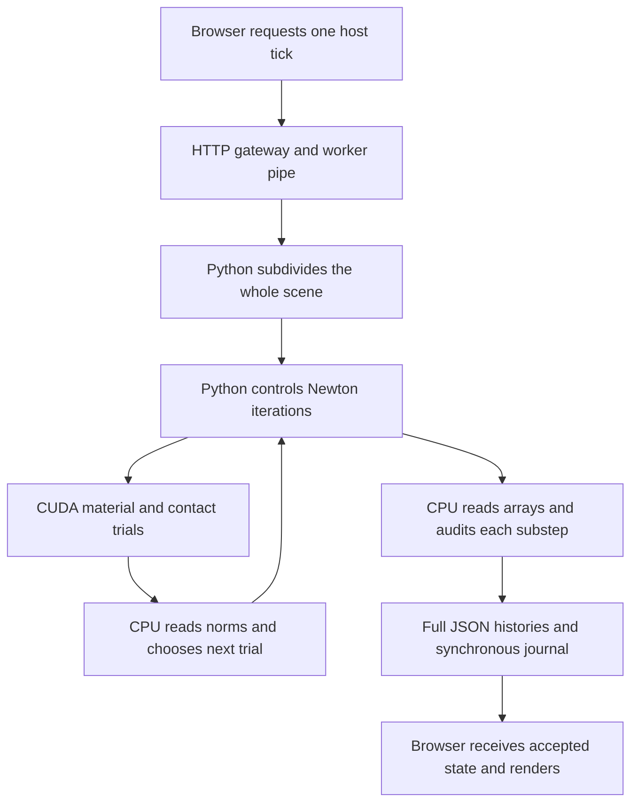

# Why the ten metre drop is slow and what must change

October 9, 2026. Audited main revision `dc6fca416aa1fee065f68816b3361c5435bfcd55`, Windows x64, RTX 5090, driver 610.88, CuPy 13.5.1 and NumPy 2.5.3. The coupled physics digest remains `31105d759be71507d256aac805caf643c5cf21e9895669e3d122819e96a0b33d`.

The coupled lab spends expensive, globally coupled material solves on a ball that is still falling through empty space. It then stops on an unresolved impact solve. The recorded ten metre release required **422.84 seconds of accepted integration for 1.425 physical seconds**, about **297 times slower than realtime**, before the final failed interval. Browser, logging and failed-interval costs are additional. A gravity-only ten metre fall takes approximately 1.428 physical seconds.

The required change is the simulation scheduler and nonlinear solve architecture: independently advance proven free flight, solve interacting material islands with local derivatives, keep their decisions and audits on the GPU, and send compact accepted snapshots to the renderer. Existing material laws, their histories and the CPU reference remain useful. The improvements below are proposed work; this audit changes no simulation law or speed.

## What currently runs when Run is pressed

The `/coupled` page uses the custom `cupy-implicit-body` backend. Its equations share C++ headers with a CPU oracle, but its Newton controller and integration/audit loops run in Python. Jolt is the separate CPU world's engine. PhysX and Newton/Warp are separate rigid contact experiments; they do not execute this sheet drop. Performance numbers from those routes cannot be applied to `/coupled`.



Source entry points:

- [Coupled controls](../client/voxel-lab/coupled.js) and [one-request-per-tick transport](../client/voxel-lab/scene-session.mjs).
- [Gateway](../scripts/voxel-lab.py), especially `Session.call`, `write`, `manual` and `simulate`.
- [Worker dispatch](../scripts/gpu-contact-worker.py).
- [Coupled equations and controller](../scripts/gpu_coupled_world.py), especially `CoupledEvaluator.__init__`, `evaluate`, `solve` and `GpuCoupledWorld.advance`.
- [Shared contact and material trial kernel](../src/physics/CoupledGpuKernel.hpp).

The visible sheet contains nine 10 mm cubes, two fixed supports, a fixed plane and one density-derived primitive sphere: **13 bodies, 60 dynamic degrees of freedom**. Glass and oak have 48 interface sites; iron has 12 plastic connectors. The sphere has no internal fracture lattice in this backend. The renderer receives calculated body transforms; it does not advance this physics clock.

## Measured growth during the real release

[Exact archived history analysis](evidence/drop-performance/history.json) retains the preceding normal-browser release under the current unchanged physics source. The last row covers only 1.25–1.425 seconds, not a complete quarter second.

| Accepted physical interval | Accepted microsteps | Integration wall seconds | Trial candidates |
|---|---:|---:|---:|
| 0–0.25 s | 259 | 16.20 | 439,876 |
| 0.25–0.50 s | 699 | 44.71 | 1,181,527 |
| 0.50–0.75 s | 976 | 64.21 | 1,686,551 |
| 0.75–1.00 s | 1,810 | 111.00 | 2,904,618 |
| 1.00–1.25 s | 1,936 | 111.23 | 3,071,220 |
| 1.25–1.425 s | 1,350 | 75.49 | 2,077,138 |

Only 342 host ticks produced **7,030 accepted microsteps, 40,944 accepted nonlinear iterations and 11.36 million trial candidates**. Rejected private trials also consume evaluations. Accepted iteration counters exclude failed solves. All of this precedes an accepted ball impact.

## The global travel guard creates unnecessary work

In `GpuCoupledWorld.advance`, `scale` is the minimum full dimension of every non-plane body, including fixed supports. The narrow support is 8 mm. A global candidate fails if the largest body translation exceeds one quarter of that dimension: **2 mm**. The ball near impact travels about 58 mm in a 1/240 s host tick. Repeated halving consequently requires at least 32 substeps, even with metres of empty space between ball and sheet.

Each oversized proposal runs the full nonlinear solve before the travel guard rejects it. The subdivision queue restarts each host tick, so expensive rejected large steps recur. The ball's motion forces every sheet interface and support contact to use the same refined clock. Material/contact stiffness creates additional refusals; travel alone does not explain every split.

[Warmed diagnostic fixtures](evidence/drop-performance/fixtures.json) confirm the cost. These are separate, explicitly initialized experiments with the ball 10 m clear, either at rest or moving downward at 14 m/s. They are not replayed late-flight sheet histories. Conditions otherwise match: 0.01 kg iron ball, dt 1/240 s, current parallel/reference-law settings, one host tick. Every instrumented accepted physical state matches its uninstrumented counterpart exactly.

| Target | Initial ball speed | Wall time for 4.17 ms of physics | Microsteps | Trial candidates |
|---|---:|---:|---:|---:|
| Glass sheet | 0 m/s | 0.110 s | 2 | 2,765 |
| Glass sheet | 14 m/s | 1.795 s | 32 | 48,544 |
| Oak sheet | 0 m/s | 0.019 s | 1 | 377 |
| Oak sheet | 14 m/s | 1.600 s | 32 | 40,555 |
| Iron sheet | 0 m/s | 0.184 s | 2 | 4,529 |
| Iron sheet | 14 m/s | 1.652 s | 32 | 39,453 |
| Plane only | 14 m/s | 0.459 s | 32 | 2,016 |

Even the isolated sphere/plane experiment repeatedly solves an empty-space gravity problem. Its geometry-driven guard uses the sphere diameter and still requires 32 halvings at this speed. Separating the ball from the sheet is necessary, but an expensive Newton solve for isolated gravity also needs a direct integration path.

These are single warmed timing samples, not statistical performance qualification. The plate starts without an equilibrium prestress; initial support/material transients contribute to its cost. Glass, oak and iron retain their declared density/stiffness differences: 2500/70 GPa, 700/12 GPa and 7870 kg/m³/211 GPa respectively. Oak has no grain law; iron's connector model is not continuum J2 plasticity. Earlier ice comparisons remain in the [resident linear checkpoint](gpu-resident-linear-checkpoint.md).

## Numerical derivatives and host control dominate each refined step

The controller perturbs every active velocity coordinate in both directions. **60 degrees of freedom generate 120 whole-scene candidates for each numerical Jacobian.** A fixed-size dense 60 by 60 matrix is then solved even while the ball has no interaction with the sheet.

The graph contains 75 shape pairs. Glass allocates **2,868 contribution rows**, including all possible surface-contact sites. Geometric checks mark many pairs inactive, and current-Jacobian reuse avoids recomputing unaffected contributions. Nevertheless, the allocated rows still participate in preparation/copy/gather work. Six custom kernels run per evaluation, followed by additional CuPy reductions, indexing, allocations and linear operations. There is no spatial broadphase producing a compact active-contact graph for the current world.

The profiled fast-ball glass tick took 1.840 s with observation overhead. Its 1,340 evaluate calls account for 0.808 s of CUDA event regions. Python made **1,765 scalar observations and 870 array observations**, including repeated convergence/fault decisions and per-substep pose, velocity, history and audit reads. Measured scalar and array wait intervals are 0.551 and 0.208 s. These overlap CUDA execution; they must not be added as independent percentages.

The measured linear-call interval totals 0.205 s, approximately 11% of that instrumented wall time. Replacing LU alone cannot recover a roughly 300-fold deficit. The existing optional native cuSOLVER bridge preserves tested results but still hands decisions back to Python. It supplies a useful primitive for a resident controller.

GPU execution is asynchronous, and the pinned [`asnumpy` API](https://docs.cupy.dev/en/v13.5.1/reference/generated/cupy.asnumpy.html) defaults to a blocking host transfer. The profiler records warmed wall time and CUDA events following [CuPy's measurement guidance](https://docs.cupy.dev/en/v13.5.1/user_guide/performance.html). Neither timing method alone identifies all driver scheduling gaps or kernel occupancy; an Nsight timeline is still needed before claiming those percentages.

## Delivery adds cost and cannot yet be batched blindly

The fast-ball glass fixture sends approximately **731 KB** for one 4.17 ms host tick. Most payload is audit/material history rather than the 13 transforms needed to draw the scene. The full recorded release expands to **164.8 MB of JSON** and occupies 42.0 MB of compressed journal storage.

The worker serializes JSON, the gateway parses it, constructs exact replacement records, compresses and deep-copies them synchronously, then serializes a response for the browser. A sampled late-flight record took 11.1 ms to serialize; its first full journal write took 57.6 ms and an identical-record write took 17.6 ms. Changing-state journal cost and browser frame cost were not separately isolated. These measurements identify additional overhead; the recorded 422.84 s integration cost already establishes the larger simulation problem.

The coupled page currently makes one sequential HTTP request per host tick. Moving to server-owned execution can remove that round trip, but the generic GPU playback scheduler currently selects 32 host ticks per call. The coupled worker bounds the entire requested interval to 128 trials, 512 accepted updates and 30 wall seconds, with whole-interval rollback. A late-flight tick already uses 32 accepted updates plus rejected proposals. Blindly choosing a 32-tick batch risks rejecting useful work or delaying Stop for a long batch. Playback batching must be aware of the actual backend's budget and checkpoint semantics.

Increasing journal limits fixed an earlier storage refusal. It did not accelerate physics.

## The impact failure needs a separate convergence repair

The real release refuses the interval following **1.425 s**, retaining a ball approximately 40 mm above the sheet. It tried 92 private intervals, rolled back 43 privately accepted microsteps, and retained 49 subdivision refusals: 10 line-search failures, 26 geometry/travel/compression/conservation refusals and 13 Newton iteration-limit failures.

The last failed solve used a 4.069 microsecond interval. Its residual fell from 0.719 to 0.012395 across 24 iterations, against a tolerance of 1.400e-10. Its recorded Jacobian condition estimate is approximately 426.5. That one matrix does not establish an extreme-conditioning explanation for all failures. Contact/material branch changes, derivative quality, starting-root choice and convergence must be investigated using the recorded inputs and candidates. Smaller steps and a faster LU have not solved this fixture.

The speed repair must preserve the rejection record and whole-interval rollback. Loosening energy gates, reducing declared stiffness, accepting an unconverged candidate or dropping contacts would change physical behavior. A ballistic speedup alone must not be reported as successful impact physics.

## Changes in implementation order

### 1 Separate free motion from interacting material clocks

Build a graph of material connections and active or conservatively predicted contacts. Give independent islands separate step schedules. A detached ball under constant gravity can use exact translation and velocity updates on CUDA, with an accounted energy/impulse ledger, instead of Newton iterations. Its material and fine geometry remain available for later activation.

Use swept bounds and verified contact-event timing to end free flight before possible contact. The current before/after overlap test is not sufficient CCD. Couple ball and target into one authoritative response when their interaction begins, including reactions and torque. Contact changes must invalidate the free-flight eligibility.

Determine material-island timesteps from that island's modes and error bounds. Retain useful previous subdivision information with explicit invalidation on state/contact/history changes. Predict obviously excessive displacement before paying for a trial. This is scheduling, not reuse of a fracture outcome.

Equilibrium initialization or sleep requires measured support reactions, prestress, stored energy and wake criteria. An oscillating elastic plate cannot simply be frozen to save time. Whole connected assemblies and distant supports remain part of stress transmission.

**User test:** A 10 m ball reaches the target in approximately 1.43 physical seconds while a separate small supported object does not slow its flight. Reset, Stop and moved-obstacle cases work. Independent ballistic oracles, swept-contact witnesses and glass/oak/iron step refinement establish accuracy before admission.

### 2 Replace global finite differences with local derivative blocks

Derive or automatically differentiate the shared pair laws' translation/rotation derivatives. Verify local blocks against independent numerical derivatives at elastic, contact, unloading, damage and plastic branch boundaries. Assemble only the actual graph blocks; reuse symbolic structure while topology is unchanged. Select a bounded solver appropriate to the matrix's actual symmetry/conditioning rather than assuming it is positive definite.

Keep the dense numerical solver as a reference oracle for small fixtures. Use contact-event location, material-aware error control and a robust nonlinear strategy to resolve the retained 10 m failure. Version changes in numerical method and compare trajectories, work and damage across timestep/resolution, rather than assuming the old numerical trajectory is an accuracy standard.

**User test:** Light and stronger glass/oak/iron impacts complete within declared bounds, with correct contact timing and visible calculated reactions. Metal unloading retains validated plastic history. Unsupported fracture/tearing laws remain explicit. Every stopped case has actual input/candidate evidence.

### 3 Keep the complete bounded solve and audit on CUDA

Move convergence norms, fault priorities, line-search choice, work/P/L reductions, history commit and rollback onto the device. Use reusable buffers and bounded device execution or validated graph scheduling. Independent islands can run in parallel. The host receives accepted completion/health summaries and render snapshots rather than synchronizing at every inner-loop decision.

Retain CPU comparative oracles, complete versioned state identities, singular/nonfinite refusal and deterministic reference reduction checks. The installed native LU graph tests demonstrate matrix command reuse; they do not yet demonstrate a resident nonlinear solver.

**User test:** The same declared scenes sustain at least one physical second per wall second on the published host, with responsive controls and no backlog. Measure the complete pipeline, including failure work and recording, not isolated kernels.

### 4 Deliver compact frames and retain complete evidence separately

Let the simulation own its clock. Publish bounded accepted pose/velocity/topology snapshots at an independent render cadence. Record complete audit histories through bounded binary/delta batches with durability, ordering and backpressure. A failed archive write must stop further simulation coherently; the observed state and recorded state must not silently diverge.

Replace the fixed 32-tick playback assumption with backend-aware work budgets and frequent accepted checkpoints. Preserve low-latency Stop/Reset, typed session expiry and no automatic replay of interrupted actions. Interpolate only compatible accepted states; never invent topology or imply uncalculated progress.

**User test:** The 3D view remains responsive while multiple objects collide. Pause reveals the exact accepted time, fracture state and diagnostic history. A replay reproduces the published states, including recorded refusal and recovery behavior.

### 5 Introduce adaptive matter after these clocks and transfers work

Represent eligible intact volumes and fragments as aggregates while keeping their material field, mass/inertia and history provenance. Activate a verified fine patch/island when contact, bending or damage requires it. Keep thin features fine and preserve all conserved state when ownership changes. Refinement must include transmitted loads and supports, not only cells closest to the visible hit.

**User test:** A fine tool edge strikes a coarse block without losing the edge or changing material strength. Results converge toward a uniformly fine reference. Increasing the size of distant intact terrain does not increase the active collision solve proportionally.

## Work to retain and work to retire

Retain shared material kernels, persistent histories, CPU/analytical oracles, actual failure records, source verification and the independent renderer. Use the existing native LU helper inside a complete resident solver only after comparison. The earlier GPU tile's fast measurements used a different experiment and laws; reuse its device scheduling ideas after checking applicability, not its performance claims.

Move the global dense/numerical-derivative controller and full-JSON-per-tick path into diagnostic/reference use after the replacement passes its gates. Consolidate experimental backend routes around one versioned scene and observation contract. Preserve tests and bounded unsupported-law reporting. Archive the chronological performance notes once their current boundaries are reflected in one maintained scorecard.

A Rust rewrite could help host structure, but the required performance gains come from changing which systems are solved, how often, and how GPU work is scheduled. A larger GPU, coarser visible meshes, a faster render loop, a longer iteration limit or replayed outcomes would not supply this architecture.

## Tests that must prevent another unusable demo

The current suites mostly establish scoped equation/CPU-GPU parity, conserved accounting, bounded refusal and UI behavior. Several compare short, low-clearance experiments. They can pass while the ten metre release is slow or refuses. Equality with a slow reference is valuable, but a separate full-scene performance and impact gate is required.

Add these acceptance gates alongside the retained law tests:

1. **Distant geometry does not control flight.** Add a tiny supported object away from a falling body. Eligible free-flight step counts must remain independent of that object's size. Test moved obstacles, grazing paths and forced eligibility invalidation against swept-contact oracles.
2. **Published drop completes.** Run the entire selected glass/oak/iron drop through contact and its aftermath. Count accepted and rejected work, including failure time and gateway recording. Compare common-time trajectories and work under timestep/resolution refinement. A refusal is a failing production gate even if rollback itself passes.
3. **Modes transfer without an extra impulse.** Join a ball to a contact/material island, fracture supported connections when the implemented law predicts failure, and reactivate later impacts. Audit mass, P/L, gravity/support work and persistent history across every transfer.
4. **Complete speed and responsiveness.** On the declared host, sustain at least 1 physical second per wall second for the bounded published scene. Record repeated median/tail measurements, cold setup separately, frame age and Stop/Reset latency. Proposed control target: less than 100 ms at an accepted checkpoint. Run browser interactions as well as headless calculations.
5. **The page matches the checked backend.** Selected material/mass/height/step settings, source digests, time and geometry must match actual records. Preserve unsupported/experimental status for laws outside the validated range. Never fulfill a failed test with an unrelated cached result.

These production acceptance gates are proposed; the new diagnostic profiler intentionally reports the current slow baseline rather than mislabeling it as passing realtime. It verifies observation parity and isolated gravity geometry, not a completed impact.

## Verification and reproducibility

Run the read-only diagnostic tool with the pinned runtime:

```powershell
build/gpu-runtime/Scripts/python.exe scripts/audit-coupled-performance.py --report build/drop-performance/fixtures.json
```

Seven fixture pairs pass exact accepted physical-state parity. All seven gravity-only ball position errors are below 1e-10 m. The observed peak accepted residuals are at most 5.41e-12 N s, 1.40e-13 N m s and 8.32e-13 J. These small residuals establish numerical accounting in the measured pre-contact fixtures; they do not qualify material response, impact convergence or realtime. The script's source hash and measurement conditions are in the evidence. No constitutive law, tolerance, geometry or production scheduler is changed by this checkpoint.

The audit and reproducible profiler are published as a coherent GitHub main checkpoint. The currently loaded ten metre experiment is left paused at its accepted state; its simulation implementation is unchanged. The first implementation priority is the separation of flight and material-island clocks, together with an explicit regression of the retained impact failure.
