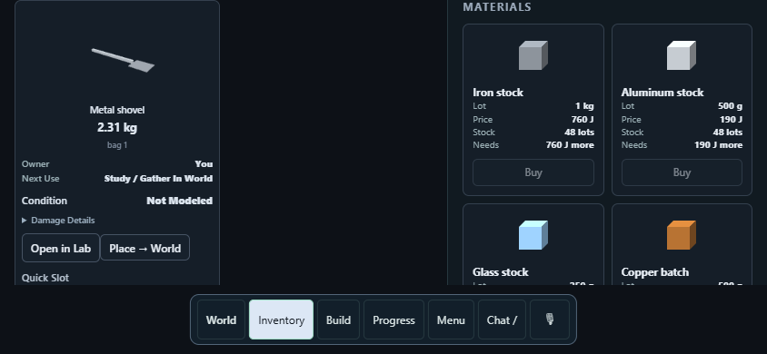

# Recipe identity and thin metal tools — October 6, 2026

## Implemented checkpoint

The first recipe milestone is available: **Metal shovel → paid Make → Inventory → equip → ordinary dig → server reload**. Its 600 × 30 × 30 mm aluminum handle and 200 × 3 × 180 mm iron blade retain their actual dimensions. The product has 28 clipped material cells in two native rigid components, joined at an actual shared planar face. The bill is **1.458 kg aluminum + 0.84996 kg iron = 2.30796 kg**. No source thickness is inflated to the world's 50 mm solid grid. Terrain remains 250 mm.

This is an explicitly selected intact rigid representation, not elastic voxels or a fracture simulation. Fixed interfaces have finite catalog-derived normal/shear capacities and section dimensions; their abrupt failure model is uncalibrated and lacks torsional failure. Internal deformation, internal fracture, heat, abrasive wear, fatigue, blunting and repair are unsupported. No new launch velocities, fragments or cosmetic excavation paths were introduced.

The versioned [recipe contract](../mcp/workshop_recipe_contract.py) derives identity from resolved geometry, material presets, connections, use and declared tests. Manufacturing settings have a separate binding. Stale observations are rejected; caller observations cannot grant qualification, inventory, energy or skills. The report is shared by built-in, saved and chat sources. Existing saved recipes and historical fingerprints are preserved.

Chat now has a bounded `set_local_cells` action alongside component/connection and ground-point authoring. Unsupported geometry, gaps, overlaps, rotations, duplicate fixings and excessive detail fail atomically. Supported initial sources are axis-aligned physical boxes without machines. Limits are 64 cells per component and 256 per product. The AI must request native admission and paid work, then measure use; choosing a model is not a passed trial. Calls remain explicit chat actions.

The shovel's `contact_drag_m: 0.10` asks the bounded native hand to work laterally farther than the legacy 40 mm target. The first measured 40 mm attempt penetrated sand but loosened nothing. This setting changes the requested hand path, with unchanged force/work limits and ground resistance. Other tools retain the original default. It does not prescribe tool velocity, damage, removal or successful use.

## Measured verification

Windows / Python 3.13 / MSVC 19.44 / Release / Jolt, CPU reference. Separate `build/local-cell-tools`, `BANJO_BUILD_LAB=OFF`. Implementation published to main as `8f3113d62e4e1f14540e1878b6130032617a18ed`, based on `64f7c6d5`. Source registration and the five scoped native/contract/local-source CTest groups were rerun on that commit (all passed). Browser interactions used actual Chrome pointer clicks in an 844 × 390 landscape viewport. These are desktop emulation results, not physical-phone acceptance. The raylib native window/input loop was not exercised.

The local demo on port 18890 uses that source commit and the recorded native binaries. The server stopped through its Ctrl+C handler after a separate saved-room backup; the existing inorganic demo world reopened and the Build screen visibly offers Metal shovel with its required supplies. The older wood-based world is preserved and remains refused by the pre-existing inorganic-only admission rule; it was not reset or converted.

| Check | Result |
|---|---|
| Source registration | 305/305 C++ sources registered, no exclusions |
| Native local-cell test | Exact density mass/inertia; 3 mm thickness; offsets 0, 3.7 and 23.1 mm; invalid matter/point/frame refusals; snapshot reopen; finite soil cuts |
| Existing ground-work and excavation | Both native groups pass; existing material resistance/work law retained |
| Contract / chat | 13 contract tests and 45 chat tests pass; atomic edits and stale identity covered |
| Local source / saved / visual / native quote | 9 tests pass; true cell dimensions, saved override, 40/50 mm readiness and native mass allocation |
| Existing precise rigid / store / buildability / component API / API | 37 / 5 / 9 / 7 / 16 tests pass |
| Existing tool authoring and contact | Workshop ground-tool suite and five keyboard/authoring/material-contact tests pass |
| Existing paid pick / inorganic catalog | Four tests pass, including actual paid pick gathering and skill evidence |
| Paid stock / ownership / recovery | 12 tests pass, including failed-save escrow, private/shared stock and reopen |
| Paid shovel journey | Pass: invalid gap costs nothing; finite starter metal; Make; collect; equip; positive native hand work; reload without duplicate product or inflated blade |

The private-stock browser fixture formerly required a wood pile in an inorganic world. It now uses collected aluminum and an actual 675 g grid-aligned aluminum output, then the existing finite shared iron stock. Historical glass/oak/iron laboratory comparisons remain intact. A precise-rigid material-refusal assertion now includes the newly admitted aluminum preset; rubber remains refused. No tolerance was widened.

The generated metal pick regression also exposed an incorrect interaction-point frame: its grip offset was computed around the entire mixed-material tool although the native root is its aluminum handle. The shared fixed-lattice compiler now supplies the actual root component's source centre to both world generation and Workshop placement. Both generated-world pickup/restore cases pass with the original 10 micrometre display bound.

Same 600 mm handle/3 mm blade, both components of the listed material, native quote:

| Material | Exact source mass kg | Native mechanical mass residual kg |
|---|---:|---:|
| Glass | 1.620000 | +4.8763e-8 |
| Oak, research only | 0.453600 | −2.3381e-8 |
| Iron | 5.099760 | +2.8530e-7 |
| Aluminum | 1.749600 | −2.6551e-8 |

Material allocation residuals were zero. The mechanical residual is existing Jolt inverse-mass float conversion, bounded at relative 2e-7 without correction. Geometry analytical mass/inertia residuals are ≤1e-12. These numbers demonstrate density differences; stiffness differences cannot be measured by this internally rigid representation.

For the same explicitly funded soil cut with each material, 250 mm terrain and nominal 50 mm local tool cells: a 0.015625 m³ band releases 25 kg in 125 actual ground constituents, with terrain volume residual ≤1e-10 m³ and zero assigned launch velocity. These are funded cut-reduction checks, not full contact momentum/energy conservation. Existing ground-work tests use dt = 1/240 s; this shovel journey uses the existing world clock/substeps. Full-pipeline conservation and granular flow remain unsupported.

The [recorded shovel run](evidence/local-cell-tools/journey-summary.json) separates wall timing from the process's declared work time and excludes walking to supplies. The workbench's 100 J/kg / 500 W estimate charges 230.796 J and requires at least 0.461592 simulation seconds. This lumped workbench model is not a calibrated metal forging process. The ordinary sand dig releases about 3.69 kg into native debris; it does not credit Inventory before collection. First-use positioning contributes to the measured strike time.



## Still open

- Ordinary timed walking/gathering and repeated shovel use across soil, sand, rock, faces and sites; physical phone input acceptance.
- The ≤5 minute 1 × 1 × 3 m dry shaft target, affordable ore-to-metal progression, and repeated-use latency gates. This checkpoint does not establish a 10 ft excavation time or 4 Hz successful removal.
- Automatic constitutive refinement and history transfer, internal tool bending/fracture/wear, calibrated interface strengths and full momentum/energy ledgers.
- Arbitrary rotated/shaped local source components and machine adapters; additional functional qualifications for other recipes.
- The wider [regression audit](regression-audit-2026-10-05.md) remains unfinished. Scoped passes are not a full-regression green claim.

Reproduce with the configured native runner and its sibling platform CLI/DLL:

```powershell
python scripts/check-source-registration.py
cmake --build build/local-cell-tools --config Release --target banjo_live_world_run banjo_platform_cli banjo_c banjo_local_cell_tools_tests --parallel 4
ctest --test-dir build/local-cell-tools -C Release -R 'banjo_(local_cell_tools|workshop_local_cells|workshop_recipe_contract|ground_work|ground_excavation|metal_shovel_game)_tests' --output-on-failure
```
