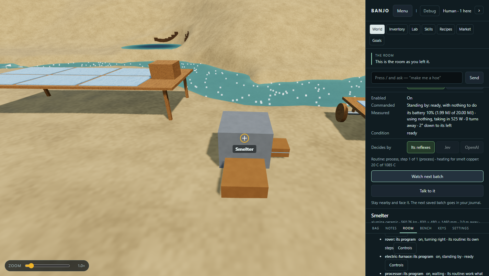
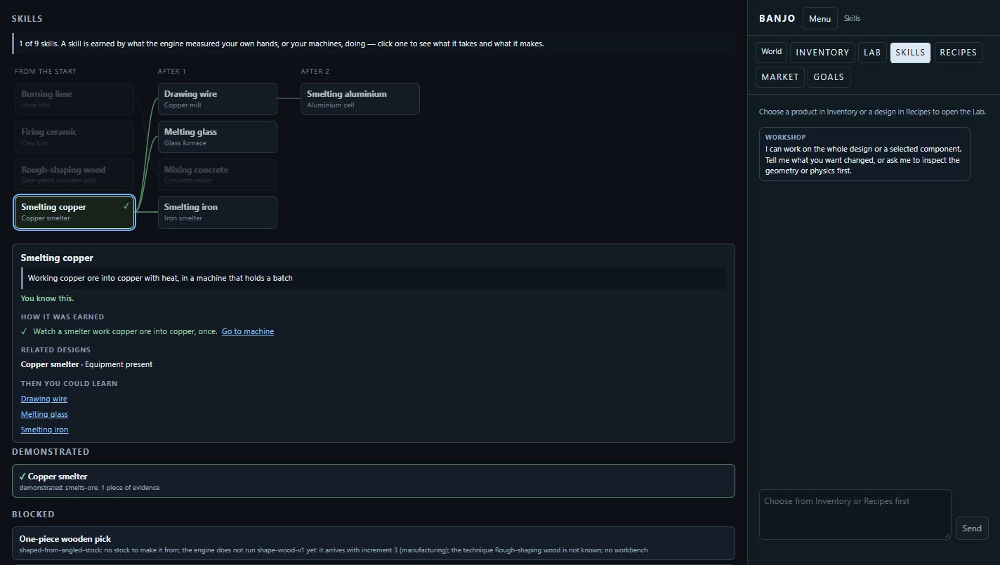

# Personal machine learning checkpoint — September 30, 2026

Code revision: `be5c7e49cf3551f6e54cc68e7a817d506d6deda7`, on main. This follows the [P0 persistence repairs](player-persistence-checkpoint.md) and implements part of the [player review's recommendations](ai-player-playthrough-review.md#recommended-work-in-order). The broader progression goal remains active.

## Implemented

- **Watch next batch** is an ordinary World machine-panel action. The authenticated guest selects one present machine, within 6 m and facing it. At the actual goods conversion the guest must still have a reported pose refreshed within 12 seconds and be inside a 120-degree view cone. A watch expires after 120 native seconds and consumes no resources itself.
- The trusted routine supplies its machine identity, declaration digest, persisted batch counter, actual input/output ledger quantities and native energy draw. Evidence IDs use those source fields and the world, so native session replacement does not create another event.
- Named worlds no longer award knowledge from the legacy unsourced callback or from whoever happened to advance time. Multiple nearby guests may explicitly observe the same work; distant guests receive nothing.
- A durable learning outbox accompanies the matching native snapshot and exact machine runtime. Journals are credited after this save succeeds. A journal failure retains the receipt; reopening replays it idempotently. Failed journal writes also roll back the in-memory revision, preventing a false duplicate from suppressing recovery.
- Curated machine recipes resolve their registered tests through the registry, replacing the two-recipe hardcoded table. Only the implemented `made_kg > 0` predicate is admitted, with positive finite inputs/outputs and the test's declared input present. Unknown, ambiguous or unsupported predicates cannot unlock a technique.
- Skills and Market resolve learning routes against the native equipment in this world, declared recipes and available intake stock. They expose an actual location/action or a missing example, machine, recipe or input. Skills links return to the selected World equipment. Related designs state unavailable processes; learning does not silently admit wood shaping.
- Waiting hand/action programs release the receiving-account transaction lock while retaining their shared session lease. The clock can advance the hand and other guests can issue commands. Native wire commands remain serialized; source transfers and snapshot publication retain their transaction locking.

## Measured acceptance

Environment: Windows 11, Python 3.13.5, MSVC 19.44 Release subprocess runner from `build/agent-progression`. No native source, constitutive law, timestep, resolution or physical tolerance changed.

| Check | Result |
|---|---|
| Generated-world smelter, explicit nearby observer, another watcher moves away | One personal technique: Smelting copper; distant guest learns none |
| Actual source batch | 5 kg copper ore → 1.5 kg copper; 10,000 J process work drawn |
| Source/save timing in recorded acceptance | Observed at 16.416667 native seconds; paired save at 16.616667 seconds; native dt 1/240 s and 50 mm scene grid |
| Inject journal write failure, shut down, reopen, repeat save | Outbox survives; one evidence record and one technique; no duplicate revision |
| Chrome pointer flow | Move near machine → Controls → Watch next batch → earned notebook entry → Skills → World link; no JavaScript exception |
| Missing gift/equipment and removed-intake fixture | Explicit missing prerequisite; no invented tool, stock or learning |
| Real HTTP action waits 0.8 seconds | Clock advances and another guest reads the advanced state within 0.6 seconds |
| Journal atomic file replacement failure | Evidence/technique revision remains unchanged in memory; retry persists once |

The processing acceptance advances the normal clock in 0.2-second slices faster than wall time; it does not accelerate the native dt or prescribe a machine outcome. The browser drives actual controls. These are assistant-authored regression journeys, not a paid model run or an autonomous character progressing beyond camp. Provider calls: zero.

[Sanitized machine acceptance](evidence/player-learning/acceptance.json)





## Checks

Run with `BANJO_LIVE_ENGINE=build/agent-progression/Release/banjo_live_world_run.exe` where native integration is required; browser checks use `BANJO_BROWSER_TESTS=required`.

```powershell
python scripts/check-source-registration.py
python tests/knowledge_tests.py
python tests/rover_brain_tests.py
python tests/room_store_tests.py
python tests/workshop_tabs_tests.py
python tests/market_tests.py
python tests/workshop_install_tests.py
python tests/fabrication_tests.py
python tests/ai_player_tests.py
python tests/workshop_navigation_tests.py GameScreens.test_watch_batch_button_earns_personal_skill_and_skills_link_to_real_equipment
node --check playground/world.js
node --check playground/workshop.js
```

Source registration: 286/286. Knowledge 41, rover 34, room store 25, Workshop tabs 9, Market 2, install boundary 20 and fabrication 27 pass. The new native/HTTP witness, waiting-action and guidance checks pass, as does the browser journey. The full AI suite passes all 11 tests in 159.279 seconds after resolving two initial failures: an obsolete expectation that an unsourced callback teaches the shared archive (intentionally refused now), and an unreproducible random source route in the persistence scenario. The persistence case now declares its generation seeds and passes at 99.296 native seconds / 102.851 wall seconds, two ground receipts, 2,800 J wallet, with disk failure/retry/rejoin/restart checked. A separate random rerun returned at 27.517 native seconds / 29.423 wall seconds. This does not qualify all generated routes; the deterministic route failure below remains open.

The existing fabrication comparison still reports glass/oak/iron masses 2.56 / 0.7168 / 8.05888 kg for 16 cells each, zero material residual and energy residual at most `1.82e-12 J` within its finite stock/workpiece/supply/station boundary. This is retained regression evidence, not full-world closure or chemistry validation.

## Remaining work and bounds

- A real reachable gathering tool, personal study receipt and measured gathering step remain required. Exact bodies still cannot carry tool points; this checkpoint does not relax that admission boundary.
- Camp still has four goals. The tool → measured gathering → work surface → supported process chain and general goal authoring are unfinished.
- The automated action catalog still stops after camp. Broader AI actions and live provider trials across seeds/scarcities remain required.
- Market purchase recommendations still need all gaps, total cost, useful next capability and compact resource/debit/next-use labels.
- The generated world's flood-fill proof is a declared terrain reachability check, not a tested steering path. A randomized real-time regression exposed a rover route timeout. A separate [reproducible terrain 4 / goods 1 probe](evidence/player-learning/rover-route-timeout.json) remains at `go_to vein` with an empty hopper and no return after 150 native seconds at unchanged dt. Some measured routes give up the intake approach and dump elsewhere; ground receipt correctness is not delivery to the intended machine. Reliable routing remains an acceptance gate. The persistence regression now selects the published review's terrain 7 / goods 851269742 experiment through the normal generator, making its source route reproducible without modifying resources or physics.
- Batch processing uses declared recipe yields and timing. This is a goods-ledger event with an actual native energy draw, not measured chemical manufacture or a certification of machine shape.
- Avatar poses are reported by clients. Distance/direction are checked; visibility occlusion, collision-aware walking and malicious teleport prevention are not implemented.
- The learning outbox is bounded to 1,024 entries / 2 MB. Watch intent is ephemeral; after restart the player watches again. Existing durable receipts replay without rewatching. Corrupt source/observer outboxes are refused.
- Existing running user servers have not been stopped or restarted. They need updated Python modules to expose this action; no production deployment occurred.
