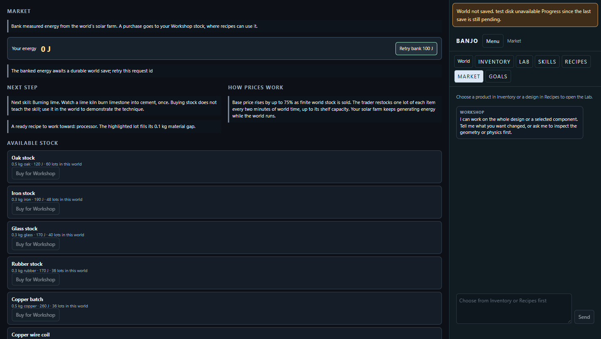

# Player persistence checkpoint — September 30, 2026

Code revision: `6d1a31798d67b8b16f6ea2121e5ff3ac6bb3c167`, on main. This addresses the two P0 failures in the [AI playthrough review](ai-player-playthrough-review.md#recommended-work-in-order). Personal learning, further goals, capability-aware guidance and expanded AI play remain open.

## Implementation

- Native bulk withdrawals retain the actual source packet. Returns report the actual accepted volumes. A general receiving ledger identifies each holder; machine names come from the server. Fabrication plus these receivers must equal native cumulative exports and returns under the existing `1e-10 m³` absolute / `1e-12` relative tolerance. The invariant was not relaxed.
- Per-world state locking keeps machine actions, host loads, source receipts, snapshot capture and publication coherent with requests and installations. Exact hopper contents, orders, execution frames and counters are persisted with a routine-declaration digest. A restart cannot silently substitute a different routine or empty a hopper.
- Installing a recipe retains the receiving ledger and every guest record. Running machine goods accounts are rebound to the new room spec instead of continuing to write into a discarded copy.
- Restoring parked cell or precise rigid bodies retains their recorded velocities. Parked bodies remain frozen. Unpark still deliberately starts a placed object at rest.
- Save success follows atomic file replacement. Refusal preserves the last durable file and exposes a notice in the shared right rail. A pending Market bank request retains its identity across reloads, preventing another native draw on retry.

## Measured evidence

Environment: Windows 11, Python 3.13.5, MSVC 19.44, Visual Studio 17 2022 x64 Release; isolated `build/agent-progression`. Native simulation uses `dt = 1/240 s`; the generated world retains its 50 mm scene grid and precise rigid equipment. No production resolution, timestep or material law changed.

| Check | Result |
|---|---|
| Generated real-time world: unattended rover, repeated banking, injected disk failure, retry, rejoin and server restart | Passed: 65.796 native seconds / 67.666 elapsed seconds; 3 receiving receipts; actual returned sand `0.000007 m³`, soil `0.01749093071744246 m³`; 2,000 J personal wallet; repeated IDs added no credit or draw |
| Loaded digging rover saved/restarted, then delivered | Passed: exact runtime record equal across restart; sand/soil/rock holder residuals zero after return |
| Two guests pack separate Camp stools, then preview/commit another bench | Passed: all existing serialized native body records and guest profiles/bags equal before/after installation; masses unchanged; bags retained after restart |
| Moving parked body restored whole, same experiment for glass/oak/iron | Passed at 20 mm cells, initial velocity `[0.3, 0.2, 0.1] m/s`, no simulation steps during save/restore; full snapshot equality |
| Chrome mouse interaction: bank fails visibly, reload Market, retry | Passed: failure notice visible; 100 J credit and exactly 100 J native draw; recovered notice hidden; no JavaScript exception |
| Corrupt density, duplicate receipt, another holder's over-return, unsupported rock, declaration mismatch and failed atomic replacement | Refused; prior ledger/runtime/durable file retained |



### Checks run

Configured with `cmake -S . -B build/agent-progression -G "Visual Studio 17 2022" -A x64 -DBANJO_BUILD_LAB=OFF`, using the existing `build/integration/_deps/joltphysics-src` and `nlohmann_json-src` through their `FETCHCONTENT_SOURCE_DIR_*` overrides. Built Release targets `banjo_live_world_run`, `banjo_live_world_tests` and `banjo_platform_cli` with parallelism 4. The first attempt used a runner locked by an existing server; the successful build used this separate directory without stopping that server.

```powershell
python scripts/check-source-registration.py
ctest --test-dir build/agent-progression -C Release -R '^banjo_live_world_tests$' --output-on-failure
$env:BANJO_LIVE_ENGINE=(Resolve-Path build/agent-progression/Release/banjo_live_world_run.exe).Path
python tests/ground_transfers_tests.py -v
python tests/rover_brain_tests.py -v
python tests/fabrication_tests.py -v
python tests/room_store_tests.py -v
python tests/workshop_install_tests.py -v
python tests/world_upgrades_tests.py -v
python tests/starter_goals_tests.py StarterGoals.test_two_players_complete_from_earned_energy_and_keep_progress_after_restart -v
python tests/ai_player_tests.py AutonomousGuests.test_realtime_rover_returns_bank_retries_reload_and_restart_agree -v
$env:BANJO_BROWSER_TESTS='required'
python tests/workshop_navigation_tests.py GameScreens.test_failed_bank_notice_is_visible_and_reload_retry_draws_only_once -v
node --check playground/game_menu.js
node --check playground/workshop.js
node --check playground/world.js
```

Results: source registration 286/286; native live-world CTest passed; receiving/runtime 5, rover 34, fabrication 27, room store 25, installation boundary 20, startup upgrades 7, targeted multiplayer 1, real-time persistence 1 and browser failure/retry 1 passed.

The retained fabrication comparison also passed glass/oak/iron: 16-cell outputs of 2.56 / 0.7168 / 8.05888 kg; material residuals zero; energy residuals at most `1.82e-12 J` inside the finite stock/workpiece/station boundary. These checks do not certify full-world conservation, constitutive realism or cross-platform determinism.

## Limits and next gates

- The adapter supports native sand/soil packets at the existing declared bulk density of 1,600 kg/m³. Rock transfer is refused before source mutation. Optional in-process adapters and old binaries are refused before machine receiving transfers; rebuild the subprocess runner for this contract.
- Source accounting closes cumulative transfer volumes. Ore fractions and machine goods remain the declared recipe/deposit model; no physical separation or chemistry law is established here.
- Receiving history is bounded to 4,096 receipts and refuses transfers when full. A verified archive/compaction mechanism is required for indefinite operation.
- A failure before a durable checkpoint restores the last complete file. Legacy files with unrecorded exports remain refused; no missing historical receipt is invented. Arbitrary failures inside every compound machine tool and cross-database transfers are not a general transaction certification.
- Reachable gathering tools, personal machine witnesses, supported post-camp goals, world-aware guidance, broader AI actions, full Market costs/gaps and concise product labels remain required. Live provider play is separate from the reference policy and was not validated by these persistence checks.
