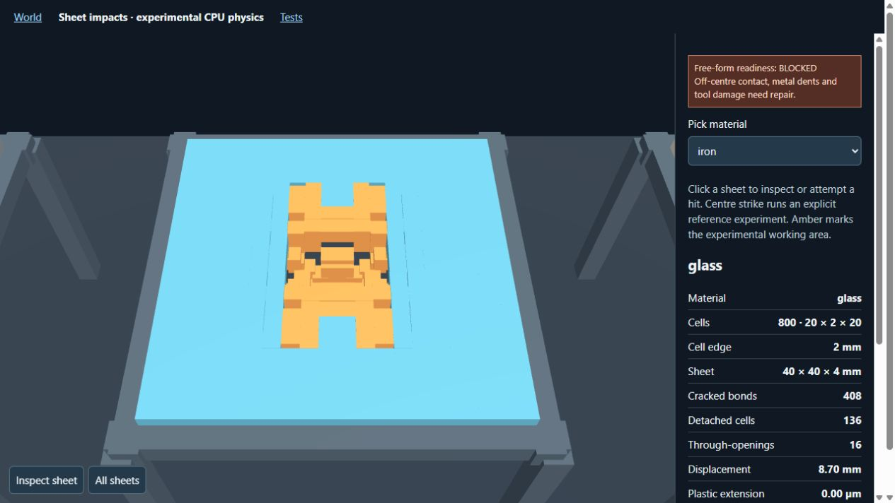

# Thin-sheet impact checkpoint — October 8, 2026

## Status: experimental, free-form qualification BLOCKED

This checkpoint adds a live CPU experiment and a diagnostic test framework. It
does **not** finish the requested free-form smashing world or validate real
material behavior. The subsequent owner request is a clearer experiment:
deformable balls of selectable material and mass dropped 10 m onto supported
deformable sheets, with a reaction observable in **both** objects. That drop rig
is not implemented by this checkpoint. A rigid striker is not a substitute.

## What runs

`/sheets.html` at the material-lab server displays eight material specimens and
eight pick material choices. Each specimen starts as 800 bonded material cells,
20 × 2 × 20, with 2 mm cell edges: 40 × 4 × 40 mm. No shards are authored.
Native `banjo_sheet_world_run --serve` owns persistent target displacement,
velocity, bond aliveness and plastic history. The browser draws returned cell
positions; it does not remove matter, synthesize fracture or play a recording.
The viewer includes close inspection and an explicit centre-strike reference.

The head and handle form one rigid compound. Material density and occupied box
volumes determine mass, centre of mass and inertia, including parallel-axis
terms. Both parts participate in native clipped-face contact geometry at their
current CPU pose. The double CPU source and serial double Verlet target own
dynamics; Jolt owns geometry queries only in this lane. Initial speed is an
explicit 6 m/s ballistic experiment, not a simulated human swing.

The outermost sheet perimeter has ideal fixed supports with recorded reactions.
The visible posts/frame depict this ideal fixture; they have no independent
collision/damage law. This is **not** evidence that hitting posts works. There
is no gravity, detached-cell self-contact, debris settling or tool deformation.
The ordinary `/world.html` remains collision-only; no running game is migrated.

## Material-law scope

The existing elastic axial lattice, strength/energy failure reference and axial
plastic return are used explicitly. No catalog law, tolerance or material
property is changed. A plastic bond extension is not a validated permanent
continuum dent. Iron/aluminum plasticity, oak grain/orthotropic rupture, rubber
hyperelasticity and concrete compression damage require their own constitutive
validation. Oak is retained solely as the mandated laboratory comparison; this
does not introduce wood to the game or make a brittle oak preset.

## Measured evidence

[Native matrix and source/binary identity](evidence/material-lab/sheet-reference-results-20261008.json)
records Windows MSVC Release, source base `e1e88822`, actual native SHA-256
`4b777db8183fd708e410dd465f0e8e17a0e30173cb177c204d8dc6486a108b38`,
and source hashes of the new native implementation. This binary was compiled
from that base plus the source hashes, not from the unmodified base alone.

All 64 material pairs were attempted for 1,000 steps. Nine refused contact:
glass with aluminum/glass/ceramic/concrete; concrete with
iron/glass/ceramic/rubber/ice. An actual browser off-centre click
`[0.0007808484689576858, 0, 0.0004226478800741229]` also refuses. The cause is
the bounded affine contact reduction becoming ill-conditioned. A broader
connected support attempt also exceeded the shared 64-node manifold budget;
it was rejected, not published as a repair. Refusals now expose the last
accepted state after rollback, including consistent energy/momentum ledgers.

Same initial geometry, fixture, iron striker and 6 m/s speed, after 1,000 steps:

| Target | dt (ns) | Elapsed (µs) | Broken bonds | Maximum displacement (mm) | Axial plastic extension (µm) | Attributed energy residual (J) |
|---|---:|---:|---:|---:|---:|---:|
| Glass | 16.903 | 16.903 | 68 | 0.1487 | 0 | 3.13e-16 |
| Oak | 21.602 | 21.602 | 60 | 0.2344 | 0 | 8.38e-18 |
| Iron | 17.274 | 17.274 | 44 | 0.0898 | 1.302 | 2.15e-16 |

Different density/stiffness imply different stable timesteps. These are equal
step counts, **not** a matched-duration damage-rate comparison. The evidence
includes native timestep declarations for every target. Oak's reference model
is neither calibrated wood nor an established material outcome.

The glass/iron centre reference reaches 60,000 steps (1.014185 ms), with 408
broken bonds, 136 detached cells, 16 empty through-sheet probe columns and
8.701 mm maximum displacement. Every original cell remains in the state.
Opening detection requires disconnected original matter **and** no current
cell intersecting the through-thickness probe; attached bending alone cannot
pass. Ordinary browser centre-strike, inspection and actual rendered removal
were observed at these same counts. This is a voxel probe test, not a complete
geometric opening area or a calibrated glass fracture pattern.



Its attributed residuals are E = -1.61e-17 J, P = 7.88e-18 N·s,
L = 3.32e-19 kg·m²/s. Initial energy is 0.03173184 J; contact loss is
0.003558385 J; numerical energy correction is 9.19e-8 J. Across the short
matrix the maximum numerical correction is 1.31% of initial energy. Small
ledger residuals alone do **not** establish temporal accuracy. Existing paired
accuracy and six sustained fracture gates remain unchanged and open.

## Tests and readiness framework

`banjo_sheet_diagnostics_tests` exercises all 64 native pairs, unloaded
glass/oak/iron, actual topology and visible opening in the glass reference,
matter retention, full attributed P/L/E and the failed browser-click rollback.
It tests diagnostic correctness even when a contact is refused. Its green
result is **not** free-form qualification. Run the separate gate:

```powershell
python tests/sheet_impact_tests.py build/local-cell-tools/Release/banjo_sheet_world_run.exe --qualify
```

This exits **1**, with `release_ready: false` and unresolved gates. The viewer
also says BLOCKED. It cannot become ready solely by passing transport tests or
showing a crack counter. No gate or tolerance was relaxed to publish this lane.

Five rebuilt/scoped CTest entries passed in 92.71 s: sheet diagnostics,
force/contact phase, double geometry/contact, external loads and Verlet.
Two further native-backed gateway tests pass, checking bounds, the saved refusal receipt, observation limits, process budget and cleanup. JavaScript syntax and Python compilation pass. Source registration is 323/323.
The full repository suite, cross-GPU/platform behavior and mobile gameplay
qualification have not been established by this checkpoint.

The loopback `/api/sheets` transport restricts materials, hit location, step
batch, process count, idle lifetime and observation count. JSONL stores the
declaration and actual complete receipts under `build/sheet-impact-logs`.
There is no automatic retry or outcome reuse. Failed native steps remain
visible; they are not converted into successful hits.

## Next implementation: the 10 m drop rig

1. Replace the rigid-source limitation with two deformable, finite-volume
   bodies sharing one contact/force clock. Carry rotational inertia/contact
   torque for cells/fragments whose connected translational support has lost
   rank. Resolve this before advertising arbitrary hit positions.
2. Declare sheet dimensions and genuine support geometry. Allow contact with
   posts and detached matter. Preserve support/external work and reaction
   torque; keep internal losses separate from contact/environmental losses.
3. Offer ball material and mass. Derive occupied volume/size from density;
   never silently change density to reach a requested weight. Release from
   rest with 10 m surface clearance and gravity 9.81 m/s². Test free-fall
   against analytical height, speed and mgh before contact. No scripted launch
   or cached fracture replaces the impact.
4. Render both live deformable objects through impact, unloading and settling.
   Observe cracks/components, permanent displacement/dent and empty openings
   separately for each. Unsupported responses remain unavailable/blocked.
5. Qualify every material pair at several masses, plus off-centre contact and
   fixture hits. Require zero-load stability, density/mass fidelity, refinement,
   P/L/E with external work, unloading/dent checks, finite-cell collisions,
   visible browser geometry and desktop/touch action delivery. Persist raw
   inputs/receipts and screenshot the actual outcomes. Only then mark the
   free-form drop environment ready.

Publishing: the source checkpoint is the main commit containing this document;
the published revision is recorded in the task response. Earlier unfinished
common-force-phase accounting edits remain preserved in a named Git stash;
they are not included or discarded by this checkpoint.
