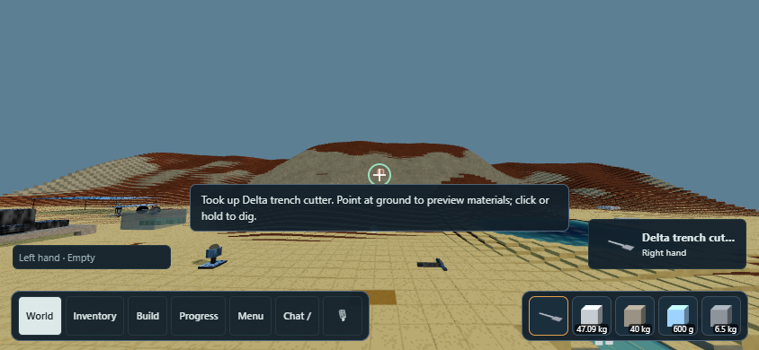

# General tool authoring — October 6, 2026

## Implementation

Tools select behavior through validated capability declarations, not product names, component names, artwork or animations. Studio/LLM inspection now exposes `recipe_contract.tool_authoring`, schema `banjo.workshop-tool-authoring.v1`. Each explicit authoring turn receives a compact server capability/anchor snapshot immediately; no extra model request or per-use LLM call is added.

For ground tools, `ground_tool` is the single physical hand/contact authority. Its component-local grip and point resolve into product coordinates, then the installed root frame. Generic `interaction_points` retain labels, surfaces and containers, but their grip/use coordinates cannot override these functional anchors. Resolution leaves the editable source unchanged. Existing source/revision hashes still bind actual geometry, materials, connections and declarations.

Every failed chat edit now restores the draft, model, overrides, change list and tool trace in both game and research contexts. This covers functional configuration and later validation/refresh failures; it is not rollback of already published external actions or a database transaction.

World restoration dispatches configured ground products back to their validated functional grip even when an ordinary native carry/haul observation lacks grip mode. Native point attachment/connectivity remains authoritative. Loose-material clicks also compare the exact press ray against native named-body occlusion before collecting material behind a tool.

The current inorganic Stone field pick explicitly declares local cells and its physical fixed mount. Its 80 mm components could not retain their touching mount on the 50 mm world lattice. Local compilation preserves the 80 mm geometry, aluminum haft and concrete head; no world-wide representation conversion or material law changes. Archived research recipes remain unchanged.

## LLM authoring requirements

1. Inspect current server capabilities and the source. Choose an implemented capability for the requested behavior; names never confer functionality.
2. Author real inorganic materials, geometry and actual connections. Select the supported physical representation explicitly; do not thicken, rescale or substitute geometry to disguise a failed build.
3. For ground work, call `define_ground_tool` with existing point/grip component references, SI coordinates in their own frames, an outward occupied tip, actual point dimensions and bounded shared controls. Inspect resolved anchors after editing.
4. Preserve source/contract identity. Save a design separately from paid manufacture; configure neither free stock nor arbitrary energy, launch speed, damage or skill awards.
5. Review native admission, exact stock/work, then test ordinary constituent pickup, equip, use, release and reload. Configuration means **unqualified** until these trials pass. A shape or an Inspect action is not proof of the requested behavior.
6. For a new mechanism without an adapter, identify the missing capability and retain a clearly labelled draft. Add the runtime/authoring adapter and an unfamiliar-product regression before promising a usable tool.

### Bow boundary

Native bow laboratories use hinged rigid limb levers, elastic joints, tension-only links and a one-way nock. They are an experimental reduction, not constitutive limb bending. Studio currently emits fixed/bearing construction joints, so it cannot author that complete assembly. Portable two-hand bow controls and separate arrow Inventory also need integration. The model is instructed to report this boundary, rather than configure a ground tool or prescribe a launch velocity. **A Studio-generated portable bow is not implemented by this checkpoint.**

## Verification

Windows / Python 3.13 / Chrome / unchanged MSVC Release native binaries in `build/local-cell-tools`, based on main `eaf9e306`.

**Published implementation:** `76b9f7e3` on GitHub main. The preserved `C:/play` demo checkout runs this revision at `http://localhost:18890`; Python restarted gracefully with unchanged native binaries and a rooms backup in `C:/play/backups/tool-authoring-76b9f7e3`. The existing owner world was reloaded in the in-app browser: the stage renders, status is `Live.`, saved stock is retained and chat starts closed. No owner item was manufactured, picked up or consumed by this smoke check.

- An uncatalogued **Delta trench cutter**, authored through the same bounded calls offered to the LLM, uses components `spine-A` and `edge-B`: a 500 × 30 × 30 mm aluminum beam and 200 × 12 × 180 mm iron edge, actual shared face fixing, 4.61484 kg. No runtime/catalog dispatch entry is added for this product.
- Landscape paid Make consumes finite collected aluminum/iron, produces an owned product, equips it, and preserves exact source geometry and private identity through restart.
- Desktop pointer pickup of one constituent and 844 × 390 touch pickup of the other retain the actual native whole-tool hand and shared controls. The input fixture holds simulation and uses a fixed fly camera while checking the ray; ordinary gravity/movement remains covered by the separate World navigation suite. Simulation resumes before the ordinary use trial.
- A plain native `grab`/carry observation followed by World reload recovers the functional grip and ready tool controls.
- Actual hand-driven sand excavation reports positive native ground work and loosened material; no prescribed launch/debris animation is added. Recorded journey timings exclude walking and are fixture measurements, not a fresh-player speed promise.
- Stone pick tests now supply finite aluminum rather than the obsolete wood handle. Native rock receipt allocation, paid manufacture/use, bag/equip/restart and private retry/save-failure tests run at 40 and 50 mm world grids. One observed 50 mm ledger has zero material residuals and energy residual −2.27e−13 J within the stock/work/station boundary; this is **not** a full simulation momentum/energy audit.
- Glass/oak/iron/concrete research compilation comparisons remain in the raw-crafting suite; the inorganic game policy does not remove oak from research coverage. Native laws and timesteps are unchanged (native tool fixture dt = 1/240 s).
- Mocked provider authoring, conflicting generic anchor resolution and failed functional-edit rollback tests verify the contract without spending provider credits. They do not measure a live model's design success rate.

Scoped reproduction:

Final scoped run: **9/9 CTest suites passed** in 44.39 s; **45/45 chat tests passed**; **305/305 sources registered**; JavaScript syntax and changed-file whitespace pass. The complete regression suite was not run for this checkpoint.



```powershell
ctest --test-dir build/local-cell-tools -C Release -R 'banjo_(workshop_recipe_contract|workshop_local_cells|metal_shovel_game|workshop_ground_tools|physical_matter.*|raw_crafting|world_navigation)_tests' --parallel 2 --output-on-failure
python tests/workshop_chat_tests.py
python scripts/check-source-registration.py
node --check playground/world.js
```

Internal bending/fracture, wear/fatigue, calibrated mount strength, arbitrary mechanism authoring, physical-phone acceptance, fast 10 ft excavation and the complete regression audit remain open. The original 3 mm shovel has its separate paid journey; passing one tool does not certify every thin mount or novel geometry.
