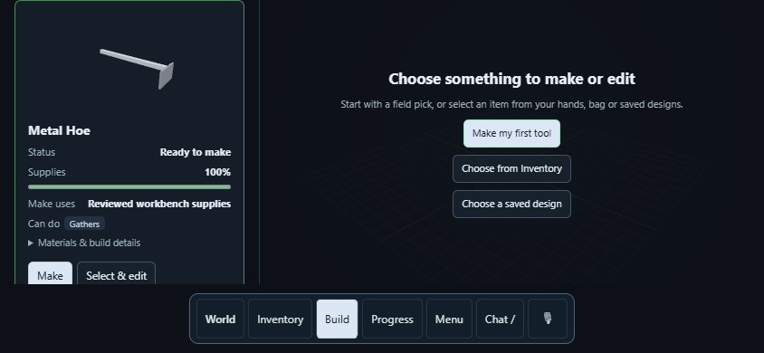
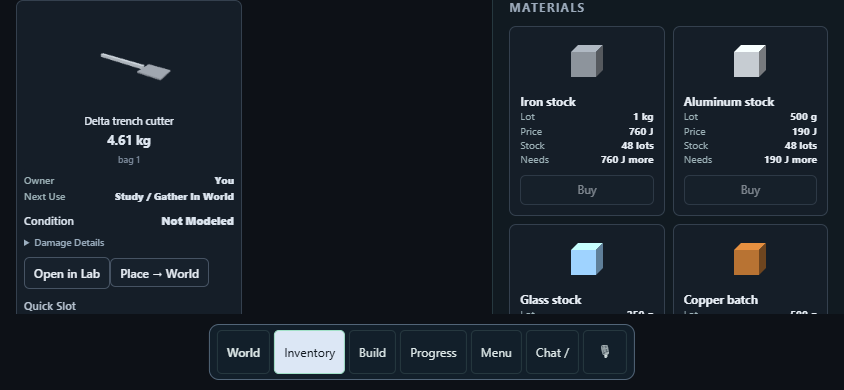

# Ground tool families — October 6, 2026

## Implementation

Picks, shovels, perpendicular hoes and unfamiliar ground tools share the
`ground_tool` component-frame declarations, native point/grip registration,
whole-item ownership, paid fabrication and player controls. Runtime behavior
does not dispatch on their names. Build now includes **Metal hoe**, an actual
12 mm iron plate mounted perpendicular to a 30 mm aluminum handle. The shovel
retains its original 3 mm iron blade and source identity. Both use explicit
50 mm clipped local material cells; the catalog pick retains its ordinary
50 mm solid representation. No native law or binary changes in this checkpoint.

The first hoe source failed its ordinary native use trial: its handle touched
the ground at the same height as the cutting edge and stopped the stroke.
Moving the actual handle mount from y = 15 mm to y = 105 mm leaves 90 mm
of clearance behind the edge while retaining its genuine shared fixing face.
No collision exemption, free work, scripted yield or launch velocity was added.

Studio inspection supplies `tool_authoring.ground_work.working_clearance`:
the oriented bounding envelopes of nonworking components projected along the
declared working direction. This conservative geometry estimate can flag a
blocking handle; it neither admits an installation nor qualifies performance.
LLM instructions require checking geometry, grips, connections and native use
for each product, including unfamiliar names. Existing capability snapshots
carry this information in explicit chat turns; there is no model call per hit.

Ground advice selects actual native column centers using the native cell size
and grid origin. Direct pointer/touch targeting retains the pressed point.
Shared contact feedback preserves a native release record when later empty
withdrawal contacts would otherwise hide it; `results` still includes every
closed episode. Receipts are not summed or invented and a later whole-tool
failure remains primary. These changes affect all declared ground tools.

## Verified player paths

`tests/metal_shovel_game_tests.py`, already registered as
`banjo_metal_shovel_game_tests`, now runs four distinct paid journeys:

| Product | Actual geometry | Material-derived mass |
|---|---|---:|
| Personal field pick | 50 mm aluminum haft / iron head | 5.65125 kg |
| Metal shovel | 3 mm iron blade / 30 mm aluminum handle | 2.30796 kg |
| Metal hoe | 12 mm perpendicular iron edge / raised aluminum handle | 3.497904 kg |
| Delta trench cutter | 12 mm iron edge / 500 mm anonymous aluminum member | 4.61484 kg |

The cutter is authored with the bounded calls available to the LLM, starting
with components `spine-A` and `edge-B`. It has no catalog/runtime dispatch entry.
This checks the tool-call contract, not a live provider's design success rate.

Every journey collects finite inorganic starter stock, uses visible landscape
Make review/work/collection, verifies charged materials and positive finite
station work, picks up **each constituent** with desktop pointer or offset touch,
uses the owned whole tool through ordinary native sand contact, then restarts
and restores one private item with functional hand configuration. Pickup tests
use a fixed fly observer and held simulation to verify exact press rays and
native occlusion, then resume simulation before use. Separate navigation tests
retain the ordinary walking/gravity path. Physical-phone acceptance is open.

Thin products retain native precise masses, material masses, exact definitions
and mass-bearing cell/offset payloads across restart. The ordinary pick retains
its native material/cell payloads. Inventory's restored body masses round to five
decimal places: the presentation comparison allows at most 5.00001e-6 kg per
body, while native snapshot fields remain exactly equal. This is a display
tolerance, not a relaxed mechanical conservation tolerance.

The opening paid pick/skill regression retains every ordinary attempt and
requires positive release within three attempts before separately testing
metered assisted cutting. One contact can legitimately do work without release;
the test no longer promises that one click always earns a skill. The initial
zero-yield attempt remains in evidence. Recipe supply regressions now collect
actual iron and derive the Table's material cost from its source, replacing
obsolete wood-stock constants while retaining private/shared, depletion,
machine-input, market and paid-Make checks.

## Scope and remaining work

Environment: Windows, Python 3.13, Chrome desktop and 844 × 390 emulated touch;
MSVC Release live runner/shared library in `build/local-cell-tools`, LAB off,
based on published main `72e04d1e`. Tool fixture dt is 1/240 s, ground columns
250 mm. Local tool cells are 50 mm with exact clipped thin dimensions. Native
glass/oak/iron contact/ownership comparisons and raw-crafting material coverage
are retained. Preset densities drive mass; this adds no constitutive law.

Fabrication ledger residuals are checked within 1e-7 kg/J for its stated
stock/workpiece/supply/station boundary. This does not audit the whole simulation's
momentum or energy, calibrate material strength, qualify grains/plasticity, or
close tool/support/fragment reactions. See the retained comparative measurements
and incomplete physical accounting in [the engine audit](digging-engine-review.md).

These tests establish supported dry-sand ground work and lifecycle compatibility.
Hoe cultivation/crops, portable bow/arrow authoring, calibrated rock fracture,
wear/fatigue, wet excavation and the constitutive terrain-patch rewrite remain
unfinished. Requested 4 Hz input is not measured 4 Hz removal: sustained two
successful removals per second and the five-minute 10 ft excavation gate remain
unpassed. Start from [the adaptive ground plan](adaptive-ground-speed-plan.md)
for the next physics/speed acceptance; do not extrapolate one successful stroke
to a hole-completion time.

## Reproduction

```powershell
ctest --test-dir build/local-cell-tools -C Release -R 'banjo_(tool_use|tool_target_client|ground_work|workshop_ground_tools|workshop_recipe_contract|workshop_local_cells|metal_shovel_game|physical_matter.*|world_navigation|raw_crafting|playable_recipes|product_labels|recipe_guidance)_tests' --parallel 2 --output-on-failure
python tests/workshop_chat_tests.py -v
python scripts/check-source-registration.py
```

Final scoped gate: **15/15 registered CTest suites pass** in 97.94 s, including
all four paid tool journeys. After switching advice to native grid origins, the
opening/catalog suite passes again in 17.05 s. **45/45 chat tests pass** and
**305/305 native sources are registered**. Changed-file whitespace and the new
relative documentation/evidence references pass. The complete CTest regression
was not run.

### Published and installed

Implementation/evidence revision **`884fa67f`** is published on GitHub main.
The preserved `C:/play` checkout runs that revision on port 18890. Python stopped
with Ctrl+C before its room backup under `C:/play/backups/tool-families-884fa67f`
and restarted hidden with the unchanged verified native binaries. Status reports
`engine_ready: true`; the owner's existing world
`c7c8058545c1492eb69f4dbcbb86edfc` reloads with `Live.`, `panel-away` and chat
closed. Build visibly includes Personal field pick, Metal shovel and Metal hoe
with actual current supply shortages. This smoke check manufactured/consumed no
owner item or material; paid trials used isolated test worlds.

## Recorded sand trials

| Product | Native released mass | Native ground work | One use wall time |
|---|---:|---:|---:|
| Personal field pick | 7.42942 kg | 12.77490 J | 1.163 s |
| Metal shovel | 3.08237 kg | 1.54534 J | 1.076 s |
| Metal hoe | 2.18508 kg | 3.53669 J | 1.208 s |
| Delta trench cutter | 6.75709 kg | 8.04167 J | 1.449 s |

These are one controlled native contact trial per source, not a calibrated
ranking or sustained excavation benchmark. [Source/result and ledger records](evidence/tool-families/journeys.json)
retain actual manufactured inputs. [Opening attempts](evidence/tool-families/opening-attempts.json)
retain zero-yield work and later demonstrated release; skill knowledge is measured.





### Retained comparative native experiment

At 40 mm body cells and dt 1/240 s, the same fixed head geometry (40 × 280 ×
40 mm), 800 × 40 × 40 mm oak handle, finite 5000 N / N·m joint fixture, bounded
4 m/s hand contact and optional lever compare glass, oak and iron. Preset head
densities are 2500, 700 and 7870 kg/m³; expected masses are 1.12, 0.3136 and
3.52576 kg respectively. The common handle is 0.896 kg. Larger iron inertia
produces deeper contact under this experiment; that is not a measured real
material-strength or grain/plasticity validation.

| Head material | Recorded episode release | Terrain-volume residual | Unclosed hand work − mechanical change − all ground work |
|---|---:|---:|---:|
| Glass | 0.243 kg | 3.55e−15 m³ | −0.444884 J |
| Oak | 0.049 kg | 1.78e−15 m³ | −0.289081 J |
| Iron | 1.041 kg | 0 m³ | −0.0448162 J |

[Native output](evidence/tool-families/native-comparisons.txt) also retains the
horizontal-lift work/contact-force comparison. These energy accounts are finite
and incomplete, not zero-residual full-pipeline conservation. No tolerance or
constitutive law changed; calibrated joints, bending, fracture and wear remain
unsupported by these rigid-tool experiments. Historical oak research remains
separate from the inorganic player catalog.
