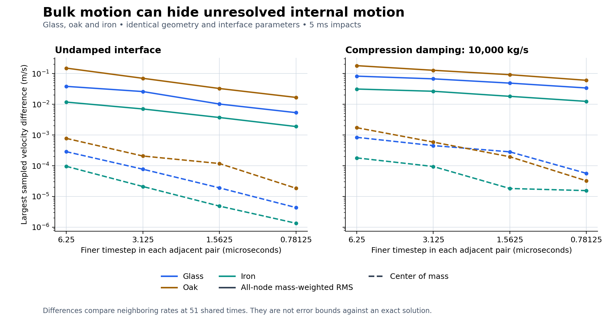

# Full-state timestep comparison across glass, oak and iron

Tested code: `e5b883e6d5d47dc85a5e1ea42c671d94a83cee99`, local `codex/physics-foundation`, September 4, 2026 (September 5 UTC). All 30 compliant-contact runs complete and all 12 Windows CTest executables pass. The new measurement path shows that bulk rebound settles much faster under timestep refinement than internal node motion. **Full material trajectory accuracy remains open.** This checkpoint changes probe output and analysis tools, not the contact/elastic law or default viewer solver. It is not pushed or merged into main.

## What changed

`banjo_solver_probe --trajectory PATH --sample-every N` exports every material node's ID, mass, position, velocity and intrinsic spin at the initial state, every N accepted steps and the final state, with round-trip double precision. Rejected trial states are not exported. Probe time-series diagnostics now also include body elastic energy, kinetic energy relative to COM translation, COM height and COM vertical speed. The relative kinetic term includes coherent rigid rotation and intrinsic cell spin; it is not a projection onto deformation-only modes.

`scripts/run-trajectory-matrix.ps1` runs glass, oak and iron with two explicit interface damping values at matching output times. `scripts/compare-trajectories.py` compares all node states by ID at exactly shared physical times. It checks complete samples, finite values, positive unchanged masses, identical initial states, physical configuration and solver executable hash. Independently summing the exported nodes must reproduce the probe's COM position/velocity within 1e-10 and COM-relative kinetic energy within 1e-8 J. The comparator currently requires this fixture's 0.04 m cells for the intrinsic-spin inertia term; it rejects other spacing instead of applying the wrong inertia.

For positions and velocities, the report gives the mass-weighted RMS difference `sqrt(sum(m_i*|state_i(h)-state_i(2h)|²)/sum(m_i))`, largest individual-node difference, and separate COM differences. It also compares internal kinetic and body elastic energy. Both final differences and maximum differences across the 51 shared samples are retained. These are adjacent numerical solutions, not an exact-solution error bound, a continuous-time supremum or a calibration certificate. There is no interpolation, alignment shift, topology matching or COM-only substitute for node motion.

## Fixed experiment and growing material set

The experiment retains the [explicit compliant law](compliance-checkpoint.md) unchanged: radius 0.25 m, spacing 0.04 m, horizon 2, occupancy sampling 3, 1,285 nodes and 17,097 bonds. Initial velocity is `(0.3,-1,0.2) m/s`, with no spin, gravity, friction, damage or internal damping. The infinite support plane starts 1 mm below the lowest node. Contact stiffness is 1e8 N/m per node/plane contact, compression-only damping is either 0 or 10000 kg/s, and the explicit compression validity bound is 0.005 m. This is an uncalibrated, resolution-dependent interface prescription; it is not derived from each material's restitution.

Glass uses catalog density 2500 kg/m³ and modulus 70 GPa, oak 700 kg/m³ and 12 GPa, and iron 7870 kg/m³ and 211 GPa. Density/stiffness change together, while geometry and chosen interface parameters remain fixed. The elastic approximation still lacks independent Poisson calibration, wood grain and iron plasticity. Substance names do not choose a fracture or rebound outcome.

Each of the six material/damping combinations runs for 5 ms at five timesteps: **12.5, 6.25, 3.125, 1.5625 and 0.78125 microseconds** (400–6,400 steps). Every 100 microseconds, all nodes are sampled; including the initial state gives 51 samples per run. The result is 30 runs and 24 adjacent-rate comparisons. [Run configuration, source, hashes and ledgers](evidence/trajectory-runs.csv), [comparison totals](evidence/trajectory-comparison.csv), and [differences at each shared time](evidence/trajectory-comparison-times.csv) preserve the numerical evidence.

## Findings

The finest pair compares 1.5625 against 0.78125 microseconds. The values below are maxima over the shared sample times, not just the final state:

| Material / damping (kg/s) | Node velocity RMS difference (m/s) | COM velocity difference (m/s) | Node position RMS difference (micrometers) |
|---|---:|---:|---:|
| Glass / 0 | 0.00534101 | 4.35923e-6 | 0.0452999 |
| Oak / 0 | 0.0167346 | 1.85387e-5 | 0.165717 |
| Iron / 0 | 0.00188816 | 1.34455e-6 | 0.0124452 |
| Glass / 10000 | 0.0339231 | 5.66608e-5 | 0.229612 |
| Oak / 10000 | 0.0603111 | 3.23926e-5 | 0.447584 |
| Iron / 10000 | 0.0124354 | 1.55046e-5 | 0.0913295 |



The full-node velocity differences are orders of magnitude larger than the corresponding COM differences. In the damped cases they remain about 3.39%, 6.03% and 1.24% of the 1 m/s incoming normal speed for glass, oak and iron respectively. The sampled RMS position and velocity differences decrease through the tested refinements for all six combinations, but the velocity differences do not show a uniform second-order regime. Small position differences alone are insufficient for stress, strain-rate or damage accuracy.

The finest damped runs finish at COM vertical speeds 0.782671751 m/s (glass), 0.769891614 m/s (oak) and 0.855605425 m/s (iron). They retain COM-relative kinetic energy of 0.134340 J, 0.119517 J and 0.106215 J, and body elastic energy of 0.187963 J, 0.378837 J and 0.058286 J respectively. The interface has separated by the final time, so contact energy is zero. A nearly steady rebound speed does not mean the material has stopped vibrating.

The large velocity/small displacement differences are consistent with unresolved phase in stiff internal oscillations. That is an interpretation, not a modal decomposition established by this measurement. Even a harmonic oscillator integrated by midpoint can preserve energy while advancing at numerical frequency `(2/dt)*atan(omega*dt/2)` rather than `omega`; the existing low-frequency radial analytical test already checks second-order refinement within its own resolved regime. The new lattice evidence does not extend that regime automatically to every internal mode.

Every accepted step passes the unchanged conservation contract. Across all 30 complete runs, the largest absolute energy, linear-momentum and angular-momentum residuals are 1.16001e-8 J, 4.91458e-8 kg m/s and 2.96636e-11 kg m²/s. The six repeated 12.5-microsecond runs reproduce the [previous checkpoint](compliance-checkpoint.md) values; exporting data does not change the solver's result. Numerical normal loss and instantaneous restitution work remain zero; explicit contact damping work has its own ledger.

Solver wall time ranges from 2.40 to 33.49 seconds per 0.005-second simulation. At the finest rate, each run takes roughly 30.5–33.5 solver seconds. This excludes CSV output and diagnostic aggregation outside the timed solve; complete command timings are recorded separately. These are single desktop development runs, not percentile benchmarks or real-time performance. Finer internal-motion accuracy is still expensive.

## Reproduction, integrity and verification

```powershell
cmake --build build/win-integration --config Release --parallel 8
ctest --test-dir build/win-integration -C Release --output-on-failure
./scripts/run-trajectory-matrix.ps1
./scripts/run-trajectory-matrix.ps1 -TimeSteps @(0.0000015625,0.00000078125) -OutputDirectory build/trajectory-fine
python scripts/compare-trajectories.py build/trajectory-matrix/matrix.csv build/trajectory-fine/matrix.csv --output build/trajectory-comparison.csv
# Optional figure, requires matplotlib:
python scripts/plot-trajectory-convergence.py build/trajectory-comparison.csv --output build/trajectory-convergence
```

The first three rates were one batch, and the two finest rates a second batch. Both ran on working source subsequently committed as `e5b883e`; the recorded HEAD and dirty flag are retained. The common solver executable SHA-256 is `65190052a50b53dd7f57f4c56afaf26766b93a199c468018d20c8c694581bc60`. It was verified during the fine batch and unchanged after the full build; the executable was not rebuilt between these runs. Hashes were added to those matrices afterward, with the original `matrix-recorded.csv` preserved. Future script runs capture the executable hash before starting. Each final trajectory also has a SHA-256 in the evidence table. Raw trajectory files and logs remain in the recorded build paths and the task's exported evidence archive.

Full Windows x64 Release build passes with no compiler warning/error in the captured log. All **12 CTest executables pass in 8.60 s**. The comparator independently verifies all 30 exported trajectories and compares 24 pairs. The PNG/SVG plot was generated using matplotlib 3.10.5 and visually inspected. The simulation environment remains Windows 11 Pro 26200, Intel Core Ultra 9 285K, VS2022/MSVC 19.44.35228, SDK 10.0.26100, CMake 4.1.2, Jolt 5.6 and raylib 6. Main's frame-control, busy-wait and static-runtime flags remain OFF. This probe/analysis change makes no new viewer-input, cross-platform or remote-CI claim.

## Next implementation boundary

1. Add a bounded temporal-error controller that observes node motion and elastic state, compares trial resolutions, and adapts without changing the contact/material law or hiding failed intervals. Validate it against these common-time trajectories and analytical oracles for glass, oak and iron. Bulk rebound alone must not control acceptance for deformation/damage.
2. Compile interface stiffness/damping against a declared surface measure before a spatial-resolution sweep can claim the same physical interface. Preserve the separate rigid `e=0.3` repeated-impact failure; selecting compliance is not a fallback repair for that law.
3. Integrate the audited path through a shared experiment owner. `RollingBallExperiment::stepFracturingPhase` currently advances Jolt before reading the sphere state, whereas `CompliantStep` advances both participants from a common initial time. A direct substitution would advance the sphere twice. Define one owner for each participating body's time, contact and support response, with transactional publication and explicit external reactions, then integrate friction and activation/handoff. The default correction-energy defect remains until that path is replaced and tested.
4. Continue fracture-work/coupon calibration, general shapes, adaptive matter, assemblies and publishing as required by the full goal. The [mechanics scorecard](mechanics-scorecard.md) retains 30 mechanics and 10 platform capabilities; this measurement checkpoint does not complete a platform gate.
