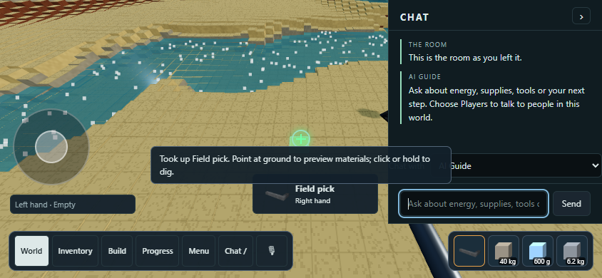

# Whole-tool pickup and deliberate World chat — October 6, 2026

## Implementation

The World click gate formerly refused the new aluminum/iron pick because its handle and head have an internal fixing. It now checks the whole declared tool: constituent anchoring, total mass and external attachments. Native point connectivity, grip, reach and ownership remain authoritative. Clicking either constituent takes the complete tool through the ordinary Inventory/native hand route; no material, grip or physics law changed.

An empty-hand click now retains the press ray and asks the native picker again, rather than acting on the last asynchronous hover result. This retains finger targeting after touch release and protects against stale hover answers. The first click/tap out of cursor or chat mode can pick up the selected item. Resuming with a held tool still consumes that click so it cannot accidentally dig or drop the tool.

The World rail opens deliberately through / or the equivalent Chat button for touch users. It contains the conversation, audience/input/send and close control. The old Details button is removed; selection and machine controls cannot unfold an inspection rail. Menu stays in the bottom navigation. Escape from the chat input or a click back into the World closes it. Selection remains available as context for chat. Existing tests that depend on the former Details rail describe the retired UI and require separate replacement by current interactions; they are not a full-regression qualification.

## Verification

Windows / Python 3.13 / Chrome / unchanged Release native binaries from the local-cell checkpoint. Based on main 8741b874; publication revision is in Git history. Scoped results:

- Three World navigation browser tests pass, including real desktop pointer pickup of the iron head and landscape touch pickup of the aluminum handle. Each verifies actual native hand.holding == field pick and the retained product in the browser hand.
- Mobile first paint, portrait/landscape control layout, cursor transitions, explicit chat, closing/reload and shared Workshop navigation pass at 390×844, 844×390, 360×640 and 1280×800.
- Visible chat children are only header and talk; header contains only close and Chat title. Details, machine cards and the Menu button are hidden there. Neither selecting a product nor a machine reveals the rail.
- Seven existing native ground-tool installation/pickup/restore tests pass, including glass/oak/iron research comparisons and generated inorganic tools.
- The paid thin-shovel Make → Inventory → equip → native dig → reload browser journey passes.
- JavaScript syntax, changed-file whitespace and 305/305 C++ source registration checks pass. The navigation suite is now explicitly registered in CTest as anjo_world_navigation_tests.

These are isolated native/browser regressions and mobile emulation, not physical-phone acceptance or a full-regression green claim. No native rebuild, constitutive qualification, wear, fracture, or excavation-speed improvement is claimed.

Reproduce using the native runner and DLL from the configured build:

`powershell
ctest --test-dir build/local-cell-tools -C Release -R banjo_world_navigation_tests --output-on-failure
`
